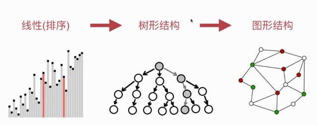

# 算法

Algorithm 英[ˈælgərɪðəm] 美[ˈælɡəˌrɪðəm]

算法（Algorithm）是指解题方案的准确而完整的描述，是一系列解决问题的清晰指令，算法代表着用系统的方法描述解决问题的策略机制。也就是说，能够对一定规范的输入，在有限时间内获得所要求的输出。如果一个算法有缺陷，或不适合于某个问题，执行这个算法将不会解决这个问题。不同的算法可能用不同的时间、空间或效率来完成同样的任务。一个算法的优劣可以用空间复杂度与时间复杂度来衡量。

算法中的指令描述的是一个计算，当其运行时能从一个初始状态和（可能为空的）初始输入开始，经过一系列有限而清晰定义的状态，最终产生输出并停止于一个终态。一个状态到另一个状态的转移不一定是确定的。随机化算法在内的一些算法，包含了一些随机输入。

形式化算法的概念部分源自尝试解决希尔伯特提出的判定问题，并在其后尝试定义有效计算性或者有效方法中成形。这些尝试包括库尔特·哥德尔、Jacques Herbrand和斯蒂芬·科尔·克莱尼分别于1930年、1934年和1935年提出的递归函数，阿隆佐·邱奇于1936年提出的λ演算，1936年Emil Leon Post的Formulation 1和艾伦·图灵1937年提出的图灵机。即使在当前，依然常有直觉想法难以定义为形式化算法的情况。

--摘自百度百科 https://baike.baidu.com/item/%E7%AE%97%E6%B3%95/209025?fr=aladdin

## 部分应用领域

* 搜索引擎

* IDE 集成开发环境( Integrated Development Environment )

* 人工智能

* 推荐算法，机器学习、深度学习

* 3D电影、动画电影等

* 游戏

* 图像识别、自动驾驶...

* 性能优化

* ...

## 需要掌握的基础知识

* 了解数组、链表、堆、栈等线性结构

* 堆基础算法知识有常识了解：如递归、遍历、算法复杂度

## 学习路径

* 线性（排序）

* 树形结构

* 图形结构

## 算法 = 数据结构?

Algorithms + Data Structures = Programs

算法 + 数据结构 = 编程

## 该课程无法覆盖所有的数据结构和算法

比如：

> 堆： 斐波那契堆？

> 树： 线段树？

> 图： 网络流？

> ...

## 算法思想

* 分治算法-归并排序，快速排序...

* 贪心算法-最小生成树...

* 动态规化-最短路径...

* 递归搜索-树形结构...

## 每个细分领域都是算法

* 图形学

* 图像学

* 机器学习

* 人工智能

* 数据挖掘

* 操作系统

* 编译原理

* 网络安全

* 虚拟现实

* 高性能计算

## Remarks

笔记作者： Capricorncd

主页：https://github.com/capricorncd

原讲师：liuyubobobo

出处：https://coding.imooc.com/learn/list/71.html
