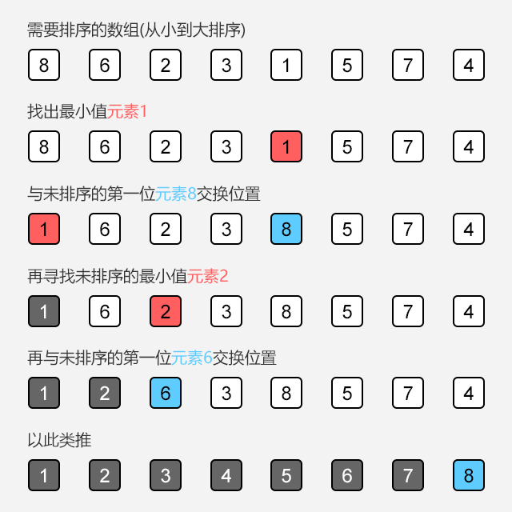

# 选择排序 Selection Sort

**选择排序**（Selection sort）是一种简单直观的排序算法。它的工作原理是每一次从待排序的数据元素中选出最小（或最大）的一个元素，存放在序列的起始位置，直到全部待排序的数据元素排完。选择排序是不稳定的排序方法（比如序列`[5, 5, 3]`第一次就将第一个`[5]`与`[3]`交换，导致第一个5挪动到第二个5后面）。

## 选择排序思路



实例

main.cpp

```c++
#include <iostream>
// 低版本需要引入swap所在库algorithm
// #include <algorithm>
// 高版本C++，swap在std命名空间中
using namespace std;

// 只能对int型数组进行排序
void selectionSort(int arr[], int n) {
  for (int i = 0; i < n; i++) {
    // 寻找[i, n)前闭后开区间里的最小值
    int minIndex = i;
    for (int j = i + 1; j < n; j++) {
      if (arr[j] < arr[minIndex])
        minIndex = j;
    }
    // 交换索引为i, minIndex元素位置
    swap(arr[i], arr[minIndex]);
  }
}

// test
int main() {
  // 定义数组
  int a[10] = {10, 9, 8, 7, 6, 5, 4, 3, 2, 1};
  // 排序
  selectionSort(a, 10);
  // 打印
  for (int i = 0; i < 10; i++)
    // 打印排序后数组的每一个元素
    cout<<a[i]<< " ";
  // 打印一个回车endl
  cout<<endl;
  return 0;
}
```

结果

```
1 2 3 4 5 6 7 8 9 10
```

注意：以上方法只能对整型数组进行排序。

## 使用模板（泛型）编写算法

期望对任意类型的数据进行排序——**模板函数**。

main.cpp

```c++
#include <iostream>

using namespace std;

template<typename T>

void selectionSort(T arr[], int n) {
  for (int i = 0; i < n; i++) {
    int minIndex = i;
    for (int j = i + 1; j < n; j++) {
      if (arr[j] < arr[minIndex])
        minIndex = j;
    }
    swap(arr[i], arr[minIndex]);
  }
}

// test
int main() {
  // 浮点数
  float b[4] = {4.4, 3.3, 2.2, 1.1};
  selectionSort(b, 4);
  for (int i = 0; i < 4; i++)
    cout<<b[i]<< " ";
  cout<<endl;

  // string
  string c[4] = {"D", "C", "B", "A"};
  selectionSort(c, 4);
  for (int i = 0; i < 4; i++)
    cout<<c[i]<< " ";
  cout<<endl;

  return 0;
}
```
结果
```
1.1 2.2 3.3 4.4
A B C D
```

#### 自定义类型

Student.h

```c++
// IDE自动生成的宏定义
#ifndef SELECTIONSORT_STUDENT_H
#define SELECTIONSORT_STUDENT_H

#include <iostream>
#include <string>

using namespace std;

// 定义Student结构体
struct Student {
  string name;
  int score;
  // 知识点：运算符重载
  // 将小于号重载
  bool operator<(const Strudent &otherStudent) {
    // 从小到大排序
    return score < otherStudent.score;
    // 从大到小排序
    // return score > otherStudent.score;
    // 从大到小排序，相同时排序name(按字典顺序)
    // return score != otherStudent.score ? score > otherStudent.score : name < otherStudent.name;
  }

  friend ostream& operator<<(ostream &os, const Student &student) {
    os<<"Student: "<<student.name<<" "<<student.score<<endl;
    return os;
  }
};
#endif // SELECTIONSORT_STUDENT_H
```

知识点：运算符重载

#### # 测试Student

```c++
// 在以上代码的基础上引入
#include "./Student.h"

int main() {
  Student d[4] = { {"D", 90}, {"C", 100}, {"B", 95}, {"A", 95} };
  selectionSort(d, 4);
  for (int i = 0; i < 4; i++) {
    cout<<d[i];
  }
  cout<<endl;
  return 0;
}
```

结果

```
Student: D 90
Student: B 95
Student: A 95
Student: C 100
```

#### # 生成随机测试用例

SortTestHelper.h

```c++
// IDE自动生成的宏定义
#ifndef SELECTIONSORT_STUDENT_H
#define SELECTIONSORT_STUDENT_H

#include <iostream>
#include <ctime>
#include <cassert>

using namespace std;

namespace SortTestHelper {
  // 生成有n个元素的随机数数组，每个元素的随机范围为[rangeL, rangeR]
  int* generateRandomArray(int n, int rangeL, int rangeR) {

    assert(rangeL <= rangeR); // 依赖cassert库

    int *arr = new int[n];
    srand(time(NULL)); // 依赖ctime库
    for (int i = 0; i < n; i++)
      arr[i] = rand() % (rangeR - rangeL + 1) + rangeL;
    return arr;
  }

  // 生成一个几乎有序的数组
  int *generateNearlyOrderedArray(int n, int swapTimes) {
    int *arr = new int[n];
    for (int i = 0; i < n; i++) {
      arr[i] = i;
    }

    // 随机打乱部分顺序
    srand(time(NULL));
    for (int i = 0; i < swapTimes; i++) {
      int posx = rand() % n;
      int posy = rand() % n;
      swap(arr[posx], arr[posy]);
    }

    return arr;
  }

  // 提取打印，封装成方法
  template<typename T>
  void printArray(T arr[], int n) {
    for (int i = 0; i < n; i++)
      cout << arr[i];
    cout << endl;
    return;
  }

  // 测试排序算法的性能
  template<typename T>
  void testSort (string sortName, void(*sort)(T[], int), T arr[], int n) {
    clock_t startTime = clock(); // 依赖ctime库
    sort(arr, n);
    clock_t endTime = clock();

    cout << sortName << " : " << double(endTime - startTime) / CLOCKS_PER_SEC << " s" << endl;
    // CLOCKS_PER_SEC: 时钟周期
    // endTime - startTime: 之间有多少个时钟周期
    return;
  }

  // 复制一个整型数组
  int* copyIntArray(int a[], int n) {
  	int* arr = new int[n];
  	copy(a, a+n, arr);
  	return arr;
  }
};

#endif // SELECTIONSORT_STUDENT_H
```

测试

```c++
// 在以上代码的基础上引入
#include "./SortTestHelper.h"

int main() {
  int n = 10000;
  int *arr = SortTestHelper::generateRandomArray(n, 0, n);
  selectionSort(arr, n);
  for (int i = 0; i < n; i++) {
    cout << arr[i];
  }
  cout << endl;
  // 释放内存空间
  delete[] arr;
  return 0;
}
```

测试

```c++
int main() {
  int n = 10000;
  int *arr = SortTestHelper::generateRandomArray(n, 0, n);
  // selectionSort(arr, n);
  // printArray(arr, n);

  SortTestHelper::testSort("Selection Sort", selectionSort, arr, n);

  delete[] arr;
  return 0;
}
```

结果（仅供参考）

```
Selection Sort : 0.193683 s
```

## Remark

笔记作者： zx1984

主页：https://github.com/zx1984
