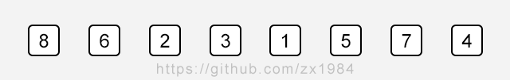
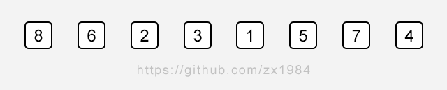

# 插入排序 Insertion Sort

 有一个已经有序的数据序列，要求在这个已经排好的数据序列中插入一个数，但要求插入后此数据序列仍然有序，这个时候就要用到一种新的排序方法——插入排序法,插入排序的基本操作就是将一个数据插入到已经排好序的有序数据中，从而得到一个新的、个数加一的有序数据，算法适用于少量数据的排序，时间复杂度为O(n^2)。是稳定的排序方法。插入算法把要排序的数组分成两部分：第一部分包含了这个数组的所有元素，但将最后一个元素除外（让数组多一个空间才有插入的位置），而第二部分就只包含这一个元素（即待插入元素）。在第一部分排序完成后，再将这个最后元素插入到已排好序的第一部分中。


插入排序的基本思想是：每步将一个待排序的记录，按其关键码值的大小插入前面已经排序的文件中适当位置上，直到全部插入完为止。

## 插入排序思路



#### # 方法实现

```c++
#include <iostream>
#include <algorithm>
#include "SortTestHelper.h"
#include "SelectionSort.h"

using namespace std;

template<typename T>
void insertionSort(T arr[], int n) {
  for (int i = 1; i < n; i++) {
    // 寻找元素arr[i]合适的插入位置
    for (int j = i; j > 0; j--) {
      if (arr[j] < arr[j - 1]) {
        swap(arr[j], arr[j-1]);
      } else {
        // 相对于选择排序，插入排序可能不用遍历完内层循环，
        // 若有满足条件可以提前结束循环
        // 理论上所花时间要比选择排序小
        break;
      }
    }
  }
}
// 或者简写
void insertionSort(T arr[], int n) {
  for (int i = 1; i < n; i++) {
    // 寻找元素arr[i]合适的插入位置
    for (int j = i; j > 0 && arr[j] < arr[j - 1]; j--) {
      swap(arr[j], arr[j-1]);
    }
  }
}

int main () {
  int n = 10000;
  int *arr = SortTestHelper::generateRandomArray(n, 0, n);
  int *arr2 = SortTestHelper::copyIntArray(arr, n);

  SortTestHelper::testSort("Insertion Sort", insertionSort, arr, n);
  SortTestHelper::testSort("Selection Sort", selectionSort, arr, n);

  // 释放内存空间
  delete[] arr;
  delete[] arr2;

  return 0;
}
```

结果：

```
Insertion Sort : 0.323584 s
Selection Sort : 0.19882 s
```

#### # 存在问题：

内层循环每次都在赋值交换数组元素，非常耗性能！

#### # 代码优化

思路：内层循环每次不进行位置交换。先将当前内层循环元素拷贝一个副本，然后一一与前面元素对比，对比完成后再交换位置。



```c++
void insertionSort(T arr[], int n) {
  for (int i = 1; i < n; i++) {
    // 寻找元素arr[i]合适的插入位置
    T e = arr[i];
    // j 保存元素e应该插入的位置
    int j;
    for (j = i; j > 0 && arr[j - 1] > e; j--) {
      arr[j] = arr[j - 1];
    }
    arr[j] = e;
  }
}
```

测试结果：

```
Insertion Sort : 0.153531 s
Selection Sort : 0.199183 s
```

#### # 对几乎有序的数组排序

```c++
int main () {
  int n = 10000;
  int *arr = SortTestHelper::generateNearlyOrderedArray(n, 100);
  int *arr2 = SortTestHelper::copyIntArray(arr, n);

  SortTestHelper::testSort("Insertion Sort", insertionSort, arr, n);
  SortTestHelper::testSort("Selection Sort", selectionSort, arr, n);

  // 释放内存空间
  delete[] arr;
  delete[] arr2;

  return 0;
}
```

测试结果：

```
Insertion Sort : 0.004422 s
Selection Sort : 0.197512 s
```

#### # 结论

* 相对于选择排序，插入排序可能不用遍历完内层循环，有满足条件可以提前结束循环，理论上所花时间要比选择排序小。

* 对于近乎有序的数组，插入排序优势更为明显，即更省时间。

* 可以在更为复杂的算法/逻辑处理过程中，部分使用插入排序优化性能。

## 对比O(n^2)排序算法

* Selection Sort 选择排序

* Insertion Sort 插入排序

  Shell Sort 希尔排序，对插入排序的延伸。

* Bubble Sort 冒泡排序

## Remark

笔记作者： zx1984

主页：https://github.com/zx1984
