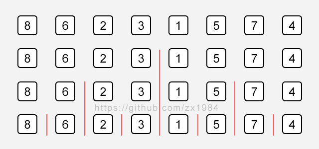
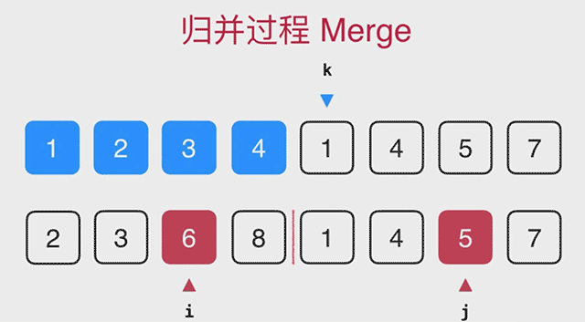

# 归并排序 Merge Sort

O(n*log n)的排序算法

#### # nlogn比n^2快多少?

|| n ^ 2 | n log n | faster |
| :-- | :-- | :-- | :-- |
| n = 10 | 100 | 33 | 3 |
| n = 100 | 1000 | 664 | 15 |
| n = 1000 | 10<sup>6</sup> | 9966 | 100 |
| n = 10000 | 10<sup>8</sup> | 132877 | 753 |
| n = 100000 | 10<sup>10</sup> | 1660964 | 6020 |

## 归并排序 Merge Sort





```c++
#include <iostream>
#include <algorithm>
#include "SortTestHelper"
#include "InsertionSort"

using namespace std;

// 将arr[l...mid]和arr[mid + 1 ...r]两个部分进行归并
template<typename T>
void __merge (T arr[], int l, int mid, int r) {
  // 分配一个临时空间，其大小为(r - l + 1)
  T aux[r-l+1];
  for (int i = l; i <= r; i++)
    aux[i-l] = arr[i];

  int i = l; j = mid + 1;
  for (int k = l; k <= r; k++) {
    // 判断索引的合法性
    if (i > mid) {
      arr[k] = aux[j-l];
      j++;
    }
    else if (j > r) {
      arr[k] = aux[i-l];
      i++;
    }
    // 再放心地比较两个数组开头的部分
    else if (aux[i-l] < aux[j-l]) {
      arr[k] = aux[i-l];
      i++;
    }
    else {
      arr[k] = aux[j-l]
      j++;
    }
  }
}

// 递归使用归并排序，对arr[l...r]的范围进行排序
template<typename T>
void __mergeSort (T arr[], int l, int r) {
  if (l >= r)
    return;

  int mid = (l + r) / 2; // 注意，当l、r足够大时，可能会溢出
  __mergeSort(arr, l, mid);
  __mergeSort(arr, mid + l, r);
  __merge(arr, l, mid, r);
}

template<typename T>
void mergeSort (T arr[], int n) {
  __mergeSort(arr, 0, n - 1);
}

int main () {
  int n = 50000;

  int* arr1 = SortTestHelper::generateRandomArray(n, 0, n);
  int* arr2 = SortTestHelper::copyIntArray(arr1, n);

  SortTestHelper::testSort("Insertion Sort", insertionSort, arr1, n);
  SortTestHelper::testSort("Merge Sort", mergeSort, arr2, n);

  delete[] arr1;
  delete[] arr2;

  cout<<endl;
  return 0;
}
```

结果：

```
# 仅供参考
Insertion Sort : 2.90219 s
Merge Sort : 0.013449 s
```

## 归并排序优化

```c++
int main () {
  int n = 50000;
  int swapTimes = 10;

  int* arr1 = SortTestHelper::generateNearlyOrderArray(n, swapTimes);
  int* arr2 = SortTestHelper::copyIntArray(arr1, n);
  // 生成一个几乎有序的数组
  SortTestHelper::testSort("Insertion Sort", insertionSort, arr1, n);
  SortTestHelper::testSort("Merge Sort", mergeSort, arr2, n);

  delete[] arr1;
  delete[] arr2;

  cout<<endl;
  return 0;
}
```

结果：

```
# 仅供参考
Insertion Sort : 0.001503 s
Merge Sort : 0.008155 s
```

#### # 优化一

```c++
// 递归使用归并排序，对arr[l...r]的范围进行排序
template<typename T>
void __mergeSort (T arr[], int l, int r) {
  if (l >= r)
    return;

  int mid = (l + r) / 2; // 注意，当l、r足够大时，可能会溢出
  __mergeSort(arr, l, mid);
  __mergeSort(arr, mid + l, r);
  // 优化，对近乎有序的数组效果明显
  if (arr[mid] > arr[mid + 1])
    __merge(arr, l, mid, r);
}
```

再次测试以上用例结果：

```
# 仅供参考
Insertion Sort : 0.000236 s
Merge Sort : 0.000675 s
```

#### # 优化二

加入插入排序...

## 自低向上归并排序 Merge Sort

```c++
template <typename T>
void mergeSortBU (T arr[], int n) {
  for (int size = 1; size <= n; size += size)
    for (int i = 0; i + size < n; i += size + size)
      // 对 arr[i...i+size-1] 和 arr[i+size...i+2*size-1] 进行归并
      __merge(arr, i, i + size - 1, min(i + size + size - 1, n - 1);
}
```

优点：未使用数组索引获取元素；可以很好的使用n log n 的时间对链表进行排序。

## Remark

笔记作者： zx1984

主页：https://github.com/zx1984
