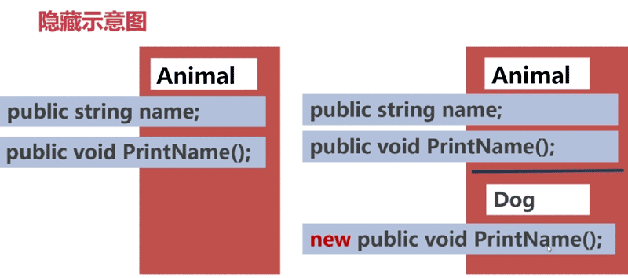
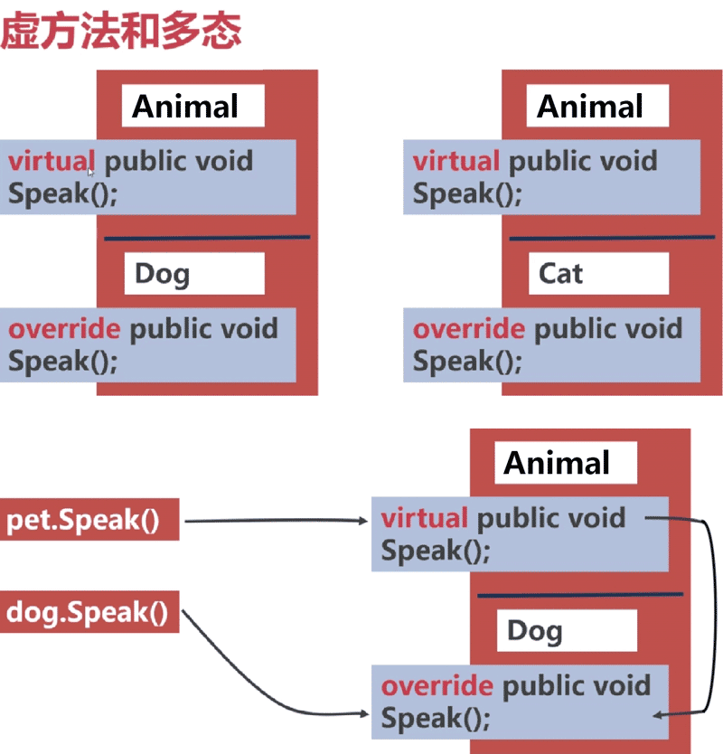

# 面向对象编程

特点：封装、继承、多态

优点：易维护、易扩展、易开发

### 继承

**实现继承：**一个类派生于另外一个基类，它拥有该基类的所有成员字段和函数（方法）。

```c#
class ChildClass:ParentClass
{
  ...
}
```

**特殊的基类**Object类是所有类的共同基类，它是唯一的非派生类，是继承层次结构的基础。对于其他类，父类和子类的概念都是相对的。

**规则**继承只有**单继承**，也就是只能继承一个父类。当然父类还可以继承自一个祖父类，直到**Object**类。

```c#
using System;
using System.Collections.Generic;
using System.Linq;
using System.Text;
using System.Threading.Tasks;

namespace ConsoleApplication3
{
    class Animal
    {
        public string name;
        public void printName()
        {
            Console.WriteLine("This animal is " + name);
        }
    }

    class Dog : Animal
    {
    }

    class Program
    {
        static void Main(string[] args)
        {
            Dog dog = new Dog();
            dog.name = "Dog";
            dog.printName();
        }
    }
}
```

**隐藏方法** 我们不能删除基类中的任何成员，但是可以用与基类成员**名称相同的成员**来**屏蔽基类成员**。

> 语法细节：

> 屏蔽数据成员：在派生类中声明**名称**和**类型**相同的成员。

> 屏蔽函数成员：在派生类中声明新的，带有相同函数签名的成员。

> 让编译器知道：可以添加**new**关键字，否则会有警告。



### 虚方法和多态

软件设计中有6种设计原则，和23种设计模式。

**一个设计原则**：

面向对象编程中，都遵循一个原则：**依赖倒置原则**。换句话说就是程序设计要依赖于**抽象类**（Animal），而不依赖于**具体类**（Dog）。

**基类的引用**：

派生类的对象包含基类部分和派生类部分，所以，我们可以通过一个基类类型的引用指向派生类。通过指向派生类的基类引用，我们仅仅能访问**派生类中的基类部分**。

```c#
class Animal
{
    public string name;
    public void printName()
    {
        Console.WriteLine("This animal is " + name);
    }
}

class Dog : Animal
{
}

class Cat:Animal
{
    new public void printName()
    {
        Console.WriteLine("This cat name is " + name);
    }
}

class Monkey:Animal
{
    new public void printName()
    {
        Console.WriteLine("This monkey name is " + name);
    }
}

class Program
{
    static void Main(string[] args)
    {
        Dog dog = new Dog();
        dog.name = "Tooon";
        dog.printName();

        Cat cat = new Cat();
        cat.name = "Lucy";
        cat.printName();
        
        Animal mk = new Monkey();
        mk.name = "Mooookey";
        mk.printName();
    }
}
```

结果：(注意Monkey的输出结果)

```
This animal is Tooon
This cat name is Lucy
This animal is Mooookey
```

**统一提高效率**（共性）

有时，我们需要一个容器（比如数组）来保存所有的基类（Animal），基类描述了共同的属性和行为，比如动物都有年龄、名字，都可以发出声音、活动、吃东西等。

**子类具有差异**（个性）

但是，基类又不能涵盖所有情况和变化，**统一的行为方法**往往在基类和派生类中**有所区别**。虽然所有的动物都能发出声音，但是发出的声音各不相同，有的甚至"不发出声音"。

**虚方法**：

声明为 `virtual` 的方法。基类的虚方法可以在派生类中使用 `override` 进行重写。

**多态**：

通过指向派生类的**基类引用**，调用虚函数，会根据引用所指向派生类的**实际类型**，调用派生类中的**同名重写**函数，便是多态。



```c#
using System;
using System.Collections.Generic;
using System.Linq;
using System.Text;
using System.Threading.Tasks;

namespace ConsoleApplication3
{
    class Animal
    {
        public string name;
        public void printName()
        {
            Console.WriteLine("This animal is " + name);
        }
        virtual public void speak()
        {
            Console.WriteLine(name + " is speaking");
        }
    }

    class Dog : Animal
    {
        override public void speak()
        {
            base.speak();
        }
    }

    class Cat : Animal
    {
        new public void printName()
        {
            Console.WriteLine("This cat name is " + name);
        }
        override public void speak()
        {
            Console.WriteLine(name + " is speaking: Miao miao ...");
        }
    }

    class Monkey : Animal
    {
        new public void printName()
        {
            Console.WriteLine("This monkey name is " + name);
        }
        override public void speak()
        {
            Console.WriteLine(name + " is speaking: Ji ji za za ...");
        }
    }

    class Program
    {
        static void Main(string[] args)
        {
            Dog dog = new Dog();
            dog.name = "Tooon";
            dog.printName();
            dog.speak(); 

            Cat cat = new Cat();
            cat.name = "Lucy";
            cat.printName();
            cat.speak();

            Animal mk = new Monkey();
            mk.name = "Mooookey";
            mk.printName();
            mk.speak();
        }
    }
}
```

运行结果：

```
This animal is Tooon
Tooon is speaking
This cat name is Lucy
Lucy is speaking: Miao miao ...
This animal is Mooookey
Mooookey is speaking: Ji ji za za ...
```

**关于虚方法的其他知识点**

* 重写虚方法必须具有相同的可访问性，且基类方法不能是private

* 不能重写static方法或者非虚方法

* 方法、属性、索引器、事件，都可以声明为virtual或override

```c#
using System;
using System.Collections.Generic;
using System.Linq;
using System.Text;
using System.Threading.Tasks;

namespace ConsoleApplication3
{
    class Animal
    {
        public string name;
        public void printName()
        {
            Console.WriteLine("This animal is " + name);
        }
        virtual public void speak()
        {
            Console.WriteLine(name + " is speaking");
        }
    }

    class Dog : Animal
    {
        // constructor
        public Dog(string newName)
        {
            name = newName;
        }
    }

    class Cat : Animal
    {
        public Cat(string newName)
        {
            name = newName;
        }
        override public void speak()
        {
            Console.WriteLine(name + " is speaking: Miao miao ...");
        }
    }

    class Monkey : Animal
    {
        public Monkey(string newName)
        {
            name = newName;
        }
        override public void speak()
        {
            Console.WriteLine(name + " is speaking: Ji ji za za ...");
        }
    }

    class Program
    {
        static void Main(string[] args)
        {
            Animal[] animals = { new Dog("Tooon"), new Cat("Lucy"), new Monkey("Jack")};
            Console.WriteLine("foreach ======================");
            foreach (Animal an in animals)
            {
                an.speak();
            }
            Console.WriteLine("for ======================");
            for (int i = 0; i < animals.Length; i++)
            {
                animals[i].speak();
            }
        }
    }
}
```

运行结果：

```
foreach ======================
Tooon is speaking
Lucy is speaking: Miao miao ...
Jack is speaking: Ji ji za za ...
for ======================
Tooon is speaking
Lucy is speaking: Miao miao ...
Jack is speaking: Ji ji za za ...
```

### 派生类及构造函数

**构造函数**

派生类对象中，有一部分是基类部分，在执行派生类的构造函数体之前，将会**隐式**或**显示**调用**基类构造函数**。


##### 调用基类的构造函数：

* 隐式调用

```c#
class MyDerived:BaseClass
{
  // 隐式调用基类构造函数
  MyDerived()
  {
    // constructor
  }
}
```

* 显示调用

```c#
class MyDerived:BaseClass
{
  // 显示调用基类构造函数base()
  MyDerived():base()
  {
    // constructor
  }
}
```

##### 调用当前类的其他构造函数

```c#
// 调用进行公共初始化的函数
Animal(int age, string name):this(name)
{
  // ...
}

// 构造函数的重载
Animal(string name)
{
  // ...
}
```

### 参考

https://www.imooc.com/learn/806
