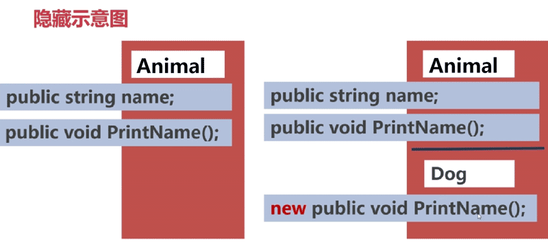
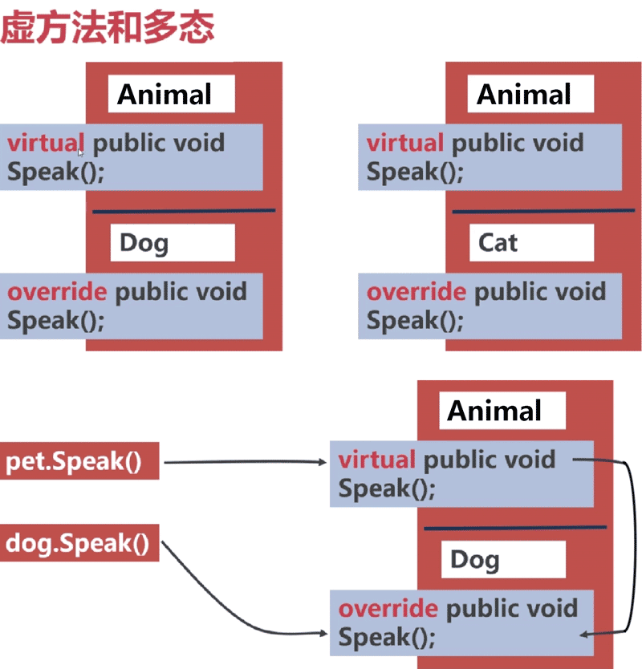

# C# 基础入门

C#(读作C Sharp)是微软公司发布的一种面向对象的、运行于.NET Framework和.NET Core(完全开源，跨平台)之上的高级程序设计语言。并定于在微软职业开发者论坛(PDC)上登台亮相。C#是微软公司研究员Anders Hejlsberg的最新成果。C#看起来与Java有着惊人的相似；它包括了诸如单一继承、接口、与Java几乎同样的语法和编译成中间代码再运行的过程。但是C#与Java有着明显的不同，它借鉴了Delphi的一个特点，与COM（组件对象模型）是直接集成的，而且它是微软公司 .NET windows网络框架的主角。

更多：https://baike.baidu.com/item/c%23

Visual Studio 2013 控制台程序代码示例:

```c-sharp
using System;
using System.Collections.Generic;
using System.Linq;
using System.Text;
using System.Threading.Tasks;

namespace ConsoleApplication//命名空间
{
    class Program//类
    {
        static void Main(string[] args)//Main方法，程序入口
        {
            Console.WriteLine("Hello World!");// 输出并换行
        }
    }
}
```

注意：代码中的`Console.WriteLine()`与`Console.Write()`区别，后者不换行，而前者会在打印之后换行。

### 快捷键

F5：代码调试，会自动关闭控制台

Ctrl+F5：运行，不自动关闭控制台

F9：添加或删除断点

F10：断点执行

### 关键字

关键字 `class` ，这个关键字的用途是声明类。比如上面例子中，类名叫做Program。

关键字 `namespace` ，这个关键字的用途是声明“命名空间”。比如上面例子中，命名空间叫做MyApp1。

关键字 `using` ，这个关键字的用途是导入命名空间。比如这句：`using System.Text;` 作用是导入System.Text命名空间中的类。

关键字 `static` (静态的)、 `void` (无返回值)、 `string` (字符串类型)。常常在Main()方法的声明中看到:static void Main(string[] args)

Main() 方法是 `C#` 中的特殊方法，是程序的入口，就是说，如果没有 `Main ()`方法，程序就无法启动。

**注意：你会发现，所有关键字都是由小写字母组成的，C#语言中，大小写是严格区分的。**

### 注释

**单行注释**的符号是2条斜线（请注意斜线的方向），2条斜线右侧的内容就是注释，左侧的代码不会受影响。

**多行注释**以`/*`开始，以`*/`结束，之间的内容就是注释，可以包含多行。

**文档注释**写在类、方法或属性（以后会学到）的前面，它的符号是3条斜线`///`。

### 常量

使用关键字 `const` 定义。

```c-sharp
const double PI = 3.1415926;
```

### 变量

```c-sharp
int number = 100;
double price = 99.99;
char gender = '男';
string name = "Jack";
bool isJack = true;

// 自动类型转换
// 低精度类型会自动转换为较高精度的类型
3.5 + 8; // 11.5

// 强制类型转换
// 无法自动转换为我们需要的类型，可以用强制类型转换
// double 型强制转换为int型将失去小数部分
int n = (int)9.5;// 9
```

### 标识符命名规则

程序中的变量名、常量名、类名、方法名，都叫做标识符。

标识符只能由**英文字母、数字和下划线**组成，不能包含空格和其他字符。

错误的标识符声明：

```c-sharp
string $user; //错在使用了其他字符
```

变量名不能用数字开头。

```c-sharp
double 6h;//错在用数字开头
```

不能用关键字当变量名。

```c-sharp
char static ;//错在用关键字static做变量名
```

### 运算符

算术运算符

```c-sharp
9 + 2.5; // 11.5
9 + "2.5"; // 92.5
15 - 20; // -5
0.8 * 3; // 2.4
2 / 0.5; // 4.0
5 / 10; // 0
19 / 5; // 3
19 % 5; // 4

int i = 0;
i++; // 0, i is 1
int j = 0;
++j; // 1
```

比较运算符

```c-sharp
int a = 1;
int b = 1;

a == b; // True
a != b; // False
a > b; // False
a < b; // False
a >= b; // True
a <= b; // True
```

逻辑运算符

```c-sharp
int x = 1;
int y = 2;
// 逻辑非
!(x > 0); // False
// 逻辑与
x > 0 && y > 0; // True
// 逻辑或
x > 3 || y > 3; // False
x == 1 || y == 1; // True
```

赋值运算符

```c-sharp
int x = 2;
x += 3; // 5

int y = 2;
y -= 3; // -1

int z = 2;
z *= 3; // 6

int i = 2;
i /= 2; // 1

int j = 2;
j %= 2; // 0
```

### 条件

if

```c-sharp
if () {
  // do something
} else {
  // do something
}
```

条件运算符

```
条件 ? 表达式 : 表达式
```

switch

```
switch(变量)
{
  case 1:
    // do something
    break;
  case 2:
    // do something
    break;
  case n:
    // do something
    break;
  default:
    // do ...
}
```

### 循环

while

```
while (条件) {}

do {} while(条件)
```

for

```c-sharp
for (int i = 0; i < 10; i++) {
  if (i == 5) continue;
  if (i >= 8) break;
  COnsole.Write(i + " ");
}
// 0 1 2 3 4 6 7
```

9-9乘法表

```c#
/*
1x1=1
1x2=2  2x2=4
1x3=3  2x3=6  3x3=9
1x4=4  2x4=8  3x4=12 4x4=16
1x5=5  2x5=10 3x5=15 4x5=20 5x5=25
1x6=6  2x6=12 3x6=18 4x6=24 5x6=30 6x6=36
1x7=7  2x7=14 3x7=21 4x7=28 5x7=35 6x7=42 7x7=49
1x8=8  2x8=16 3x8=24 4x8=32 5x8=40 6x8=48 7x8=56 8x8=64
1x9=9  2x9=18 3x9=27 4x9=36 5x9=45 6x9=54 7x9=63 8x9=72 9x9=81
*/
// double for
int n;
for (int i = 1; i <= 9; i++)
{
    for (int j = 1; j <= i; j++)
    {
        n = i * j;
        Console.Write("{0}x{1}={2} {3}", j, i, n, n < 10 ? " " : "");
        // 换行
        if (j == i) Console.WriteLine("");
    }
}
```

```c#
/*
0.....0
.0...0.
..0.0..
...0...
..0.0..
.0...0.
0.....0
*/
int len = 6;
for (int i = 0; i <= len; i++)
{
    for (int j = 0; j <= len; j++)
    {
        if (i == j || len - i ==j || len - j == i)
        {
            Console.Write("0");
        }
        else
        {
            Console.Write(".");
        }
    }
    Console.WriteLine("");
}
```

### 数组

一维数组

```c-sharp
int[] arr = new int[3];
arr[0] = 1;
arr[1] = 2;
arr[2] = 52;

int[] arr2 = new int[3]{ 1, 2, 3 };

int[] arr3 = new int[]{ 1, 2, 3 };
arr3.Length; // 3

int[] num = { 12, 54, 7, 65 };
foreach (int i in num)
{
    Console.WriteLine(i);
}
```

二维数组

```c-sharp
int[,] arr = new int[,]{{1, 3, 5}, {6, 7, 9}}; 
```

### 示例

```c-sharp
using System;
using System.Collections.Generic;
using System.Linq;
using System.Text;
using System.Threading.Tasks;

namespace ConsoleApplication2
{
    class Program
    {
        /**
         * 查找数组中的最大值
         */
        static void findMaxScore()
        {
            // 学生姓名
            string[] names = new string[] { "武松", "钱冬雨", "浮沉", "陈璐", "周鑫", "林日鹏", "何坤", "关欣" };
            // 考试成绩
            int[] scores = new int[] { 89, 90, 98, 56, 60, 91, 93, 85 };
            // 存储最大值变量
            int max = scores[0];
            // 最大值对应的索引
            int index = 0;
            for (int i = 1; i < scores.Length; i++)
            {
                if (scores[i] > max)
                {
                    max = scores[i];
                    index = i;
                }
            }
            Console.WriteLine("考试最好成绩是: {0} {1}分。", names[index], max);
        }
        
        static void Main(string[] args)
        {
            // 查找最大值
            findMaxScore();

            // 数组 foreach
            int[] num = { 12, 54, 7, 65 };
            foreach (int i in num)
            {
                Console.WriteLine(i);
            }
            
            // 用户输入交互
            string name;
            Console.WriteLine("please, enter your name.");
            // 获取用户输入
            name = Console.ReadLine();
            Console.WriteLine("Hello {0}", name);
        }
    }
}
```

# 面向对象编程

特点：封装、继承、多态

优点：易维护、易扩展、易开发

### 继承

**实现继承：**一个类派生于另外一个基类，它拥有该基类的所有成员字段和函数（方法）。

```c#
class ChildClass:ParentClass
{
  ...
}
```

**特殊的基类**Object类是所有类的共同基类，它是唯一的非派生类，是继承层次结构的基础。对于其他类，父类和子类的概念都是相对的。

**规则**继承只有**单继承**，也就是只能继承一个父类。当然父类还可以继承自一个祖父类，直到**Object**类。

```c#
using System;
using System.Collections.Generic;
using System.Linq;
using System.Text;
using System.Threading.Tasks;

namespace ConsoleApplication3
{
    class Animal
    {
        public string name;
        public void printName()
        {
            Console.WriteLine("This animal is " + name);
        }
    }

    class Dog : Animal
    {
    }

    class Program
    {
        static void Main(string[] args)
        {
            Dog dog = new Dog();
            dog.name = "Dog";
            dog.printName();
        }
    }
}
```

**隐藏方法** 我们不能删除基类中的任何成员，但是可以用与基类成员**名称相同的成员**来**屏蔽基类成员**。

> 语法细节：

> 屏蔽数据成员：在派生类中声明**名称**和**类型**相同的成员。

> 屏蔽函数成员：在派生类中声明新的，带有相同函数签名的成员。

> 让编译器知道：可以添加**new**关键字，否则会有警告。



### 虚方法和多态

软件设计中有6种设计原则，和23种设计模式。

**一个设计原则**：

面向对象编程中，都遵循一个原则：**依赖倒置原则**。换句话说就是程序设计要依赖于**抽象类**（Animal），而不依赖于**具体类**（Dog）。

**基类的引用**：

派生类的对象包含基类部分和派生类部分，所以，我们可以通过一个基类类型的引用指向派生类。通过指向派生类的基类引用，我们仅仅能访问**派生类中的基类部分**。

```c#
class Animal
{
    public string name;
    public void printName()
    {
        Console.WriteLine("This animal is " + name);
    }
}

class Dog : Animal
{
}

class Cat:Animal
{
    new public void printName()
    {
        Console.WriteLine("This cat name is " + name);
    }
}

class Monkey:Animal
{
    new public void printName()
    {
        Console.WriteLine("This monkey name is " + name);
    }
}

class Program
{
    static void Main(string[] args)
    {
        Dog dog = new Dog();
        dog.name = "Tooon";
        dog.printName();

        Cat cat = new Cat();
        cat.name = "Lucy";
        cat.printName();
        
        Animal mk = new Monkey();
        mk.name = "Mooookey";
        mk.printName();
    }
}
```

结果：(注意Monkey的输出结果)

```
This animal is Tooon
This cat name is Lucy
This animal is Mooookey
```

**统一提高效率**（共性）

有时，我们需要一个容器（比如数组）来保存所有的基类（Animal），基类描述了共同的属性和行为，比如动物都有年龄、名字，都可以发出声音、活动、吃东西等。

**子类具有差异**（个性）

但是，基类又不能涵盖所有情况和变化，**统一的行为方法**往往在基类和派生类中**有所区别**。虽然所有的动物都能发出声音，但是发出的声音各不相同，有的甚至"不发出声音"。

**虚方法**：

声明为 `virtual` 的方法。基类的虚方法可以在派生类中使用 `override` 进行重写。

**多态**：

通过指向派生类的**基类引用**，调用虚函数，会根据引用所指向派生类的**实际类型**，调用派生类中的**同名重写**函数，便是多态。



```c#
using System;
using System.Collections.Generic;
using System.Linq;
using System.Text;
using System.Threading.Tasks;

namespace ConsoleApplication3
{
    class Animal
    {
        public string name;
        public void printName()
        {
            Console.WriteLine("This animal is " + name);
        }
        virtual public void speak()
        {
            Console.WriteLine(name + " is speaking");
        }
    }

    class Dog : Animal
    {
        override public void speak()
        {
            base.speak();
        }
    }

    class Cat : Animal
    {
        new public void printName()
        {
            Console.WriteLine("This cat name is " + name);
        }
        override public void speak()
        {
            Console.WriteLine(name + " is speaking: Miao miao ...");
        }
    }

    class Monkey : Animal
    {
        new public void printName()
        {
            Console.WriteLine("This monkey name is " + name);
        }
        override public void speak()
        {
            Console.WriteLine(name + " is speaking: Ji ji za za ...");
        }
    }

    class Program
    {
        static void Main(string[] args)
        {
            Dog dog = new Dog();
            dog.name = "Tooon";
            dog.printName();
            dog.speak(); 

            Cat cat = new Cat();
            cat.name = "Lucy";
            cat.printName();
            cat.speak();

            Animal mk = new Monkey();
            mk.name = "Mooookey";
            mk.printName();
            mk.speak();
        }
    }
}
```

运行结果：

```
This animal is Tooon
Tooon is speaking
This cat name is Lucy
Lucy is speaking: Miao miao ...
This animal is Mooookey
Mooookey is speaking: Ji ji za za ...
```
