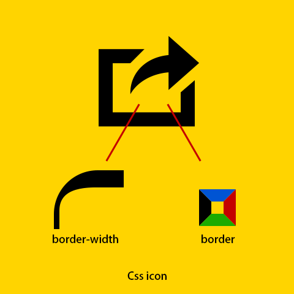
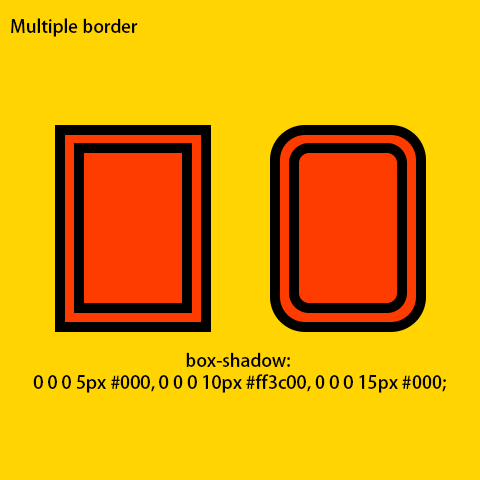
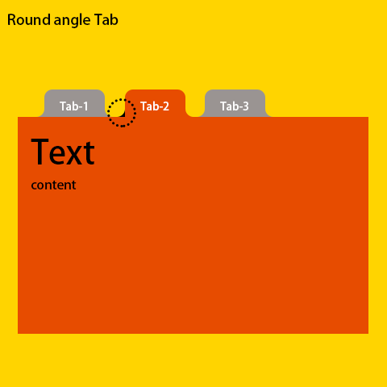
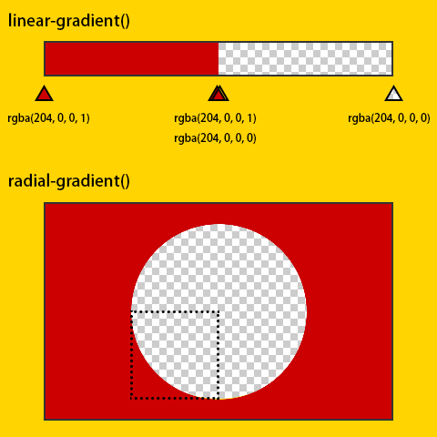

# 重拾CSS的乐趣

### # Css icon



```html
<style>
.css-icon {
  position:relative;
  margin: 50px;
  width: 150px;
  height:126px;
  border-left: 23px solid #000;
  border-bottom: 23px solid #000;
  box-sizing: border-box;
}

.css-icon:before {
  position: absolute;
  top: 0;
  left: 0;
  width: 34px;
  border-top: 23px solid #000;
  border-right: 23px solid transparent;
  content: '';
}

.css-icon:after {
  position: absolute;
  bottom: 0;
  right: 0;
  height: 20px;
  border-right: 23px solid #000;
  border-top: 23px solid transparent;
  content: '';
}

.css-icon .olecranon {
  position: relative;
  width: 97px;
  height: 100px;
  overflow: hidden;
}

.css-icon .olecranon:before {
  position: absolute;
  top: 17px;
  left: 28px;
  width: 130px;
  height:100px;
  border-top: 35px solid #000;
  border-left: 0;
  border-radius: 63px;
  content:'';
}

.css-icon .triangle {
  position: absolute;
  top: -7px;
  left: 97px;
  border-left: 40px solid #000;
  border-top: 43px solid transparent;
  border-bottom: 43px solid transparent;
}
</style>

<div class="css-icon">
  <div class="olecranon"></div>
  <div class="triangle"></div>
</div>
```

### # 元素的多重边框效果



box-shadow

```html
<style>
.mult-border {
  margin: 50px;
  width: 118px;
  height:170px;
  background-color: #ff3c00;
  border-radius:20px;
  box-shadow: 0 0 0 10px #000, 0 0 0 20px #ff3c00, 0 0 0 30px #000;
}
</style>

<div class="mult-border"></div>
```

outline
outline-offset 目前不能解决圆角问题

### # css 内凹圆角





radial-gradient() 径向渐变

```html
<style>
.tab-wrapper {
  margin: 50px;
  width:480px;
}

.tab-wrapper .tab-group {
  margin: 0 0 0 10px;
  padding: 0;
  height: 34px;
  list-style: none;
}

.tab-wrapper .tab-group .tab {
  display: inline-block;
  position: relative;
  margin: 0 10px;
}

.tab-wrapper .tab-group .tab .text {
  display: block;
  text-align: center;
  width: 75px;
  height: 34px;
  line-height: 34px;
  color: #fff;
  font-size: 14px;
  background-color: #9a9492;
  border-radius: 10px 10px 0 0;
  text-decoration: none;
}

.tab-wrapper .tab-group .tab .concave-corner {
  position: absolute;
  bottom: 0;
  width: 10px;
  height: 10px;
  overflow: hidden;
}

.tab-wrapper .tab-group .tab .concave-corner:after {
  position: absolute;
  bottom: 0;
  width: 20px;
  height: 20px;
  background: radial-gradient(circle 20px, rgba(154, 148, 146, 0) 0, rgba(154, 148, 146, 0) 9px, rgba(154, 148, 146, 1) 10px);
  content: '';
}

.tab-wrapper .tab-group .tab .concave-corner.l {
  left: -10px;
}

.tab-wrapper .tab-group .tab .concave-corner.l:after {
  right: 0;
}

.tab-wrapper .tab-group .tab .concave-corner.r {
  right: -10px;
}

.tab-wrapper .tab-group .tab .concave-corner.r:after {
  left: 0;
}

.tab-wrapper .tab-group .tab.active .text {
  background-color: #e74c00;
}

.tab-wrapper .tab-group .tab.active .concave-corner:after {
  background: radial-gradient(circle 20px, rgba(231, 76, 0, 0) 0, rgba(231, 76, 0, 0) 9px, rgba(231, 76, 0, 1) 10px);
}
</style>

<div class="tab-wrapper">
  <ul class="tab-group">
    <li class="tab">
      <a href="javascript:;" class="text">Tab-1</a>
      <div class="concave-corner l"></div>
      <div class="concave-corner r"></div>
    </li>
    <li class="tab active">
      <a href="javascript:;" class="text">Tab-2</a>
      <div class="concave-corner l"></div>
      <div class="concave-corner r"></div>
    </li>
    <li class="tab">
      <a href="javascript:;" class="text">Tab-3</a>
      <div class="concave-corner l"></div>
      <div class="concave-corner r"></div>
    </li>
  </ul>
</div>
```

扩展：
linear-gradient()


### # 备注

笔记作者： Capricorncd

主页：https://github.com/capricorncd

原讲师：CSS魔法

出处：https://www.imooc.com/learn/588
