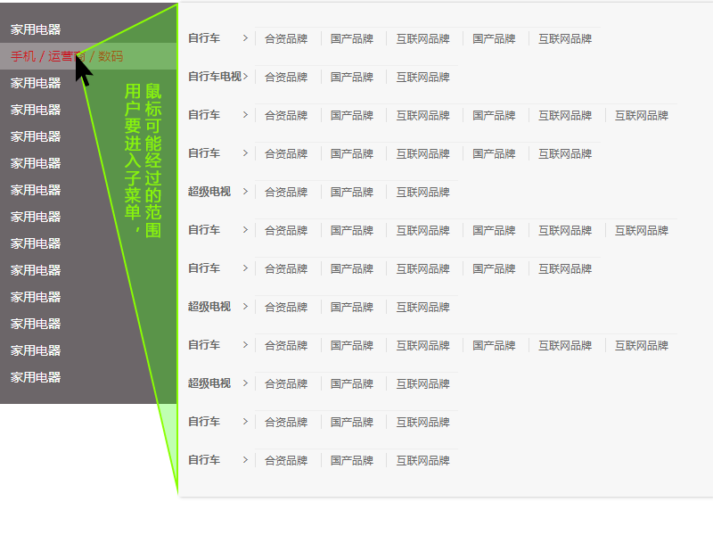
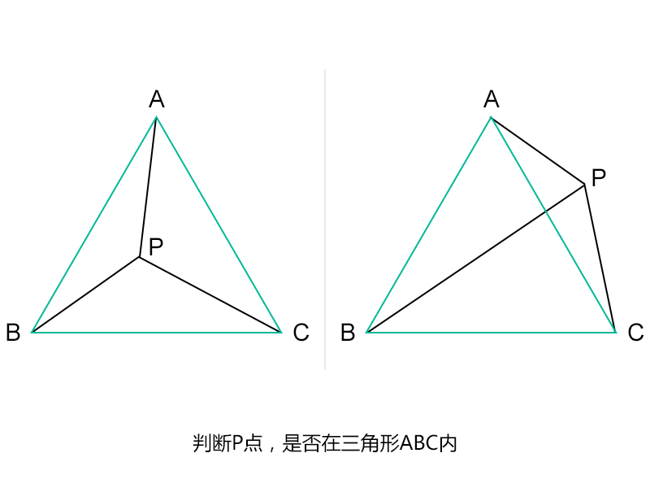

# 京东商品分类无延时菜单

## # 基本DOM结构

* 略（请看源码）

## # 开发普通的二级菜单

* 事件代理方式进行绑定

* mouseenter和mouseover的区别：

  使用mouseover/mouseout时，如果鼠标移动到子元素上，即便没有离开父元素，也会触发父级的mouseout事件；

  使用mouseenter/mouseleave时，如果鼠标没有离开父元素，在其子元素上任意移动，都不会触发mouseleave事件。

## # 加入延迟（第一轮优化）

```javascript
// 问题 1
移动鼠标至子项时容易触发其他菜单，
必须保证水平沿当前菜单移动，才不会触发其他菜单
```

* 切换子菜单的时候，用setTimeout设置延迟

* debounce 去抖技术

  在事件被频繁触发时，只执行最后一次处理。

## # 基于用户行为预测的切换技术（第二轮优化）

```
问题 2
利用debounce去抖技术，带来新的体验问题——延迟（卡顿）严重
```

* 跟踪鼠标的移动

* 用鼠标当前位置，和鼠标上一次位置，与子项DOM容器上下边缘形成的三角形区域进行比较



#### 如何比较

* 向量： Vab = Pb - Pa

* 二维向量叉乘公式

  a(x1,y1) * b(x2,y2) = x1\*y2 - x2\*y1

* 用插乘法判断点在三角形内



#### 最终效果

* 鼠标自然的移动和点击到子项

* 切换时无延迟

## # 备注

笔记作者： Capricorncd

主页：https://github.com/capricorncd

原讲师：呵呵SN

出处：https://www.imooc.com/learn/829
