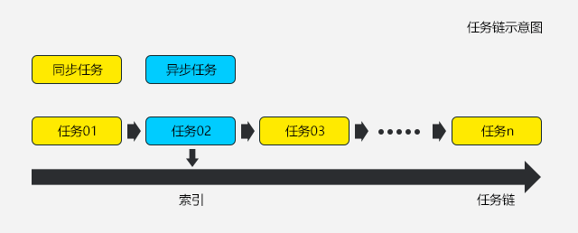

# JavaScript 帧动画库

**帧动画**，就是在“连续的关键帧”中分解动画动作，也就是在时间轴的每帧上逐帧绘制不同的内容，使其连续播放而形成动画。

**帧动画**具有非常大的灵活性，几乎可以表现任何想表现的内容。

## JavaScript实现帧动画的原理

1. 如果有多张帧图片，用一个image标签去承载图片，定时改变image的src属性（不推荐）。

> 每次改变src属性，将从新发起一下http请求

2. 把所有动画关键帧绘制在一张图片上，把图片作为元素的background-image，定时改变元素的background-position属性（推荐）。

> 请求一次

## 设计一个帧动画库

需求分析 -> 编程接口 -> 调用方式 -> 代码设计

#### # 需求分析

* 支持图片**预加载**

* 支持**2种**动画播放方式，及**自定义**每帧动画

* 支持**单组**动画控制循环次数（可支持无限次循环）

* 支持一组动画完成后，进行下一组动画（支持不同动画切换）

#### # 编程接口

* loadImage(imgs) // 图片预加载

* changePosition(el, position, imgUrl) // 通过改变元素的background-position实现动画

* changeSrc(el, imgs) // 通过改变img的src属性

* enterFrame(callback) // 每一帧动画执行的函数，相当于用户可以自定义每一帧动画的callback

* repeat(times) // 动画重复执行(循环)的次数，times为空时表示无限循环

* wait(msec) // 每个动画执行完后的等待时间msec

* then(callback) // 动画执行完成后的回调函数

* start(interval) // 动画开始执行，interval表示动画每帧切换的间隔

* pause() // 动画暂停

* restart() // 动画从上一次暂停位置，重新执行

* dispose() // 释放资源

#### # 调用方式

怎样让使用者用得爽？

* 支持链式调用，我们期望**动词的方式**描述接口，调用方式入下：

```javascript
var anime = require('animation')
var demo = anime()
  .loadImage(imgs)
  .changePosition(el, position)
  .repeat(2)
  .then(function () {
    // 动画执行完成后调用此函数
  })

demo.start(80)
```

#### # 代码设计

* 我们把“图片预加载 -> 动画执行 -> 动画结束”等一系列操作看成一条**任务链(数组)**

> 任务链有两种类型的任务

> a. 同步执行完毕的

> b. 异步定时执行的(通过计时器或者raf)

* 记录当前任务链的索引

* 每个任务执行完毕后，通过调用next()方法，执行下一个任务，同时更新任务链索引值

#### # 链式调用(任务链)图解



## 备注

原讲师：ustbhuangyi

视频地址：https://www.imooc.com/learn/659

Create by Capricorncd

https://github.com/capricorncd


