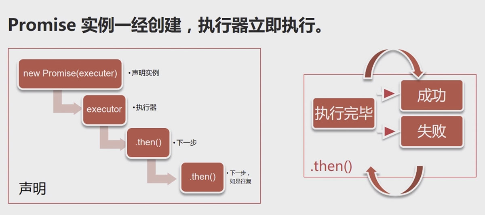

# Promise

英 `[ˈprɒmɪs]` 美 `[ˈprɑ:mɪs]`

vt. 允诺，许诺;给人以…的指望或希望

vi. 许诺;有指望，有前途

n. 许诺;希望，指望;允诺的东西

## 解释

#### # MDN

Promise对象用于异步计算。

一个Promise表示一个现在、将来或永远不可能出现的值。

#### # 按照用途来解释

主要用于异步计算

可以将异步操作队列化，按照期望的顺序执行，返回符合预期的结果。

可以在对象之间传递和操作Promise，帮助我们处理队列。

## Promise诞生原因

#### # JavaScript包含大量的异步操作。

JavaScript为检查表单而生。

创造它的首要目标是操作DOM。

所有，JavaScript的操作大多是异步的。

```
异步操作可以避免页面冻结！
```

#### # 异步操作的常见语法

* 事件监听与响应

```js
const el = document.getElementById('Start')
el.addEventListener('click', start, false)

function start () {
  // 响应事件，进行相应操作
}

// jQuery用'.on()'也是事件监听
$('#Start').on('click', start)
```

* 回调

```
$.ajax('http://url.cn', {
  success: function (res) {
    // 回调处理
  }
})
```

#### # 浏览器中的JavaScript

* 异步操作以事件为主

* 回调主要出现在Ajax和File Api

* 这个时候的问题尚不严重

#### # 有了Node.js之后

对异步的依赖进一步加剧了...

* 无阻塞高并发，是Node.js的招牌

* 异步操作是其保障

* 大量操作依赖回调函数( 暴露出回调的问题 )

* 稍有不慎，就会踏入“回调地狱”

#### # 回调有四个问题

* 嵌套层次很深，难以维护

* 无法正常使用return 和 throw（异步函数不在同一个堆栈）

* 无法正常检索堆栈信息（每次回调都是在一个系统层面的一个新的堆栈）

* 多个回调之间难以建立联系（一个回调一旦启动，我们就再没办法对他进行操作）

## Promise 详解

#### # 栗子

```js
new Promise(
  /* 执行器 executor */
  function (resolve, reject) {
    // 一段耗时很长的异步操作

    resolve() // 数据处理完成

    reject() // 数据处理出错
  }
)
.then(function A () {
  // 成功，下一步
}, function B () {
  // 失败，做相应处理
})
```

Promise 是一个代理对象，它和原先进行的操作并无关系。我们只是把原先的操作放到了执行器executor里面而已。

它通过引入一个回调，避免更多的回调。它可以把一个回调展开，全部基于Promise自己的回调。

#### # Promise有3个状态

* pending 【待定】初始状态

* fulfilled 【实现】 操作成功

* reject 【被否决】 操作失败

Promise状态发生改变，就会触发.then()里面的响应函数处理后续步骤

Promise 状态一经改变，不会再变。




## 备注

讲师：Meathill

视频讲解： https://www.imooc.com/learn/949
