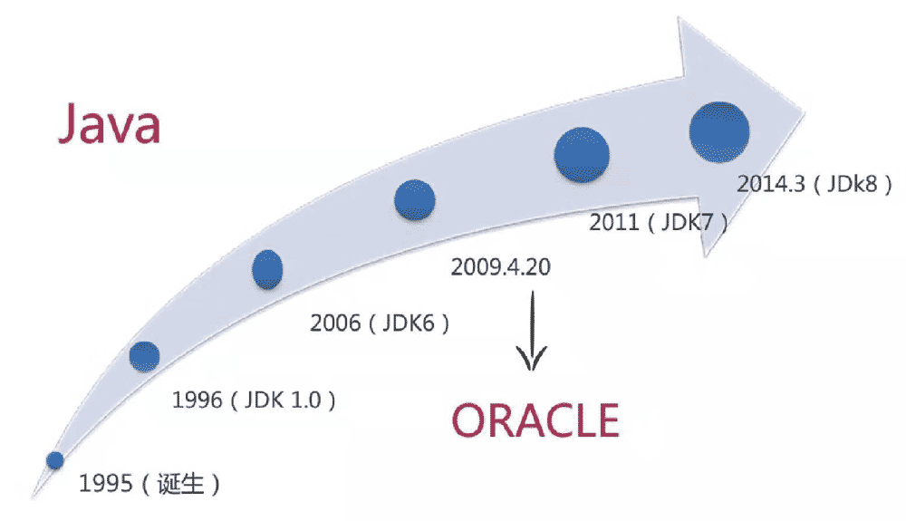
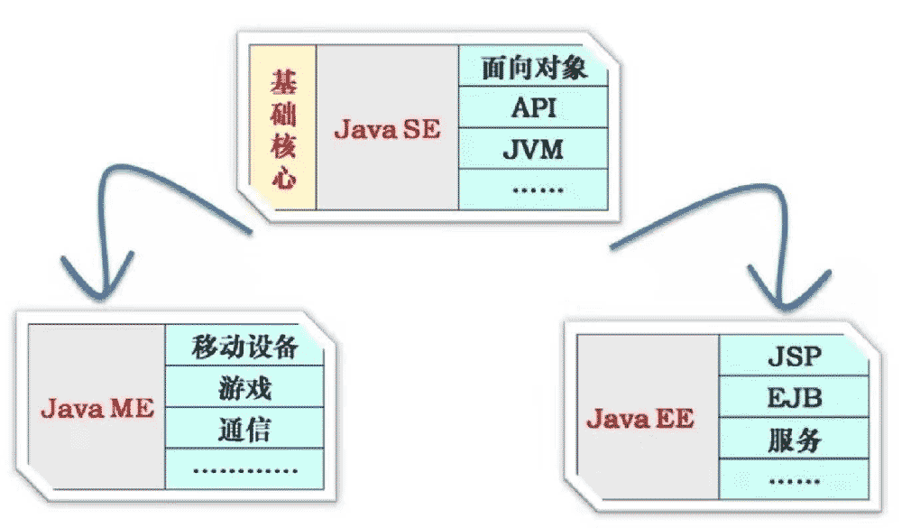
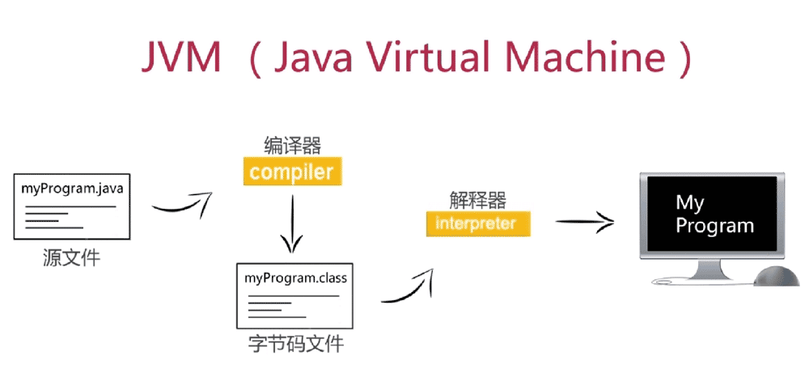
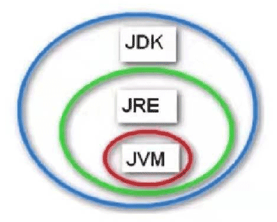
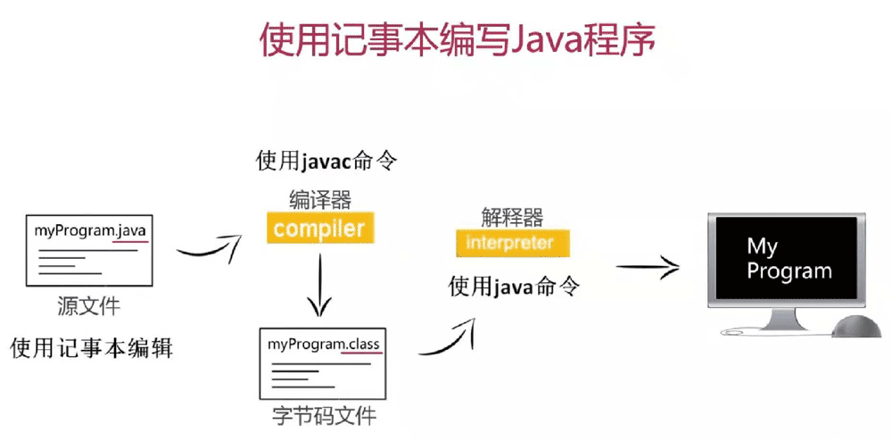

# Java

* Java平台应用

* 核心概念：JVM/JDK/JRE

* 搭建Java开发环境

* 使用工具开发Java程序



1995由Sun公司推出，2009被Oracle收购。

### Java平台应用



### 核心概念：JVM/JDK/JRE

JVM: Java Virtual Machine



JDK: Java Development Kit (Java开发工具包)

JRE: Java Runtime Environment (Java运行时环境)



### Java 开发环境搭建

* 安装JDK

https://www.oracle.com/technetwork/java/javase/downloads/index.html

JDK8

https://www.oracle.com/technetwork/java/javase/downloads/jdk8-downloads-2133151.html

库文件，以`.jar`结尾

* window 10 配置环境变量（系统变量）

```bash
# 配置JDK安装路径
JAVA_HOME
C:\Program Files\Java\jdk1.8.0_172

# 配置类库文件的位置
CLASSPATH
.;%JAVA_HOME%\lib\dt.jar;%JAVA_HOME%\lib\tools.jar

# 配置JDK命令文件的位置
path
C:\ProgramFiles\Java\jdk1.8.0_172\bin
C:\Program Files\Java\jdk1.8.0_172\bin\jre\bin
```

* Mac

直接装`jdk-8u201-macosx-x64.dmg`就可以了。

### 使用工具开发Java程序



HelloWorld.java

```java
public class HelloWorld {
  public static void main(String[] args) {
    System.out.println("Welcome to Java world.");
  }
}
```

使用bash，找到文件路径，执行

```bash
javac HelloWorld.java
```

此时，会在当前位置生产一个HelloWorld.class的字节码文件。

```bash
# 执行字节码文件，注意不能跟后缀名.class
java HelloWorld
# Welcome to Java world.
```

