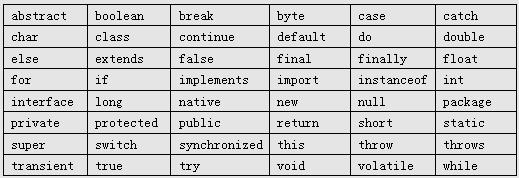

# 变量与常量

### Java关键字



Java 关键字是区分`大小写`

### Java标识符

标识符就是用于给 Java 程序中`变量`、`类`、`方法`等命名的符号。

使用标识符时，需要遵守几条规则：

1. 标识符可以由字母、数字、下划线（_）、美元符（$）组成，但不能包含 @、%、空格等其它特殊字符，不能以数字开头。譬如：123name 就是不合法。

2. 标识符不能是 Java 关键字和保留字（ Java 预留的关键字，以后的升级版本中有可能作为关键字），但可以包含关键字和保留字。如：不可以使用 void 作为标识符，但是 Void 可以。

3. 标识符是`严格区分大小写`的。

4. 标识符的命名最好能反映出其作用，做到`见名知意`。

### 变量

在 Java 中，我们通过三个元素描述变量：`变量类型`、`变量名`以及`变量值`。

```java
int a = 30;
String b = "this is String";
```

通常：

1. 变量名由`多单词`组成时，第一个单词的`首字母小写`，其后单词的`首字母大写`，俗称`骆驼式`命名法（也称`驼峰`命名法），如 createUserInfo。

2. 变量命名时，尽量简短且能清楚的表达变量的作用，做到见名知意。如：定义变量名 `studentName` 保存“学生姓名”信息。

3. Java 变量名的长度没有限制，但 Java 语言是区分大小写的，所以`price`和`Price` 是两个完全不同的变量！

```java
public class HelloWorld {
  public static void main(String[] args) {
    int hobby = 9999;
    System.out.println(hobby);
  }
}
```

### Java中的数据类型

Java 语言是一种`强类型`语言。通俗点说就是，在 Java 中存储的数据都是有类型的，而且必须在编译时就确定其类型。 Java 中有两类数据类型：


在 Java 的领域里，`基本数据类型`变量存的是`数据本身`，而`引用类型`变量存的是保存数据的`空间地址`。

|数据类型|说明|字节|应用|示例|
|:--|:--|:--|:--|:--|
|int|整型|4|整数，如年龄/个数等|int age=21;|
|double|双精度浮点型|8|小数，如商品价格/成绩平均分等|double price=21.5;|
|float|单精度浮点型|4|小数，如身高等|float height=180.3f;|
|char|字符型|2|单个字符，如性别`男`/`女`|char gander='男';|
|boolean|布尔型|1|表示真`true`或假`false`|boolean flag=true;|

> float变量赋值时，在数值后面添加字母`f`。

> char变量赋值时，使用单引号`'`。

### Java中变量的使用规则

1. Java 中的变量需要先声明后使用

2. 变量使用时，可以声明变量的同时进行初始化

3. 变量中每次只能赋一个值，但可以修改多次

4. main 方法中定义的变量必须先赋值，然后才能输出

```java
String a;
System.out.println(a); // error
```

5. 虽然语法中没有提示错误，但在实际开发中，变量名不建议使用中文，容易产生安全隐患。譬如后期跨平台操作时出现乱码等等。

### Java中的自动类型转换

自动类型转换:

```java
int a = 89;
double b = a;
System.out.println(b); // 89.0
```

自动类型转换是需要满足特定的条件:

1. 目标类型能与源类型兼容，如 double 型兼容 int 型，但是 char 型不能兼容 int 型。

2. 目标类型大于源类型，如 double 类型长度为 8 字节， int 类型为 4 字节，因此 double 类型的变量里直接可以存放 int 类型的数据，但反过来就不可以。

### Java中的强制类型转换

```java
double average = 74.9;
int average2 = (int)average;
System.out.println(average); // 74.9
System.out.println(average2); // 74
```

> 强制类型转换可能会造成数据的丢失

### Java常量的应用

语法

```java
final 常量名 = 值;
```

程序中使用常量可以提高代码的`可维护性`。

常量名一般使用`大写字符`。

### Java中使用注释

在编写程序时，经常需要添加一些注释，用以描述某段代码的作用。

一般来说，对于一份规范的程序源代码而言，注释应该占到源代码的 1/3 以上。因此，注释是程序源代码的重要组成部分。

Java 中注释有三种类型：`单行注释`、`多行注释`、`文档注释`。

```java
package com.test
/**
 * 这是文档注释
 * @author authorName
 * @version v1.0.0
 */
public class TestDemo {
  /*
   * 这是多行注释
   * 可以包含多行内容
   */
  public static void main(String[] args) {
    // 这是单行注释
    System.out.println("Hello World");
  }
}
```

我们可以通过 javadoc 命令从文档注释中提取内容，生成程序的 API 帮助文档。

```bash
javadoc -d doc TestDemo.java
```

使用文档注释时还可以使用 javadoc 标记，生成更详细的文档信息：

```
@author 标明开发该类模块的作者

@version 标明该类模块的版本

@see 参考转向，也就是相关主题

@param 对方法中某参数的说明

@return 对方法返回值的说明

@exception 对方法可能抛出的异常进行说明
```

