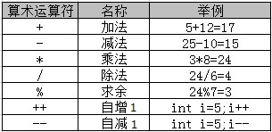
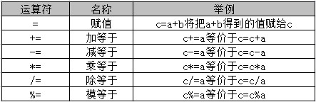
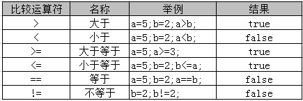
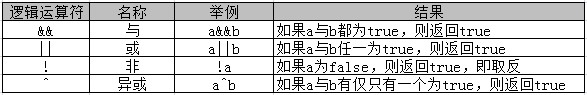

# 运算符

* 算术运算符

* 赋值运算符

* 比较运算符

* 逻辑运算符

* 条件运算符

### 算术运算符

算术运算符主要用于进行基本的算术运算，如加法、减法、乘法、除法等。



### 赋值运算符

赋值运算符是指为变量或常量指定数值的符号。如可以使用 “=” 将右边的表达式结果赋给左边的操作数。



### 比较运算符

比较运算符用于判断两个数据的大小，例如：大于、等于、不等于。比较的结果是一个布尔值（ true 或 false ）。



1. `>`、`<`、`>=`、`<=` 只支持左右两边操作数是`数值`类型

2. `==`、`!=` 两边的操作数既可以是`数值`类型，也可以是`引用`类型

### 逻辑运算符

逻辑运算符主要用于进行逻辑运算。Java 中常用的逻辑运算符如下表所示：



我们可以从“投票选举”的角度理解逻辑运算符：

1、 与：要求所有人都投票同意，才能通过某议题

2、 或：只要求一个人投票同意就可以通过某议题

3、 非：某人原本投票同意，通过非运算符，可以使其投票无效

4、 异或：有且只能有一个人投票同意，才可以通过某议题

当使用逻辑运算符时，我们会遇到一种很有趣的“短路”现象。

譬如：( one > two ) && ( one < three ) 中，如果能确定左边 one > two 运行结果为 false , 则系统就认为已经没有必要执行右侧的 one < three 啦。

同理，在( one > two ) || ( one < three ) 中，如果能确定左边表达式的运行结果为 true , 则系统也同样会认为已经没有必要再进行右侧的 one < three 的执行啦！

### 条件运算符

条件运算符（ ? : ）也称为 “三元运算符”。

语法形式：

```
布尔表达式 ？表达式1 ：表达式2
```

### 运算符的优先级

所谓优先级，就是在表达式中的运算顺序。

|优先级|运算符|
|:--|:--|
|1|`()`|
|2|`! +正 -负 ++ --`|
|3|`* / %`|
|4|`+加 -减`|
|5|`< <= > >=`|
|6|`== !=`|
|7|`^`|
|8|`&&`|
|9|`\|\|`|
|10|` ? : `三元运算符|
|11|`= += -= *= /= %=`|

级别为 `1` 的优先级最高，级别 `11` 的优先级最低。

```java
( 11+ 3* 8 ) / 4 % 3; // 2
```
