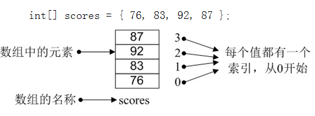

# 数组

```java
int[] scores = { 1, 2, 3, 4, 5, 6, 7 }
System.out.println(scores[2]); // 3
```



### 声明和初始化赋值

1. 声明数组

    语法：  `数据类型[ ] 数组名`；

    或者   `数据类型 数组名[ ]`；

    其中，数组名可以是任意合法的变量名，如：

    ```java
    // 存储学生成绩的数组，类型为整型
    int[] scores;
    // 存在身高的数组，类型为浮点型
    double height[];
    // 存储学生姓名的数组，类型为字符串
    String[] names;
    ```

2. 分配空间

   简单地说，就是指定数组中最多可存储多少个元素

   语法：  `数组名 = new  数据类型 [ 数组长度 ]`;

   其中，数组长度就是数组中能存放元素的个数，如：

    ```java
    scores = new int[5];
    height = new double[5];
    names = new String[5];
    ```

    也可以将上面的两个步骤合并，在声明数组的同时为它分配空间

    ```java
    int[] scores = new int[5];
    ```

3. 赋值

    ```java
    scores[0] = 100;
    scores[1] = 99;
    ```

4. 处理数组中数据

    ```java
    System.out.println(scores[1]); // 99
    ```

    同时声明数组、分配空间和赋值：

    ```java
    int[] scores = {89, 90, 100, 78};
    ```

```java
public class HelloWorld {
    public static void main(String[] args) {
    // 定义一个长度为5的字符串数组，保存考试科目信息
    String[] subjects = new String[5];
    // 分别为数组中的元素赋值
    subjects[0] = "Oracle";
    subjects[1] = "PHP";
    subjects[2] = "Linux";
    subjects[3] = "Java";
    subjects[4] = "HTML";
    System.out.println("数组中第4个科目为：" + subjects[3]);
  }
}
```

例子：

```java
// error:
// Cannot define dimension expressions when an array initializer is provided
int[ ] score = new int[ 4 ] { 90, 12, 34, 77 };

// error:
// Variable must provide either dimension expressions
// or an array initializer
int[ ] score = new int[ ];

// right
int score[ ] = new int[ ] { 34, 90, 87, 54, 24 };
```

### 循环操作

```java
int[] arr = { 34, 53, 98, 23};
for (int i = 0; i < arr.length; i++) {
  System.out.println("arr["+ i +"]=" + arr[i]);
}
```

`数组名.length`  用于获取数组的长度。

数组下标的范围是 `0` 至 `数组长度-1` ，如果越界访问，就会报错。

```
// Array.java
Exception in thread "main" java.lang.ArrayIndexOutOfBoundsException: 4
	at com.array.Array.main(Array.java:15)
```

练习：

`输出数组中的最大值、最小值和平均值`

```java
public class Array {
    public static void main(String[] args) {
        // 定义一个整型数组，并赋初值
        int[] nums = new int[] { 61, 23, 4, 74, 13, 148, 20 };

        int max = nums[0]; // 假定最大值为数组中的第一个元素
        int min = nums[0]; // 假定最小值为数组中的第一个元素
        double sum = 0;// 累加值
        double avg = 0;// 平均值

        for (int i = 0; i < nums.length; i++) { // 循环遍历数组中的元素
            // 如果当前值大于max，则替换max的值
            if (i > 0 && nums[i] > max) {
                max = nums[i];
            }
            // 如果当前值小于min，则替换min的值
            if (i > 0 && nums[i] < min) {
                min = nums[i];
            }
            // 累加求和
            sum += nums[i];
        }
        // 求平均值
        avg = sum / nums.length;
        System.out.println("数组中的最大值：" + max);
        System.out.println("数组中的最小值：" + min);
        System.out.println("数组中的平均值：" + avg);
    }
}
```

### 使用 Arrays 类操作 Java 中的数组

`Arrays` 类是 Java 中提供的一个工具类，在 `java.util` 包中。该类中包含了一些方法用来直接操作数组，比如可直接实现数组的排序、搜索等

1. 排序

   语法：
   ```
   Arrays.sort(数组名);
   ````

```java
public class Array {
    public static void main(String[] args) {
        // 定义一个整型数组，并赋初值
        int[] nums = new int[] { 61, 23, 4, 74, 13, 148, 20 };
        Arrays.sort(nums);
        System.out.println("排序后的首尾数为：" + nums[0] + ", " + nums[nums.length - 1]);
        System.out.println("toString: " + Arrays.toString(nums));
    }
}
```

2. 将数组转换为字符串

   语法：
   ```
   Arrays.toString(数组名);
   ```
