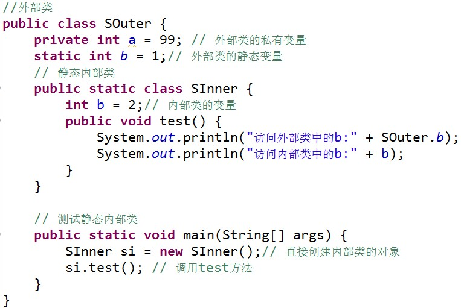
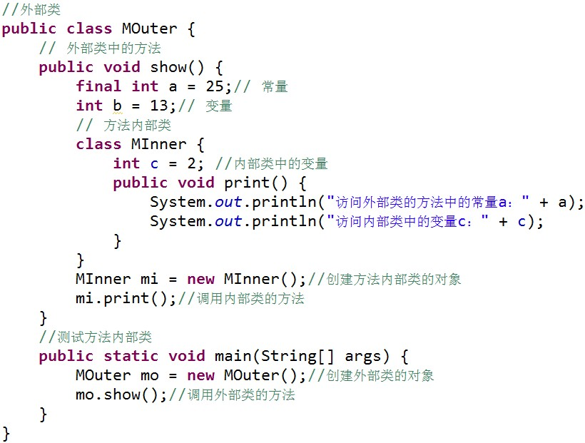
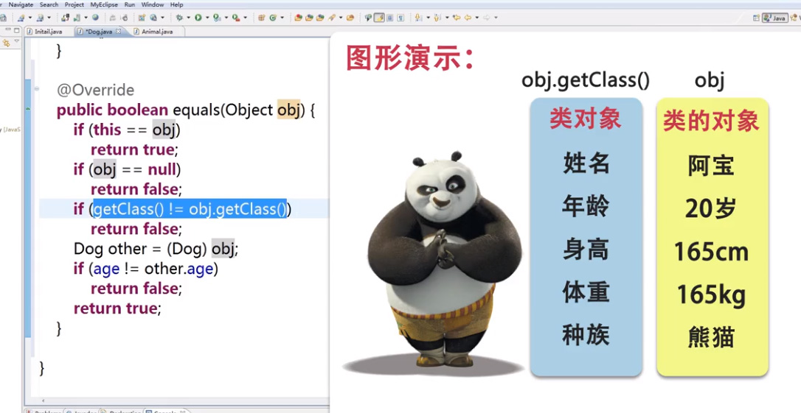

# Object Oriented Programming

面向对象特性、java中的包、访问修饰符、this

### 面向对象特性

三大特性：封装、继承、多态

## 封装

1、概念

> 将类的某些信息隐藏在类内部，不允许外部程序直接访问，而是通过该类提供的方法来实现对隐藏信息的操作和方法。

2、好处

> 只能通过规定的方法访问数据
> 隐藏类的实例细节，方便修改和实现

3、封装的实现步骤


```java
public class Hello {
    provite float screen;

    // getter
    public float getScreen() {
        return screen;
    }

    // setter
    public void setScreen(float newScreen) {
        screen = newScreen;
    }
}
```

### java中的包

1、作用

管理Java文件

解决同名文件冲突

2、包的定义：package 报名

注意：必须放在Java源程序的第一行，包名间可以使用`.`号隔开，eg: `com.test.HelloWorld`

```
// 例子：音乐类-MyClassMusic
// music
com.test.music.MyClassMusic
// movie
com.test.movie.MyClassMusic
```

3、系统中的包

`java.(功能).(类)`

```
java.lang.(类) 包含java语言基础的类
java.util.(类) 包含java语言中各种工具类
java.io.(类) 包含输入、输出相关功能的类
```

4、包的使用

可以通过`import`关键字，在某个文件使用其它文件中的类。

```
import com.test.music.MyClass
```

Java中，包的命名规范是全小写字母拼写

使用的时候不但可以加载某个包下面的所以文件

```
com.test.*
```

也可以加载某个具体包下的所以文件

```
com.test.music.*
```

### Java中的访问修饰符

```
class Telphone {
    private float screen = 5.0f;

    public float getScreen() {
        return screen;
    }
    publick void setScreen(float newScreen) {
        screen = newScreen;
    }
    // ...
}
```

访问修饰符--可以修饰属性和方法的访问范围。

|访问修饰符|本类|同包|子类|其他|
|:--|:--:|:--:|:--:|:--:|
|private|o|-|-|-|-|
|默认|o|o|-|-|
|protected|o|o|o|-|
|public|o|o|o|o|

### Java中的this关键字

1、this关键字代表当前对象

```
this.属性 操作当前对象的属性
this.方法 调用当前对象的方法
```

2、封装对象的属性的时候，经常会使用this关键字

```
# Eclipse编辑器自动生成getter/setter
菜单栏 -> source -> Generate Getters and Setters ...
# 指定需要生成getter或setter方法的属性
```

```
class Telphone {
    private float screen = 5.0f;

    public float getScreen() {
        return screen;
    }
    publick void setScreen(float screen) {
        this.screen = screen;
    }
    // ...
}
```

### Java中的内部类

内部类（Inner Class）就是定义在另外一个类里的类。与之对应，包含内部类的类被称为外部类。

内部类的主要作用如下：

1. 内部类提供了更好的封装，可以把内部类隐藏在外部类之内，不允许同一个包中的其他类访问该类

2. 内部类的方法可以直接访问外部类的所有数据，包括私有的数据

3. 内部类所实现的功能使用外部类同样可以实现，只是有时使用内部类更方便

内部类可分为以下几种：

- 成员内部类
- 静态内部类
- 方法内部类
- 匿名内部类

#### 成员内部类

```java
public class Outer {
  int outerNumber = 10;
  // 成员内部类
  public class Inner {
    int innerNumber = 20;
    public void print () {
      System.out.println("Inner class's print method, and outerNumber=" + outerNumber);
    }
  }
  public static void main (String[] args) {
    // 创建外部类对象
    Outer ou = new Outer();
    // 创建内部类对象
    Inner in = ou.new Inner();
    // 调用内部类对象方法
    in.print();
  }
}
```

成员内部类的使用方法：

1. Inner 类定义在 Outer 类的内部，相当于 Outer 类的一个成员变量的位置，Inner 类可以使用任意访问控制符，如 public 、 protected 、 private 等

2. Inner 类中定义的 `print()` 方法可以直接访问 Outer 类中的数据，而不受访问控制符的影响，如直接访问 Outer 类中的私有属性a

3. 定义了成员内部类后，必须使用外部类对象来创建内部类对象，而不能直接去 new 一个内部类对象，即：

    `内部类 对象名 = 外部类对象.new 内部类( );`

4. 编译上面的程序后，会发现产生了两个 `.class` 文件

    

    其中，第二个是外部类的 .class 文件，第一个是内部类的 .class 文件，即成员内部类的 .class 文件总是这样：外部类名$内部类名.class

注意：

1. 外部类不能直接使用内部类的成员和方法

    

    可先创建内部类的对象，然后通过内部类的对象来访问其成员变量和方法。

2. 如果外部类和内部类具有相同的成员变量或方法，内部类默认访问自己的成员变量或方法，如果要访问外部类的成员变量，可以使用 `this`关键字。如：

    

运行结果：

```
访问外部类中的b：1
访问内部类中的b：2
```

#### 静态内部类

静态内部类是 `static` 修饰的内部类，这种内部类的特点是：

1. 静态内部类不能直接访问外部类的非静态成员，但可以通过 `new 外部类().成员` 的方式访问

2. 如果外部类的静态成员与内部类的成员名称相同，可通过“类名.静态成员”访问外部类的静态成员；如果外部类的静态成员与内部类的成员名称不相同，则可通过“成员名”直接调用外部类的静态成员

3. 创建静态内部类的对象时，不需要外部类的对象，可以直接创建 内部类 `对象名= new 内部类();`

    

    结果：

    ```
    访问外部类中的b:1
    访问内部类中的b:2
    ```

#### 方法内部类

方法内部类就是内部类定义在外部类的方法中，方法内部类只在该方法的内部可见，即只在该方法内可以使用。



注意：

> 由于方法内部类不能在外部类的方法以外的地方使用，因此方法内部类不能使用访问控制符和 static 修饰符。

## 继承

继承是类与类的一种关系，是一种`is a`的关系。

> Java中的继承是单继承。

优点：

1. 子类拥有父类的所有属性和方法。`private修饰符`的属性和方法除外。

2. 复用父类的代码（代码复用）。

语法：

```
class 子类 extends 父类
```

例子

```java
// Animal.java
class Animal {
  // 相当于JavaScript的constructor
  public Animal() {
    // ...
  }
  public name;
  public age;
  public void eat() {
    System.out.println("调用了Animal的eat方法");
  }
}
```

```java
// Dog.java
class Dog extends Animal {
}
```


```java
// Initial.java
class Initial {
  public static void main() {
    Dog dog = new Dog();
    dog.name = "DD";
    dog.age = 2;
    dog.eat();
  }
}
```

### 方法的重写

如果子类对继承父类的方法不满意，可以重写父类继承的方法，当调用方法时会优先调用子类的方法。

语法规则：

> `返回值类型`，`方法名`，`参数类型及个数`都要与父类继承的方法相同，才叫`方法的重写`

### 继承的初始化顺序

初始化父类再初始化子类

先执行初始化对象中属性，再执行构造方法中的初始化

### final 关键字

使用final关键字做标识有`最终的`含义

> final可以修饰类、方法、属性和变量

> final修饰类，则该类不允许被继承

> final修饰方法，则该方法不允许被覆盖（重写）

> final修饰属性：则该类的属性不会进行隐式的初始化（类的初始化属性必须有值），或在构造方法中赋值（但只能选其一）。

> final修饰变量，则该变量的值只能赋一次值，即变为常量。

```java
final public class Animal {
  // ...
}
```

### super 关键字

在对象的内部使用，可以代表父类对象。

访问父类的属性

```
super.age
```

访问父类的方法

```
super.eat()
```

例子

```java
// Dog.java
public void method() {
    System.out.println(super.age);
}
```

super的应用

> 子类的构造的过程当中必须调用其父类的构造方法。

> 如果子类的构造方法中没有显式调用父类的构造方法，则系统默认调用父类无参的构造方法。

> 如果显式的调用构造方法，必须在子类的构造方法的第一行。

```java
// Dog.java
public class Animal {
    // constructor
    public Animal() {
        super(); // 必须放在第一行
        // ...
    }
}
```

> 如果子类构造方法中既没有显式调用父类的构造方法，而父类又没有无参的构造方法，则编译就会出错。

### Object类

Object类是所有类的父类，如果一个类没有使用extends关键字明确标识继承另外一个类，那么这个类默认继承Object类。

Object类中的方法，适合所有子类。

1、toString()方法

在Object类里面定义toString()方法的时候，返回的对象的哈希code码（对象地址字符串）

可以通过重写toString()方法表示出对象的属性

```
# Eclipse快速重写toString
菜单栏 -> source -> Generate toString
```

2、equals()方法

比较的是对象的引用是否指向同一块内存地址。

一般情况下比较两个对象时，比较他的值是否一致，所以要进行重写。

```
# Eclipse快速生成
source -> Generate hasCode() and equals()...
```



