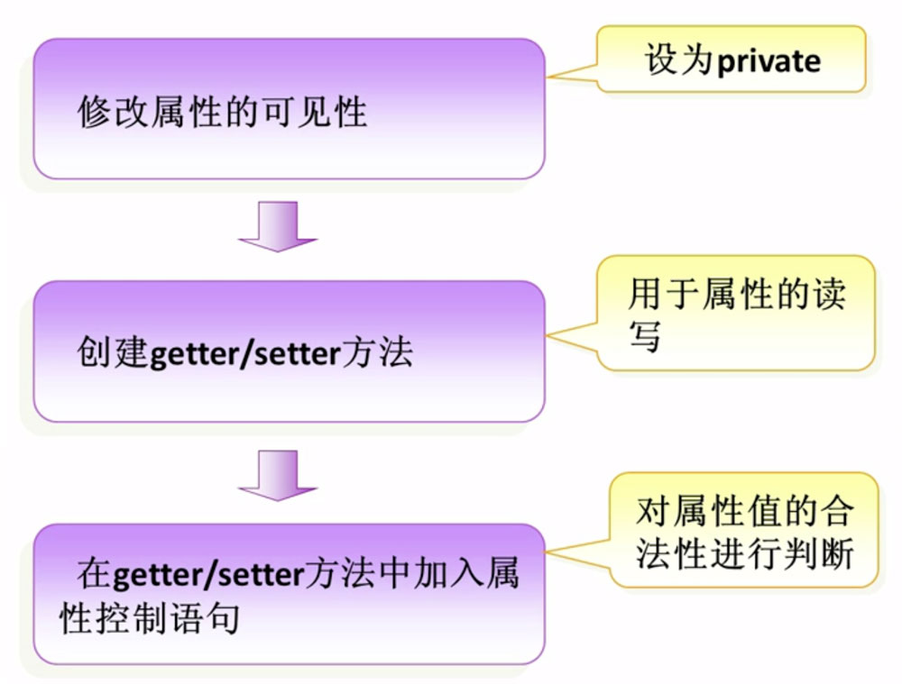
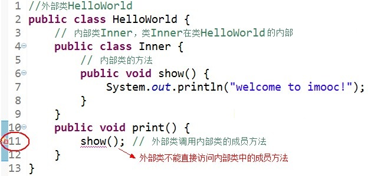
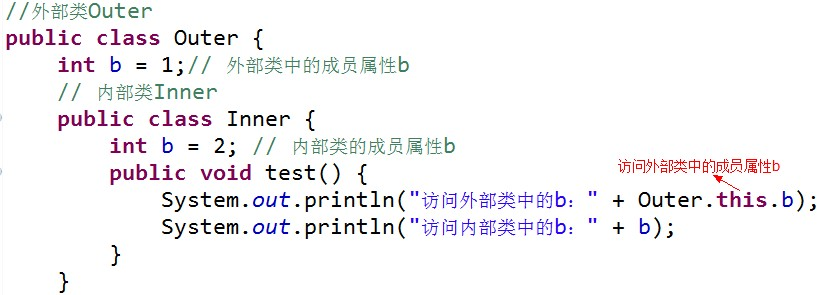

# Object Oriented Programming

面向对象特性、java中的包、访问修饰符、this

### 面向对象特性

三大特性：封装、继承、多态

### 封装

1、概念

> 将类的某些信息隐藏在类内部，不允许外部程序直接访问，而是通过该类提供的方法来实现对隐藏信息的操作和方法。

2、好处

> 只能通过规定的方法访问数据
> 隐藏类的实例细节，方便修改和实现

3、封装的实现步骤



```java
public class Hello {
    provite float screen;

    // getter
    public float getScreen() {
        return screen;
    }

    // setter
    public void setScreen(float newScreen) {
        screen = newScreen;
    }
}
```

### java中的包

1、作用

管理Java文件

解决同名文件冲突

2、包的定义：package 报名

注意：必须放在Java源程序的第一行，包名间可以使用`.`号隔开，eg: `com.test.HelloWorld`

```
// 例子：音乐类-MyClassMusic
// music
com.test.music.MyClassMusic
// movie
com.test.movie.MyClassMusic
```

3、系统中的包

`java.(功能).(类)`

```
java.lang.(类) 包含java语言基础的类
java.util.(类) 包含java语言中各种工具类
java.io.(类) 包含输入、输出相关功能的类
```

4、包的使用

可以通过`import`关键字，在某个文件使用其它文件中的类。

```
import com.test.music.MyClass
```

Java中，包的命名规范是全小写字母拼写

使用的时候不但可以加载某个包下面的所以文件

```
com.test.*
```

也可以加载某个具体包下的所以文件

```
com.test.music.*
```

### Java中的访问修饰符

```
class Telphone {
    private float screen = 5.0f;

    public float getScreen() {
        return screen;
    }
    publick void setScreen(float newScreen) {
        screen = newScreen;
    }
    // ...
}
```

访问修饰符--可以修饰属性和方法的访问范围。

|访问修饰符|本类|同包|子类|其他|
|:--|:--:|:--:|:--:|:--:|
|private|o|-|-|-|-|
|默认|o|o|-|-|
|protected|o|o|o|-|
|public|o|o|o|o|

### Java中的this关键字

1、this关键字代表当前对象

```
this.属性 操作当前对象的属性
this.方法 调用当前对象的方法
```

2、封装对象的属性的时候，经常会使用this关键字

```
# Eclipse编辑器自动生成getter/setter
菜单栏 -> source -> Generate Getters and Setters ...
# 指定需要生成getter或setter方法的属性
```

```
class Telphone {
    private float screen = 5.0f;

    public float getScreen() {
        return screen;
    }
    publick void setScreen(float screen) {
        this.screen = screen;
    }
    // ...
}
```

### Java中的内部类

内部类（Inner Class）就是定义在另外一个类里的类。与之对应，包含内部类的类被称为外部类。

内部类的主要作用如下：

1. 内部类提供了更好的封装，可以把内部类隐藏在外部类之内，不允许同一个包中的其他类访问该类

2. 内部类的方法可以直接访问外部类的所有数据，包括私有的数据

3. 内部类所实现的功能使用外部类同样可以实现，只是有时使用内部类更方便

内部类可分为以下几种：

- 成员内部类
- 静态内部类
- 方法内部类
- 匿名内部类

```java
public class Outer {
  int outerNumber = 10;
  // 成员内部类
  public class Inner {
    int innerNumber = 20;
    public void print () {
      System.out.println("Inner class's print method, and outerNumber=" + outerNumber);
    }
  }
  public static void main (String[] args) {
    // 创建外部类对象
    Outer ou = new Outer();
    // 创建内部类对象
    Inner in = ou.new Inner();
    // 调用内部类对象方法
    in.print();
  }
}
```

成员内部类的使用方法：

1. Inner 类定义在 Outer 类的内部，相当于 Outer 类的一个成员变量的位置，Inner 类可以使用任意访问控制符，如 public 、 protected 、 private 等

2. Inner 类中定义的 `print()` 方法可以直接访问 Outer 类中的数据，而不受访问控制符的影响，如直接访问 Outer 类中的私有属性a

3. 定义了成员内部类后，必须使用外部类对象来创建内部类对象，而不能直接去 new 一个内部类对象，即：

    `内部类 对象名 = 外部类对象.new 内部类( );`

4. 编译上面的程序后，会发现产生了两个 `.class` 文件

    

    其中，第二个是外部类的 .class 文件，第一个是内部类的 .class 文件，即成员内部类的 .class 文件总是这样：外部类名$内部类名.class

注意：

1. 外部类不能直接使用内部类的成员和方法

    

    可先创建内部类的对象，然后通过内部类的对象来访问其成员变量和方法。

2. 如果外部类和内部类具有相同的成员变量或方法，内部类默认访问自己的成员变量或方法，如果要访问外部类的成员变量，可以使用 `this`关键字。如：

    

运行结果：

```
访问外部类中的b：1
访问内部类中的b：2
```
