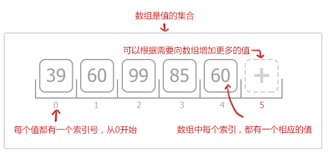
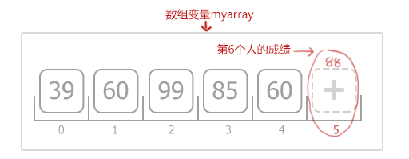
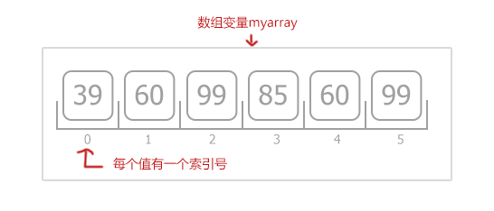

# JavaScript进阶篇

#### JavaScript能做什么？

1. 增强页面动态效果(如:下拉菜单、图片轮播、信息滚动等)

2. 实现页面与用户之间的实时、动态交互(如:用户注册、登录验证等)

## 一、变量

#### 1. 什么是变量

从字面上看，变量是可变的量；从编程角度讲，变量是用于存储某种/某些数值的存储器。

#### 2. 变量命名

1. 必须以字母、下划线或美元符号开头，后面可以跟字母、下划线、美元符号和数字。

2. 变量名区分大小写，如:A与a是两个不同变量。

3. 不允许使用JavaScript关键字和保留字做变量名。

| 关键字 | -- | -- | -- |
| :--: | :--: | :--: | :--: |
| break | else | new | var |
| case | finally | return | void |
| catch | for | switch | while |
| default | if | throw | delete |
| in | try | do | instanceof |
| typeof |  |  |  |

| 保留字 | -- | -- | -- |
| :--: | :--: | :--: | :--: |
| abstract | enum | int | short |
| boolean | export | interface | static |
| byte | extends | long | super |
| char | final | native | synchronized |
| class | float | package | throws |
| const | goto | private | transient |
| debugger | implements | protected | volatile |
| double | import | public | |

#### 3. 变量声明及赋值

```
声明变量语法: var 变量名;   
```

`var`就相当于找盒子的动作，在JavaScript中是关键字（即保留字），这个关键字的作用是声明变量，并为**变量**准备位置(即内存）。

```javascript
// 声明一个变量num1
var num1, mun2; 
// 声明一个变量mynum并赋值
var mynum = 10; 

// 123是数值
var num1 = 123;
// "一二三"是字符串   
var num2 = "一二三";
// 布尔值true（真），false(假)
var num3 = true;    
```

其中，num1变量存储的内容是数值；num2变量存储的内容是字符串，字符串需要用一对引号""括起来，num3变量存储的内容是布尔值(true、false)。

**注意:** 
1. 等号 "="的作用是给变量赋值，不是等于号。
2. 变量也可以不声明，直接使用，但为了规范，需要先声明，后使用。


## 二、JS基础语法 (表达式、操作符、运算符)

**表达式**与数学中的定义相似，表达式是指具有一定的值、用操作符把常数和变量连接起来的代数式。一个表达式可以包含常数或变量。

```javascript
// 赋值表达式
var num = 0;
  (变量)    (赋值)  (表达式)
var result    =    num + 1;

// 串表达式
'表达式num + 1' + '的' + '结果为：' + result

// 数值表达式
num + 5 * 10

// 布尔表达式
20000 > 35000; // false
num == 5; // false
num < 60; // true
```

#### 1. +号操作符

操作符是用于在JavaScript中指定一定动作的符号。

```
sum = numa + numb;
```
其中的`=`和`+`都是操作符。

JavaScript中还有很多这样的操作符，例如，算术操作符(`+`、`-`、`*`、`/`等)，比较操作符(`<`、`>`、`>=`、`<=`等)，逻辑操作符(`&&`、`||`、`!`)。

**注意:** `=` 操作符是赋值，不是等于。

**算术运算符**主要用来完成类似加减乘除的工作，在JavaScript中，`+`不只代表加法，还可以连接两个字符串，例如：

```javascript
// mystring的值“JavaScript”这个字符串
var mystring = "Java" + "Script"; 
```

#### 2. 自加一，自减一 ( ++和--)

算术操作符除了(`+`、`-`、`*`、`/`)外，还有两个非常常用的操作符，自加一`++`；自减一`--`。

```javascript
mynum = 10;
mynum++; //mynum的值变为11
mynum--; //mynum的值又变回10

mynum = mynum + 1;//等同于mynum++
mynum = mynum - 1;//等同于mynum--
```

#### 3. 比较操作符

| 操作符 | 描述 | 操作符 | 描述  |
| :--: | -- | :--: | -- |
| < | 小于 | > | 大于  |
| <= | 小于等于 | => | 大于等于 |
| == | 等于 | != | 不等于  |

```javascript
var a = 5; //定义a变量，赋值为5
var b = 9; //定义b变量，赋值为9
document.write (a < b); //a小于b的值吗? 结果是真(true)
document.write (a >= b); //a大于或等于b的值吗? 结果是假(false)
document.write (a != b); //a不等于b的值吗? 结果是真(true)
document.write (a == b); //a等于b的值吗? 结果是假(false)
```

#### 4. 逻辑与操作符(&&)

```javascript
// 数学里面的 a<b<c
b > a && b < c
```

`&&`是逻辑与操作符，只有`&&`两边值同时满足(同时为真)，整个表达式值才为真。

| A | B | A && B |
| -- | -- | -- |
| 真(true) | 真(true) | 真(true) |
| 真(true) | 假(false) | 假(false) |
| 假(false) | 真(true) | 假(false) |
| 假(false) | 假(false) | 假(false) |

**注意:** 如果A为假，A && B为假，不会在执行B; 反之，如果A为真，要由 B 的值来决定 A && B 的值。

#### 5. 逻辑或操作符(||)

`||`逻辑或操作符，相当于生活中的**或者**，当两个条件中有任一个条件满足，“逻辑或”的运算结果就为“真”。

**注意:** 如果A为真，A || B为真，不会在执行B; 反之，如果A为假，要由 B 的值来决定 A || B 的值。

#### 6. 逻辑非操作符(!)

`!`是逻辑非操作符，也就是**'不是'**的意思,非真即假，非假即真。

| A | !A |  
| :--: | :--: |  
| 真(true) | 假(false) |
| 假(false) | 真(true) |

#### 7. 操作符优先级

**算术操作符** → **比较操作符** → **逻辑操作符** → **"="赋值符号**

```javascript
var n = 3;
var m = 6;
var result = n + 30 > 10 && m * 3 < 2; // 结果为false
```

## 三、数组

**数组**是一个值的集合，每个值都有一个索引号，从0开始，每个索引都有一个相应的值，根据需要添加更多数值。



#### 1. 创建数组

```javascript
var myArray = new Array();
// 或
var maArray = [];
```

 我们创建数组的同时，还可以为数组指定长度，长度可任意指定。
 
```javascript
// 创建数组，存储8个数据。 
var myArray = new Array(8);
```

#### 2. 数组赋值

```javascript
var myArray = new Array(); //创建一个新的空数组
	myArray[0] = 66; //存储第1个人的成绩
	myArray[1] = 80; //存储第2个人的成绩
	myArray[2] = 90; //存储第3个人的成绩
	myArray[3] = 77; //存储第4个人的成绩
	myArray[4] = 59; //存储第5个人的成绩
```

**注意：**数组每个值有一个索引号，从0开始。

用更简洁的方式来创建数组：

```javascript
var myArray = new Array(66,80,90,77,59); // 创建数组同时赋值
```
工作中最常用的方式**字面量数组**
```javascript
var myArray = [66, 80, 90, 77, 59]; // 直接输入一个数组（称 “字面量数组”）
```

**数组存储的数据**可以是任何类型（数字、字符、布尔值、对象等）

#### 3. 向数组增加一个新元素



```javascript
// 使用一个新索引，为数组增加一个新元素
myArray[5] = 88; 
// 或
myArray.push(88);
```

#### 4. 使用数组元素



要得到一个数组元素的值，只需引用数组变量并提供一个索引，如：  
```javascript
// 获取第一个人的成绩
var score1 = myArray[0];
// 获取第三个人的成绩
var score3 = myArray[2];
```

#### 5. 数组属性length

**Length属性**表示数组的长度，即数组中元素的个数。

```javascript
// 获得数组myarray的长度
var len = myArray.length;
```
**注意：**

1. 因为数组的索引总是由0开始，所以一个数组的首尾限分别是：**0**和**length-1**。如数组的长度是5，数组的上下限分别是0和4。

2. 同时，JavaScript数组的length属性值是可变的。在未限定数组长度（容量）时，删除或新增数组中的元素后，数组的长度值会改变。

```javascript
var arr = [98,76,54,56,76]; // 包含5个数值的数组
document.write('数组长度为： ' + arr.length); // 数组长度为： 5
arr[15] = 34;  //增加元素，使用索引为15,赋值为34
document.write('数组长度为： ' + arr.length); // 数组长度为： 16
```

#### 6. 二维数组

一维数组，我们看成一组盒子，每个盒子只能放一个内容。

```
一维数组的表示: myArray[ ]
```

二维数组，我们看成一组盒子，不过每个盒子里还可以放多个盒子。

```
二维数组的表示: myArray[ ][ ]
```

**注意:** 二维数组的两个维度的索引值也是从0开始，两个维度的最后一个索引值为长度-1。

**(1) 二维数组的定义一**

```javascript
var myArray = new Array(); //先声明一维
for(var i = 0; i < 2; i++) {   //一维长度为2
myArray[i] = new Array();  //再声明二维 
	for(var j = 0; j < 3; j++) {   //二维长度为3
		myArray[i][j] = i + j;   // 赋值，每个数组元素的值为i+j
	}
}
```

将上面二维数组，用表格的方式表示:

| ` | 0 | 1 | 2 |
| -- | -- | -- | -- |
| 0 | myArray[0][0] | myArray[0][1] |myArray[0][2] |
| 1 | myArray[1][0] | myArray[1][1] |myArray[1][2] |
| 2 | myArray[2][0] | myArray[2][1] |myArray[2][2] |

**(2) 二维数组的定义二**

```javascript
var myArray = [[0, 1, 2 ], [1, 2, 3]]
```
**(3)  赋值**

```javascript
myArray[0][1] = 5; //将5的值传入到数组中，覆盖原有值。
```
**说明:** myarr[0][1], **0** 表示表的行，**1**表示表的列

## 四、 流程控制语句

#### 1. if语句