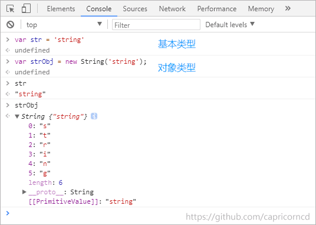
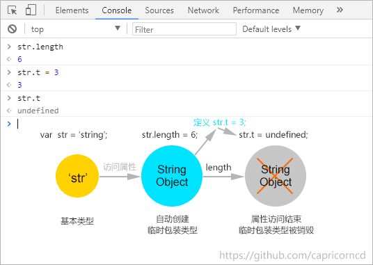
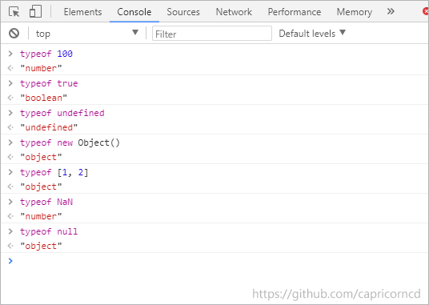

# JavaScript深入浅出

这是一个帮助您系统学习JavaScript编程语言的课程，该课由浅入深的介绍JavaScript的语言特性，结合实际例子解析常见误区，启发你的思考，帮助学习者从入门到掌握，提升您的 JavaScript 技能。

## JavaScript六种数据类型

Number类型、String类型、boolean类型、null类型、undefined类型、Object类型

* 原始类型

  number

  string

  boolean

  null

  undefined

* object对象

  Function

  Array

  Date

  ...

## JavaScript隐式转换

JavaScript的数据类型是非常弱的（不然不会叫它做弱类型语言了）！在使用算术运算符时，运算符两边的数据类型可以是任意的，比如，一个字符串可以和数字相加。之所以不同的数据类型之间可以做运算，是因为JavaScript引擎在运算之前会悄悄的把他们进行了隐式类型转换。

```javascript
// +字符串拼接
var x = 'The answer is ' + 42;
var y = 42 + ' is the answer';

// 先将'37'转化为整型，再相减
'37' - 7 = 30
// 字符串拼接
'37' + 7 = 377
```

#### # 巧用`+/-`转换类型

```javascript
var num
// 把num转为整型
num - 0
// 把num转为字符串
num + ''
```

#### # 等于`==`

```javascript
// js会先将字符串转换为数字再进行比较
'1.23' == 1.23
0 == false
null == undefined
new Object() == new Object()
[1, 2] == [1, 2]
```

#### # 严格等于`===`

首先判断等号两边的类型，类型相同再比较值。类型不同，则不等，为flase；类型相同且值相等，则为true。

* 类型不同，返回false

* 类型相同：

```javascript
null === null // true
nudefined === undefined // true
NaN !== NaN // true
new Object !== new Object // true
```

#### # `==`与`===`区别

* 类型相同，`==`同`===`

* 类型不同，尝试类型转换和比较：

  1. null == undefined 相等

  ```javascript
  null == undefined // true
  ```

  2. number == string // 转number

  ```javascript
  1 == '1.0' // true
  ```

  3. boolean == ? // 转number

  ```javascript
  1 == true // true
  ```

  4. object == number | string // 尝试对象转为基本类型

  ```javascript
  new String('hi') == 'hi' // true
  ```

  5. 其他false

## JavaScript包装对象





## JavaScript类型检测

* typeof

* instanceof

* Object.prototype.toString

* constructor

* duck type

#### # typeof

适合基本类型的判断

| typeof 100 | "number" |
|:--|:--|
| typeof true | "boolean" |
| typeof function | "function" |
| typeof undefined | "undefined" |
| typeof new Object() | "object" |
| typeof [1, 2] | "object" |
| typeof NaN | "number" |
| typeof null | "object" |



## 备注

笔记作者： Capricorncd

主页：https://github.com/capricorncd

原讲师：Bosn

出处：https://www.imooc.com/learn/277
