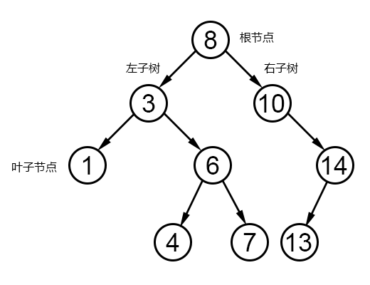

# JavaScript二叉树算法

在计算机科学中，**二叉树**(Binary Tree)是每个节点最多有两个子树的树结构。通常子树被称作“左子树”（left subtree）和“右子树”（right subtree）。二叉树常被用于实现二叉查找树和二叉堆。

**二叉树**的每个结点至多只有二棵子树(不存在度大于2的结点)，二叉树的子树有左右之分，次序不能颠倒。二叉树的第i层至多有2^{i-1}个结点；深度为k的二叉树至多有2^k-1个结点；对任何一棵二叉树T，如果其终端结点数为n_0，度为2的结点数为n_2，则n_0=n_2+1。

一棵深度为k，且有2^k-1个节点称之为满二叉树；深度为k，有n个节点的二叉树，当且仅当其每一个节点都与深度为k的满二叉树中，序号为1至n的节点对应时，称之为完全二叉树。

#### # 为什么要学数据结构

程序=算法+数据结构，计算机程序设计的本质是将业务逻辑转换为数理逻辑，通过逻辑推理运算解决客观世界存在的困难，而算法和数据结构就是数理逻辑的推演模式和展现方法。如果把编程语言比作文学，那么算法和数据结构就相当于语法，没有合理的语法，文字就无法准确的传达意义。

## 什么是二叉树



#### # 排序二叉树实例

构造函数

```js
// 构造函数
function BinaryTree() {
  this.root = null;
}
```

创建排序二叉树：

```js
var Node = function (key) {
  this.key = key;
  this.left = null;
  this.right = null;
}

var insertNode = function (node, newNode) {
  if (newNode.key < node.key) {
    if (node.left === null) {
      node.left = newNode;
    } else {
      insertNode(node.left, newNode);
    }
  } else {
    if (node.right === null) {
      node.right = newNode;
    } else {
      insertNode(node.right, newNode);
    }
  }
}

BinaryTree.prototype.insert = function (key) {
  var newNode = new Node(key);
  if (this.root === null) {
    this.root = newNode;
  } else {
    insertNode(this.root, newNode);
  }
}
```

例子：

```js
var nodes = [8, 3, 10, 1, 6, 14, 4, 7, 13];
var binaryTree = new BinaryTree();
nodes.forEach(function (val, index) {
  binaryTree.insert(val);
  console.log(index, val);
})
```

## 二叉树遍历

二叉树遍历有三种方法：中序遍历、前序遍历、后序遍历

#### # 中序遍历

先访问左子树，再访问当前节点

```js
// 中序遍历
var inOrderTraverseNode = function (node, callback) {
  if (node !== null) {
    inOrderTraverseNode(node.left, callback);
    callback(node.key);
    inOrderTraverseNode(node.right, callback);
  }
}

BinaryTree.prototype.inOrderTraverse = function (callback) {
  inOrderTraverseNode(this.root, callback);
}
```

例子：

```js
var callback = function (key) {
  console.log(key);
  // 结果： 1 3 4 6 7 8 10 13 14
}

binaryTree.inOrderTraverse(callback);
```

#### # 前序遍历

先访问当前节点，再访问左右子树

```js
// 前序遍历
var preOrderTraverseNode = function (node, callback) {
  if (node !== null) {
    callback(node.key);
    preOrderTraverseNode(node.left, callback);
    preOrderTraverseNode(node.right, callback);
  }
}

BinaryTree.prototype.preOrderTraverse = function (callback) {
  preOrderTraverseNode(this.root, callback);
}
```

例子：

```js
var callback = function (key) {
  console.log(key);
  // 结果： 8 3 1 6 4 7 10 14 13
}

binaryTree.preOrderTraverse(callback);
```

#### # 后序遍历

先访问左子树，再访问右子树，最后访问当前节点

应用：操作系统文件遍历

```js
// 后序遍历
var postOrderTraverseNode = function (node, callback) {
  if (node !== null) {
    postOrderTraverseNode(node.left, callback);
    postOrderTraverseNode(node.right, callback);
    callback(node.key);
  }
}

BinaryTree.prototype.postOrderTraverse = function (callback) {
  postOrderTraverseNode(this.root, callback);
}
```

例子：

```js
var callback = function (key) {
  console.log(key);
  // 结果： 1 4 7 6 3 13 14 10 8
}

binaryTree.postOrderTraverse(callback);
```

## 二叉树查找

最小值、最大值、指定值

#### # 最小值查找

查找左子树

```js
// 最小值节点查找
var minNode = function (node) {
  if (node) {
    while (node && node.left !== null) {
      node = node.left;
    }
    return node.key;
  }
  return null;
}

BinaryTree.prototype.min = function () {
  return minNode(this.root);
}
```

例子：

```js
console.log('Min node is: ' + binaryTree.min());
// 结果：Min node is: 1
```

#### # 最大值查找

查找右子树

```js
// 最大值节点查找
var maxNode = function (node) {
  if (node) {
    while (node && node.right !== null) {
      node = node.right;
    }
    return node.key;
  }
  return null;
}

BinaryTree.prototype.max = function () {
  return maxNode(this.root);
}
```

例子：

```js
console.log('Max node is: ' + binaryTree.max());
// 结果：Max node is: 14
```

#### # 指定值查找

对比当前节点，指定值小于当前节点查找左子树；反之，查找右子树。

```js
// 指定值查找
var searchNode = function (node, key) {
  if (node === null) {
    return false;
  }

  if (key < node.key) {
    return searchNode(node.left, key);
  } else if (key > node.key) {
    return searchNode(node.right, key);
  } else {
    return true;
  }
}

BinaryTree.prototype.search = function (key) {
  return searchNode(this.root, key);
}
```

例子：

```js
console.log(binaryTree.search(7));
// 结果：true
```

## 二叉树删除节点

```js
// 查找右子树的最小节点
var findMinNode = function (node) {
  if (node) {
    while (node && node.left !== null) {
      node = node.left;
    }
    return node;
  }
  return null;
}

// 删除节点 *********************************************
var removeNode = function (node, key) {
  if (node === null) {
    return null;
  }
  if (key < node.key) {
    node.left = removeNode(node.left, key);
    return node;
  } else if (key > node.key) {
    node.right = removeNode(node.right, key);
    return node;
  } else {
    // 删除叶子节点
    if (node.left === null && node.right === null) {
      node = null;
      return node;
    }
    // 删除非叶子节点，
    // 且只有左子树或只有右子树
    if (node.left === null) {
      node = node.right;
      return node;
    } else if (node.right === null) {
      node = node.right;
      return node;
    }
    // 删除的节点为同时含有左右子树的节点
    // 在右子树中去查找最小值节点
    var aux = findMinNode(node.right);
    // 将要删除的节点值，更新为最小值节点的值
    node.key = aux.key;
    // 删除值为aux.key的节点
    node.right = removeNode(node.right, aux.key);
    return node;
  }
}

BinaryTree.prototype.remove = function (key) {
  return removeNode(this.root, key);
}
```

例子：

```js
// 删除只有右节点的节点
binaryTree.remove(10);
binaryTree.inOrderTraverse(callback);
// 结果：1 3 4 6 7 8 13 14

// 删除既有左节点，又有右节点的节点
binaryTree.remove(3);
binaryTree.inOrderTraverse(callback);
// 结果：1 4 6 7 8 13 14
```
