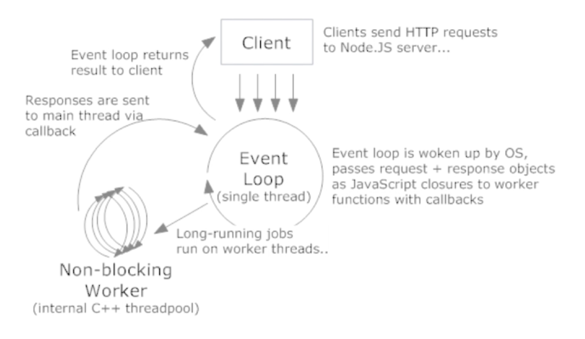

## # NodeJS是什么

Node.js® is a JavaScript runtime built on Chrome's V8 JavaScript engine.

https://nodejs.org/en/

### I/O密集 vs CUP密集

* CPU密集：压缩、解压、加密、解密

* I/O密集：文件操作、网络操作、数据库

### Web常见场景

* 静态资源读取

* 数据库操作

* 渲染页面

### 高并发应对之道

* 增加机器数量

* 增加每台机器的CPU数--多核

## 进程

进程：是计算机中的程序关于某数据集合上的一次运行活动，是系统进行资源分配和调度的基本单位。

多进程：启动多个进程，多个进程可以一起执行多个任务。

### 线程

线程：进程内一个相对独立的、可调度的执行单元，与同属一个进程的线程共享的资源。

多线程：启动一个进程，在一个进程内启动多个线程，这样，多个线程也可以一起执行多个任务。

## NodeJS的单线程

* 单线程只是针对主进程，I/O操作系统底层多线程调度。

* 单线程并不是单进程。

### NodeJS工作模型

* 高性能前提

Web场景

高并发

I/O密集

### 常用场景

* Web Server

* 本地代码构建

* 实用工具开发
