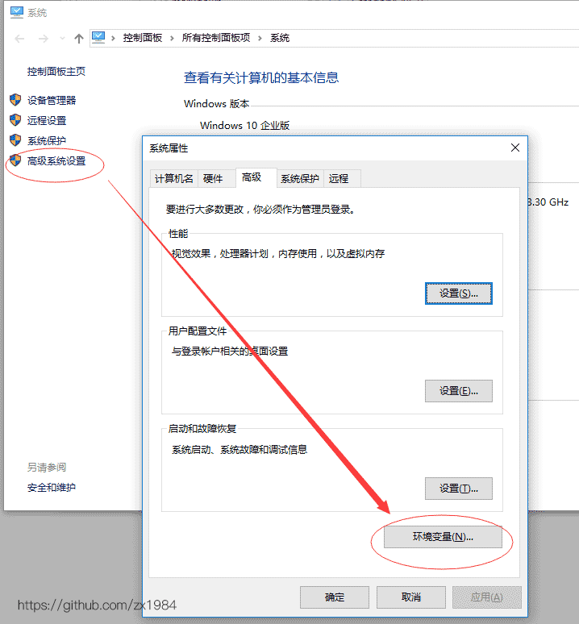
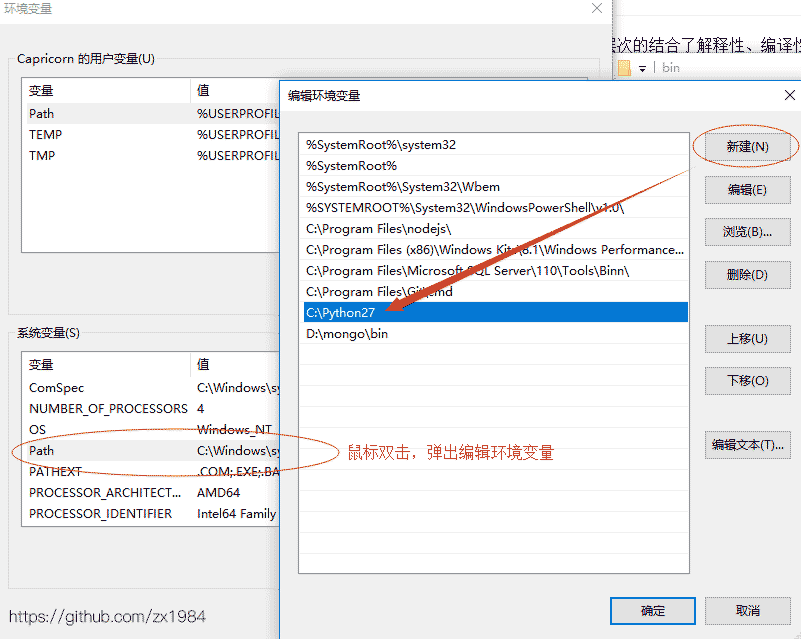
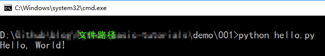

# Python 2.7入门

Python 是一个高层次的结合了解释性、编译性、互动性和面向对象的脚本语言。

Python 的设计具有很强的可读性，相比其他语言经常使用英文关键字，其他语言的一些标点符号，它具有比其他语言更有特色语法结构。

Python 是一种解释型语言： 这意味着开发过程中没有了编译这个环节。类似于PHP和Perl语言。

Python 是交互式语言： 这意味着，您可以在一个Python提示符，直接互动执行写你的程序。

Python 是面向对象语言: 这意味着Python支持面向对象的风格或代码封装在对象的编程技术。

Python 是初学者的语言：Python 对初级程序员而言，是一种伟大的语言，它支持广泛的应用程序开发，从简单的文字处理到 WWW浏览器再到游戏。

更多介绍：http://www.runoob.com/python/

#### # 作者

Guido van Rossum 龟叔，荷兰人 1989年圣诞节发明python语言

#### # 语言特点

优雅、明确、简单

#### # 适合领域

* Web网站和各种网络服务

* 系统工具和脚本

* 作为“胶水”语言把其他语言开发的模块包装起来方便使用

#### # 不适合的领域

* 贴近硬件的代码(首选C)

* 移动开发：IOS/Android有各自的开发语言(ObjC、Swift/Java)

* 游戏开发(C/C++)

#### # 与其他语言对比

||类型|运行速度|代码量|
|:--|:--|:--|:--|
|C|编译为机器码|非常快|非常多|
|Java|编译为字节码|快|多|
|Python|解释执行|慢|少|

#### # 缺点

* Python源码不能加密

## Python安装

#### 官网

https://www.python.org/ 下载系统对应安装包，安装（略）。

#### # 测试Python环境

进入Python交互式开发环境

```
windows键 + R
或C:\Windows\System32 手动启动cmd.exe(最好右键“以管理员身份运行”)
```
在cmd中不能直接运行python命令时，需手动配置环境变量(以win10系统为例)：

桌面 -> 此电脑 -> 右键单击 -> 属性， 弹出以下界面





## 第一个Python程序

hello.py

```python
print 'Hello, World!'
```

运行代码



## 参考资料

笔记作者：zx1984

https://github.com/zx1984

腾讯课堂：python零基础入门到精通

https://ke.qq.com/course/206902

原讲师：廖雪峰

https://www.imooc.com/learn/177
