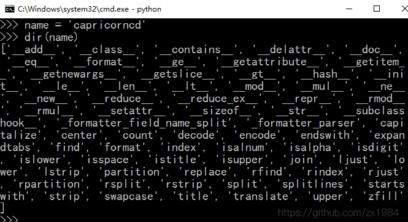
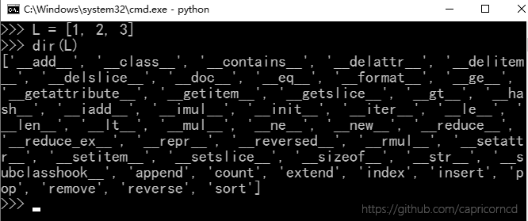

# Python 2.7 - 变量和数据类型

## 语法规则

1. 缩进统一(空格或Tab，但不能混用)

2. 标识符的**第一个字符**必须是字母(大写或小写)或者一个下划线('_')，标识符名称的其他部分可以由字符、下划线或数字(0-9)组成。

3. 标识符名称是对**大小写敏感**的。例如：myname和myName不是一个标识符。

4. Python注释 `#`号为单行注释；**多行注释**用3个单引号或3个双引号

   任何时候，我们都可以给程序加上注释。注释是用来说明代码的，给自己或别人看，而程序运行的时候，Python解释器会直接忽略掉注释，所以，有没有注释不影响程序的执行结果，但是影响到别人能不能看懂你的代码。

    ```python
    # 单行注释
    ```

    ```python
    '''
    多行注释内容
    '''
    ```

    ```python
    """
    多行注释内容
    """
    ```

## 变量

在Python中，变量的概念基本上和初中代数的方程变量是一致的。

例如，对于方程式 `y=x*x` ，`x`就是变量。当`x=2`时，计算结果是`4`，当`x=5`时，计算结果是`25`。

只是在计算机程序中，变量不仅可以是数字，还可以是任意数据类型。

在Python程序中，变量是用一个变量名表示，变量名必须是**大小写英文、数字和下划线（_）**的组合，且不能用数字开头，比如：

Python中的变量不需要声明。每个变量在使用前都必须赋值，变量赋值以后该变量才会被创建。

```python
# 变量语法
变量名 = 变量的值
```

1. 变量名只能包含字母、数字和下划线，变量名可以以字母或下划线开头，但不能以数字开头。

2. 变量名不能包含空格，可以用下划线来分割单词

3. 不要将Python自带关键字或函数名作变量名

4. 变量名应该简短并具有描述性，比如name, studentName, nameLength, `student_name`, `name_length`

5. 慎用小写字母`l`和大写字母`O`

## print语句

print语句可以向屏幕上输出指定的文字。比如输出'hello, world'，用代码实现如下：

```
>>> print 'Hello, World'
```

注意：

1. 当我们在Python交互式环境下编写代码时，`>>>`是Python解释器的提示符，不是代码的一部分。

2. 当我们在文本编辑器中编写代码时，千万不要自己添加 `>>>`。

**print语句** 也可以跟上多个字符串，用逗号`“,”`隔开，就可以连成一串输出：

```
print 'The quick brown fox', 'jumps over', 'the lazy dog'
# 输出结果：The quick brown fox jumps over the lazy dog
```

print会依次打印每个字符串，遇到逗号“,”会输出一个空格，因此，输出的字符串是这样拼起来的：


## 数据类型

计算机顾名思义就是可以做数学计算的机器，因此，计算机程序理所当然地可以处理各种数值。但是，计算机能处理的远不止数值，还可以处理文本、图形、音频、视频、网页等各种各样的数据，不同的数据，需要定义不同的数据类型。在Python中，能够直接处理的数据类型有以下几种：

#### # 整数

Python可以处理任意大小的整数，当然包括负整数。，整数的表示方法和数学上的写法一模一样，例如：`1`，`100`，`-8080`，`0` 等等。

计算机由于使用二进制，所以，有时候用十六进制表示整数比较方便，十六进制用`0x`前缀和`0-9`，`a-f`表示，例如：`0xff00`，`0xa5b4c3d2` 等等。

#### # 浮点数

浮点数也就是小数，之所以称为浮点数，是因为按照科学记数法表示时，一个浮点数的小数点位置是可变的，比如，`1.23x10^9`和`12.3x10^8`是相等的。浮点数可以用数学写法，如`1.23`，`3.14`，`-9.01` 等等。但是对于很大或很小的浮点数，就必须用科学计数法表示，把`10`用`e`替代，`1.23x10^9`就是`1.23e9`，或者`12.3e8`，`0.000012`可以写成`1.2e-5` 等等。

整数和浮点数在计算机内部存储的方式是不同的，整数运算永远是精确的（除法难道也是精确的？是的！），而浮点数运算则可能会有四舍五入的误差。

#### # 字符串

字符串是以`''`或`""`括起来的任意文本，比如`'abc'`，`"xyz"`等等。请注意，`''`或`""`本身只是一种表示方式，不是字符串的一部分，因此，字符串`'abc'`只有`a`，`b`，`c`这3个字符。

#### # 布尔值

布尔值和布尔代数的表示完全一致，一个布尔值只有`True`、`False`两种值，要么是`True`，要么是`False`。在Python中，可以直接用`True`、`False`表示布尔值（请注意大小写），也可以通过布尔运算计算出来。

布尔值可以用`and`、`or`和`not`运算。

| 关键字 | 名称 |描述|
|:--:|:--|:--|
| and | 与运算 | 只有所有都为 True，and运算结果才是 True |
| or | 或运算 | 只要其中有一个为 True，or 运算结果就是 True |
| not | 非运算 | 它是一个单目运算符，把 True 变成 False，False 变成 True |

#### # 空值

空值是Python里一个特殊的值，用`None`表示。`None`不能理解为`0`，因为`0`是有意义的，而`None`是一个特殊的空值。

此外，Python还提供了列表、字典等多种数据类型，还允许创建自定义数据类型...

## 三. 数据类型

标准数据类型，Python2中有6个标准的数据类型

`Number` 数字 `/英 [ˈnʌmbə(r)] 美 [ˈnʌmbɚ] `

`String` 字符串 `/英 [strɪŋ] 美 [strɪŋ]`

`List` 列表 `/英 [lɪst] 美 [lɪst] `

`Tuple` 元组 `/英 [tʌpl] 美 [tʌpl] n. 元组，数组`

`Sets` 集合 `/英 ['sets] 美 ['sets] `

`Dictionary` 字典 `/英 [ˈdɪkʃənri] 美 [ˈdɪkʃəneri] `

#### 1. Number 数字

int, float, bool, complex(复数)

- int 整型

    Python2中，只有一种`整数类型 int`，表示长整型

- float 浮点型

    浮点型即小数，之所以称之为浮点型，是因为按照科学计数法表示时，一个浮点的小数点位置是可变的。比如 1.23x10<sup>9</sup>和12.3x10<sup>8</sup>是相等的。

    浮点数可以用数学写法，如 1.23, 3.14, -.9.01等等。

    但是对于很大或很小的浮点型，就必须用科学计数法表示，把10用e替代，1.23x10<sup>9</sup>即为1.23e9或12.3e8，0.000012即为1.2e-5 等等。

```
>>> a = 3.14
>>> b = 1.23e10
>>> a
3.14
>>> b
12300000000.0
>>> type(a)
'float'
>>> type(b)
'float'
```

- bool 布尔值

    布尔值和布尔代数的表示完全一致，一个布尔值只有True、False两种值。注意不能用true或false，Python中将true/flase会识别为自定义变量。

#### 2. string 字符串

字符串就是一些列字符。Python中，用引号(单引号或双引号)括起来的就是字符串。如'This is String', "This is also a String"

| 字符串方法 | 作用 | 例子 |
| :-- | :-- | :-- |
| String.title() | 首字母大写 | 'ada love'.title() # 'Ada Love' |
| String.upper() | 所有字母大写 | 'ada love'.upper() # 'ADA LOVE' |
| String.lower() | 所有字母小写 | 'ADA LOVE'.lower() # 'ada love' |



```python
# 字符串拼接(合并)
>>> name = 'Capricorncd'
>>> msg = name + ' is an uncle'
>>> msg
'Capricorncd is an uncle'
```

- 使用函数`str()`避免类型错误

```
>>> age = 30
>>> msg = 'Happy' + str(age) + 'rd birthday!'
>>> msg
'Happy 30rd birthday!'
```

大多数情况下，Python中使用数字都比较简单。如果结果出乎意料，请检查Python是否按你期望的方式解读了数值或字符串。

#### 3. List 列表

**List** 是Python中使用最频繁的数据类型。

列表可以完成大多数集合类的数据结构实现。列表中元素的类型可以不相同，支持数字、字符串，甚至可以包含列表(所谓嵌套)。

列表是写在方括号[]之间，用逗号分隔开的元素列表。

```python
>>> L = ['abc', 123, 2.3, 'capricorncd']
>>> L[0]
'abc'
>>> L[1:3]
[123, 2.3]
>>> L[2:]
[2.3, 'capricorncd']
>>> L*2
['abc', 123, 2.3, 'capricorncd', 'abc', 123, 2.3, 'capricorncd']
```



## 四. 基本运算符

算术运算符、比较(关系)运算符、赋值运算符、逻辑运算符、位运算符、成员运算符、身份运算符

#### 1. 算术运算符

| 运算符 | 名称| 说明 | 实例 |
| :--: | :--: | :-- | :-- |
| + | 加 | 两个对象相加 | 5+4 结果 9|
| - | 减 | 两个数相减 | 4.3-2 结果 2.3|
| * | 乘 | 两个数相乘，或返回一个被重复n次的字符串/List | [12, 34]*2 结果 [12, 34, 12, 34]|
| / | 除 | 两个数相除(注意类型) | 3/4 结果 0; 3/4.0 结果 0.75|
| % | 取余/取模 | 返回除法的余数 | 5%4 结果 1|
| ** | 乘方/幂 | 返回x的n次幂 | 5**2 结果 25|
| // | 取整除 | 返回商的整数部分(向下取整) | -2//4 结果 -1|

注意：除法`/` 整数除以整数，结果为整数，且向下取整。浮点型除以整数，或整数除以浮点型，或浮点型除以浮点型，其结果为浮点数。

#### 2. 比较运算符

以下假设变量 `a = 10` , `b = 20`

| 运算符 | 说明 | 实例 |
| :--: | :-- | :-- |
| == | 等于 - 比较对象是否相等 | a == b 返回 False |
| != | 不等于 - 比较对象是否不相等 | a != b 返回 True |
| > | 大于 - 返回a是否大于b | a > b 返回 False |
| < | 小于 - 返回a是否小于b | a < b 返回 True |
| >= | 大于等于 - 返回a是否大于等于b | a >= b 返回 False |
| <= | 小于等于 - 返回a是否小于等于b | a <= b 返回 True |

#### 3. 赋值运算符

以下假设变量 `a = 10` , `b = 20`

| 运算符 | 说明 | 实例 |
| :--: | :-- | :-- |
| = | 简单的赋值运算符 | c = a + b |
| += | 加法赋值运算符 | c += a 等效于 c = c + a |
| -= | 减法赋值运算符 | c -= a 等效于 c = c - a |
| *= | 乘法赋值运算符 | c *= a 等效于 c = c * a |
| /= | 除法赋值运算符 | c /= a 等效于 c = c / a |
| %= | 取模赋值运算符 | c %= a 等效于 c = c % a|
| **= | 幂赋值运算符 | c **= a 等效于 c = c ** a |
| //= | 取整除赋值运算符 | c //= a 等效于 c = c // a |

#### 4. 逻辑运算符

| 运算符 | 表达式 | 说明 | 实例 |
| :--: | :-- | :-- | :-- |
| and | x and y | '与'。x为False，x and y 返回 False，否则返回y的计算值 | a and b 返回 20 |
| or | x or y | '或'。x为True，它返回True，否则返回y的计算值 | a or b 返回 10 |
| not | not x | '非'。x为True，它返回False；x为False，它返回True | not(a and b) 返回 False |

#### 5. 位运算符

#### 6. 成员运算符

#### 7. 身份运算符

#### 8. 运算符优先级顺序

## 五. List和Tuple

**List** 是一种有序的集合，可以随时添加或删除其中的某个元素

| 方法 | 说明 |
| :-- | :-- |
| append(item) | 在list尾部追加元素 |
| extend() | 在列表尾部追加包含多个值的序列，即扩展一个list |

```
list1 = [1, 2, 3]
list2 = [7, 8]
list1.append(4)
# [1, 2, 3, 4]
list1.append(list2)
# [1, 2, 3, 4, [7, 8]]
```

```
list1 = [1, 2, 3]
list2 = [7, 8]
list1.extend(list2)
# [1, 2, 3, 4, 7, 8]
```

## 参考资料

笔记作者： zx1984

主页：https://github.com/zx1984

原讲师：廖雪峰

出处：https://www.imooc.com/learn/177
