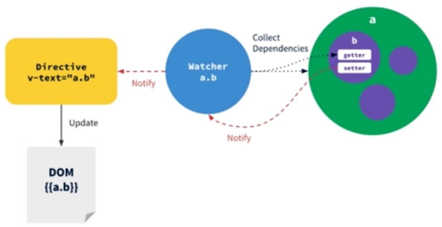

# Vue.js高仿饿了么外卖App开发笔记

## 一、主要知识点

#### 1、 线上生产环境开发流程

* 代码开发及测试环节

> UI标注

> 真实数据演示

* 代码规范

> 架构设计

> 组件抽象

> 模块拆分

> 代码风格统一

> JS变量命名规范

> CSS代码规范

#### 2、功能技术分析

* vue-resource 与后端数据交换

* vue-router 路由，实现单页应用

* 第三方js库better-scroll

* 最大程度组件化

* html5的localStorage

* 图标字体的使用

* 移动端1像素边框

* css sticky footer布局

* flex弹性布局

#### 3、前置知识

* Vue.js、 HTML、 CSS、 JavaScript/ES6

#### 4、内容

* 掌握Vue.js在实战中的运用

* 学会使用Vue.js完整地开发移动端App

* 学会工程化、组件化、模块化的开发方式

* Vue.js介绍

* Vue-cli脚手架 搭建基本代码框架

* vue-router 官方插件 路由管理

* vue-resource Ajax通信

* Webpack 构建工具

* es6 + eslint eslint：es6代码风格检查工具

* 移动端常用开发技巧：flex弹性布局、css stickyfooter、酷炫的交互设计 ...

#### 5、近年来Web前端发展趋势

* 旧的浏览器被淘汰，移动端需求增加。
> IE6-8不支持ES5特性
> IE9/Chrome/safari/firefox 支持ES5
* 前段交互越来越多，功能越来越复杂
> 高大上的技术库和框架
> 酷炫的运营活动页面
> H5小游戏
> 新闻趣味站、在线购物平台、社交网络、打车出行平台、视频分享平台、音乐互动社区、金融信贷应用 ...
* 架构从传统MVC向REST API + 前端 MV*（ MVC/MVP/MVVM(vue.js) ） 迁移

#### 6、MVVM框架


* 针对具有复杂交互逻辑的前端应用
* 提供基础的架构抽象
* 通过Ajax数据持久化，保证前端用户体验
* 目前具有代表性的几个MVVM框架：Angular.js react.js vue.js

#### 7、Vue.js核心思想

* 数据驱动
> DOM是数据的一种自然映射


> 数据响应原理：数据（model）改变**驱动**视图（view）自动更新



* 组件化

> 扩展HTML元素，封装可重复使用的代码

* 组件设计原则
> 页面上每个独立的可视/可交互区域视为一个组件
> 每个组件对应一个工程目录，组件所需要的各种资源在这个目录下就近维护
> 页面不过是组件的容器，组件可以嵌套自由组合形成完整的页面

* Vue-cli是Vue的脚手架工具，其作用：

> 目录结构/本地调试/代码部署/热加载/单元测试

```
// Installation
npm install -g vue-cli
// Usage
vue init <template-name> <project-name>
// Example
vue init webpack my-project
```

Official Templates

> webpack/webpack-simple/browserify/browserify-simple/pwa/simple

Custom Templates

```
vue init username/repo my-project
```

Example

```
vue init webpack test
// 项目名称
// Project name test
// 项目介绍
// Project description test app
// 作者
// Author you-nick-name
// ESLint语法检查
// Use ESLint to lint your code ? Yes
// 标准模式
// Pick an ESLint preset Standard
// 单元测试
// Setup unit tests with Karma + Mocha? No
// Setup e2e tests with Nightwatch? No
```
目录自动生成后，进入目录根目录，执行`npm install`安装package.json中的依赖

**附：** Vue.js中文官网 https://cn.vuejs.org/

#### 8、目录结构

* `build/`

* `config/`

* `node_modules/` 一波node依赖包

* `src/`

* `static/`

* `.babelrc`

* `.editorconfig`

* `.eslintrc.js`

* `.gitignore`

* `index.html`

* `package.json`

* `README.md`

github提交代码的一些配置

* github默认会忽略空目录，如果需要上传空目录，需在空目录中新建`.gitkeep`文件

* 不需要提交的文件或文件夹需要在根目录下`.gitignore`中配置

## 二、部分技术总结

#### 1、 线上生产环境开发流程

* 代码开发及测试环节

## 备注

笔记作者：zx1984

主页：https://github.com/zx1984
