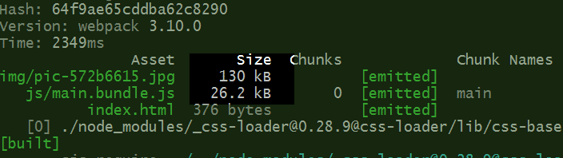
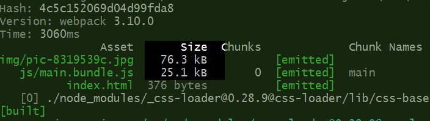

# webpack

https://webpack.js.org/

常用loader列表： https://webpack.js.org/loaders/

英文官网：http://webpack.github.io/

## # js代码编译

hello.js

```javascript
var world = require('./world')

function Hello (str) {
  console.log(str + world('World!'))
}

Hello('Hello ')
```

world.js

```javascript
function World(str) {
  return str
}

module.exports = World
```

命令行中执行：`webpack hello.js hello.bundle.js`

```javascript
// 请打开hello.bundle.js文件查看效果
```

## # 引入样式

style.css

```css
html, body {
  margin: 0;
  padding: 0;
}

body {
  background-color: coral;
}
```

需安装相应loader

```bash
npm install css-loader style-loader --save-dev
```

hello.js

```javascript
require('style-loader!css-loader!./style.css')
function Hello (str) {
  console.log(str)
}

Hello('Hello World!')
```

命令行中执行：`webpack hello.js hello.bundle.js`

```javascript
// 请打开hello.bundle.js文件查看效果
```

或者：

hello.js

```javascript
require('./style.css')
function Hello (str) {
  console.log(str)
}

Hello('Hello World!')
```

命令行中执行：

`webpack hello.js hello.bundle.js --module-bind 'css=style-loader!css-loader'`

新建index.html文件

```html
<!DOCTYPE html>
<html lang="en">
<head>
    <meta charset="UTF-8">
    <meta name="viewport" content="width=device-width">
    <title>Webpack Test</title>
</head>
<body>

<script src="./hello.bundle.js"></script>
</body>
</html>
```

```javascript
// 请在浏览器中打开index.html文件查看效果
```

## 监控修改，实时编译

```bash
webpack hello.js hello.bundle.js --module-bind 'css=style-loader!css-loader' --watch
```

#### # entry

webpack.config.js

```javascript
// String
module.exports = {
  entry: './src/js/main.js'
}

// or Array
module.exports = {
  entry: ['./src/js/main.js', './src/js/page1.js']
}

// or Object
module.exports = {
  entry: {
    'main': './src/js/main.js',
    'page1': './src/js/page1.js'
  }
}
```

#### # output

```javascript
module.exports = {
  entry: {
    'main': './src/js/main.js',
    'page1': './src/js/page1.js'
  },
  output: {
    path: __dirname + '/dist/js',
    // [name] 对应entry对象key值
    // [hash] 每次打包的版本号
    // [chunkhash] 文件的MD5值，当文件内容改变时chunkhash才会改变
    filename: '[name].[chunkhash].js'
  }
}
```

## html-webpack-plugin

https://www.npmjs.com/package/html-webpack-plugin

webpack.config.js

```javascript
const htmlWebpackPlugin = require('html-webpack-plugin')

module.exports = {
  entry: {
    'main': './src/js/main.js'
  },
  output: {
    path: __dirname + '/dist/js',
    filename: 'bundle.[chunkhash].js'
  },
  plugins: [
    new htmlWebpackPlugin()
  ]
}
```

#### # bug

` Cannot find module 'webpack/lib/node/NodeTemplatePlugin'`

项目中未安装webpack，只在全局中安装了。解决方法，项目根目录中执行

```bash
  npm install webpack --save-dev
```

再执行webpack，编辑结果：

dist/js/index.html

```html
<!DOCTYPE html>
<html>
  <head>
    <meta charset="UTF-8">
    <title>Webpack App</title>
  </head>
  <body>
    <script type="text/javascript" src="bundle.2781f2de29a504c79e7f.js"></script>
  </body>
</html>
```

#### # html-webpack-plugin修改参数后

```javascript
  plugins: [
    new htmlWebpackPlugin({
      template: 'index.html' // 项目根目录下路径，context决定
    })
  ]
```

dist/js/index.html

```html
<!DOCTYPE html>
<html lang="en">
<head>
    <meta charset="UTF-8">
    <meta name="viewport"
          content="width=device-width, initial-scale=1.0, minimum-scale=1.0, maximum-scale=1.0, user-scalable=no">
    <title>Webpack Test</title>
</head>
<body>
  <script src="bundle.js"></script>
  <script type="text/javascript" src="bundle.2781f2de29a504c79e7f.js"></script>
</body>
</html>
```

## 在html文档不同位置引入js

index.html

```html
<!DOCTYPE html>
<html lang="en">
<head>
  <meta charset="UTF-8">
  <meta name="viewport"
        content="width=device-width, initial-scale=1.0, minimum-scale=1.0, maximum-scale=1.0, user-scalable=no">
  <title><%= htmlWebpackPlugin.options.title %></title>
  <script src="<%= htmlWebpackPlugin.files.chunks.main.entry %>"></script>
</head>
<body>
  <script src="<%= htmlWebpackPlugin.files.chunks.page1.entry %>"></script>
</body>
</html>
```

webpack.config.js

```javascript
const htmlWebpackPlugin = require('html-webpack-plugin')

module.exports = {
  entry: {
    'main': './src/js/main.js',
    'page1': './src/js/page1.js'
  },
  output: {
    path: __dirname + '/dist',
    filename: 'js/[name].[chunkhash].js'
  },
  plugins: [
    new htmlWebpackPlugin({
      template: 'index.html',
      // 生成的script标签，插入文档位置
      inject: false,
      // 自定义模板参数
      title: 'webpack 指定js插入位置'
    })
  ]
}
```

运行webpack结果

```html
<!DOCTYPE html>
<html lang="en">
<head>
  <meta charset="UTF-8">
  <meta name="viewport"
        content="width=device-width, initial-scale=1.0, minimum-scale=1.0, maximum-scale=1.0, user-scalable=no">
  <title>webpack 指定js插入位置</title>
  <script src="js/main.d0f6ae5b02025dc3baeb.js"></script>
</head>
<body>
  <script src="js/page1.9e95b500e60a34d7f3b6.js"></script>
</body>
</html>
```

#### # html代码压缩

```javascript
  plugins: [
    new htmlWebpackPlugin({
      template: 'index.html',
      inject: false,
      title: 'webpack test',
      // html代码压缩
      minify: {
        // 删除注释
        removeComments: true,
        // 删除空格
        collapseWhitespace: true
      }
    })
  ]
```

## 生成多页面的html

webpack.config.js

#### # chunks: 需要加载的chunk，指定需要加载的chunk

```javascript
const htmlWebpackPlugin = require('html-webpack-plugin')

module.exports = {
  // context: , // 运行上下文
  entry: {
    'main': './src/js/main.js',
    'page1': './src/js/page1.js',
    'page2': './src/js/page2.js'
  },
  output: {
    path: __dirname + '/dist',
    filename: 'js/[name].[chunkhash].js',
    publicPath: 'http://zx1984.cn/'
  },
  plugins: [
    new htmlWebpackPlugin({
      filename: 'main.html',
      template: 'index.html',
      inject: 'body',
      title: 'webpack main.html',
      chunks: ['main', 'page1']
    }),
    new htmlWebpackPlugin({
      filename: 'page1.html',
      template: 'index.html',
      inject: 'body',
      title: 'webpack page1.html',
      chunks: ['page1']
    }),
    new htmlWebpackPlugin({
      filename: 'page2.html',
      template: 'index.html',
      inject: 'body',
      title: 'webpack page2.html',
      chunks: ['page2']
    })
  ]
}
```

#### # excludeChunks: 排除指定chunk，加载其他chunk

```javascript
  plugins: [
    new htmlWebpackPlugin({
      filename: 'main.html',
      template: 'index.html',
      inject: 'body',
      title: 'webpack main.html',
      excludeChunks: ['page2']
    }),
    new htmlWebpackPlugin({
      filename: 'page1.html',
      template: 'index.html',
      inject: 'body',
      title: 'webpack page1.html',
      excludeChunks: ['main', 'page2']
    }),
    new htmlWebpackPlugin({
      filename: 'page2.html',
      template: 'index.html',
      inject: 'body',
      title: 'webpack page2.html',
      excludeChunks: ['main', 'page1']
    })
  ]
```

## 把部分脚本直接写入html文件，减少http请求

https://github.com/jantimon/html-webpack-plugin

// 官方解决方案

https://github.com/jantimon/html-webpack-plugin/blob/master/examples/inline/template.jade

index.html(template)

```html
<!DOCTYPE html>
<html lang="en">
<head>
  <meta charset="UTF-8">
  <meta name="viewport"
        content="width=device-width, initial-scale=1.0, minimum-scale=1.0, maximum-scale=1.0, user-scalable=no">
  <title><%= htmlWebpackPlugin.options.title %></title>
  <script>
    <%=
      compilation.assets[htmlWebpackPlugin.files.chunks.main.entry.substr(htmlWebpackPlugin.files.publicPath.length)].source()
    %>
  </script>
</head>
<body>
  <% for (var key in htmlWebpackPlugin.files.chunks) {%>
    <% if (key !== 'main') { %>
      <script src="<%= htmlWebpackPlugin.files.chunks[key].entry %>"></script>
    <% } %>
  <% } %>
</body>
</html>
```

## loader

webpack enables use of loaders to preprocess files. This allows you to bundle any static resource way beyond JavaScript. You can easily write your own loaders using Node.js.

常用loader列表： https://webpack.js.org/loaders/

https://webpack.js.org/concepts/loaders/

* require() 中使用

  Inline: Specify them explicitly in each import statement.

* CLI (命令行)中使用

  CLI: Specify them within a shell command.

* 配置文件中使用

  Configuration (recommended): Specify them in your webpack.config.js file.

## babel-loader

* Babel is a JavaScript compiler.

  http://babeljs.io/

* webpack

  http://babeljs.io/docs/setup/#installation

  ```bash
  npm install --save-dev babel-loader babel-core
  ```

* 三种配置方式

  http://babeljs.io/docs/plugins/preset-env/

  ```bash
  npm install babel-preset-env --save-dev
  ```

  package.json

  ```json
  {
    "bable": {
      "presets": ["env"]
    },
  }
  ```

* webpack.config.js

  ```javascript
  const path = require('path')
  const htmlWebpackPlugin = require('html-webpack-plugin')

  module.exports = {
    entry: './src/app.js',
    output: {
      path: __dirname + '/dist',
      filename: 'js/[name].bundle.js'
    },
    module: {
      rules: [
        {
          test: /\.js$/,
          // 排除目录，减少编译时间
          exclude: /node_modules/,
          // exclude: path.resolve(__dirname, 'node_modules'),
          // 指定打包文件查找范围
          // include: './src/',
          include: path.resolve(__dirname, 'src'),
          // https://webpack.js.org/configuration/module/#condition
          // include: [
          //   path.resolve(__dirname, "app/styles"),
          //   path.resolve(__dirname, "vendor/styles")
          // ],
          loader: "babel-loader",
          query: {
            presets: ['env']
          }
        }
      ]
    },
    plugins: [
      new htmlWebpackPlugin({
        filename: 'index.html',
        template: 'index.html',
        inject: 'body'
      })
    ]
  }
  ```

## css-loader

处理js页面中引入的css样式文件

```javascript
// webpack将css文件内容，以模块的形式打包到js文件中
import './css/common.css'
```

#### # importloaders

解决@import '*.css'，未加兼容前缀问题，即不能被postcss-loader处理

https://github.com/webpack-contrib/css-loader#importloaders

```javacript
  module: {
    rules: [
      {
        test: /\.css$/,
        use: [
          'style-loader',
          // 解决@import '*.css'，未加兼容前缀问题
          {
            loader: 'css-loader',
            options: {
              // modules: true, // 将修改.class名称为模块名称
              importLoaders: 1
            }
          },
          {
            loader: 'postcss-loader',
            options: {
              ident: 'postcss',
              plugins: function () {
                return [
                  require('autoprefixer')()
                ]
              }
            }
          }
        ]
      }
    ]
  }
```

## style-loader

将webpack打包的js中的css模块，添加到html文档`<style></style>`中

## postcss-loader

Loader for webpack to process CSS with PostCSS. 给需要兼容个浏览器的css样式，加上(-webkit,-ms,-o等)前缀。

https://www.npmjs.com/package/postcss-loader

https://github.com/postcss/postcss-loader

https://github.com/michael-ciniawsky/postcss-load-config

```bash
npm i -D postcss-loader
```

webpack.config.js

```bash
module.exports = {
  module: {
    rules: [
      {
        test: /\.css$/,
        use: [ 'style-loader', 'postcss-loader' ]
      }
    ]
  }
}
```

webpack.config.js (recommended)

```bash
module.exports = {
  module: {
    rules: [
      {
        test: /\.css$/,
        use: [
          'style-loader',
          { loader: 'css-loader', options: { importLoaders: 1 } },
          'postcss-loader'
        ]
      }
    ]
  }
}
```

#### # bug

缺少`postcss-loader config`

* 每次执行postcss-loader，都会去查找postcss.config.js文件

* 先会去查找要处理的css文件所在目录是否有`postcss.config.js`配置文件，若无则会查找项目根目录中的`postcss.config.js`文件

postcss.config.js

```javascript
module.exports = {
  // parser: 'sugarss',
  ident: 'postcss',
  plugins: {
    'autoprefixer': {}
    // 'postcss-import': {},
    // 'postcss-cssnext': {},
    // 'cssnano': {}
  }
}
```

webpack.config.js中直接配置

```javascript
  module: {
    rules: [
      {
        test: /\.css$/,
        use: [
          'style-loader',
          {
            loader: 'css-loader',
            options: { importLoaders: 1 }
          },
          {
            loader: 'postcss-loader',
            options: {
              ident: 'postcss',
              plugins: function () {
                return [
                  require('autoprefixer')()
                ]
              }
            }
          }
        ]
      }
    }
  }
```

#### # autoprefixer

https://www.npmjs.com/package/autoprefixer

```javascript
module.exports = {
  entry: './src/app.js',
  output: {
    path: __dirname + '/dist',
    filename: 'js/[name].bundle.js'
  },
  module: {
    rules: [
      {
        test: /\.css$/,
        use: [
          'style-loader',
          'css-loader',
          {
            loader: 'postcss-loader',
            options: {
              ident: 'postcss',
              plugins: function (loader) {
                return [
                  require('autoprefixer')()
                ]
              }
            }
          }
        ]
      }
    ]
  }
}
```

## 项目中的模板文件

webpack把html文件当字符串处理，或字符串模板处理

webpack模板loader列表： https://webpack.js.org/loaders/#templating

#### # html-loader

```bash
npm i -D html-loader
```

```javascript
  {
    test: /\.html$/,
    loader: 'html-loader'
  }
```

#### # ejs-loader

详见DEMO src/components/layer

```javascript
  {
    test: /\.ejs$/,
    loader: 'ejs-loader'
  }
```

## 图片文件处理

#### # file-loader

模板

```html
<div class="layer">
  <div>This is <%= name %> layer</div>
  <ul>
    <% for (var i = 0; i < arr.length; i++) { %>
      <li><%= arr[i] %></li>
    <% } %>
  </ul>
  <div class="pic">
    
  </div>
</div>
```

```javascript
  {
    test: /\.(png|jpg|gif|svg)$/,
    loader: 'file-loader'
  }
```

* 根目录html文件、css样式文件引入图片，能被正常访问

* 模板文件中引入图片，则不能被正确加载404

```javascript
  {
    test: /\.(png|jpg|gif|svg)$/,
    loader: 'file-loader'
  }
```

解决方法，修改模板文件

```html
<div class="layer">
  <div class="pic">
    
  </div>
</div>
```

* 指定文件名即输出目录

```
  {
    test: /\.(png|jpg|gif|svg)$/,
    loader: 'file-loader',
    query: {
      name: 'img/[name]-[hash:8].[ext]'
    }
  }
```

#### # url-loader

指定大小的图片，可以被编译成base64

https://www.npmjs.com/package/url-loader

```
  {
    test: /\.(png|jpg|gif|svg)$/i,
    loader: 'url-loader',
    query: {
      limit: 20480,
      name: 'img/[name]-[hash:8].[ext]'
    }
  }
```

* 优点：减少http请求

* 缺点：图片文件无浏览器缓存，base64代码可能冗余

#### # image-webpack-loader 压缩图片

压缩图片，减小图片大小

https://www.npmjs.com/package/image-webpack-loader

```
npm install image-webpack-loader --save-dev
```

```
  {
    test: /\.(png|jpg|gif|svg)$/i,
    use: [
      'url-loader?limit=20480&name=img/[name]-[hash:8].[ext]',
      // 压缩图片
      'image-webpack-loader'
    ]
  }
```

* 未使用image-webpack-loader



* 使用image-webpack-loader




