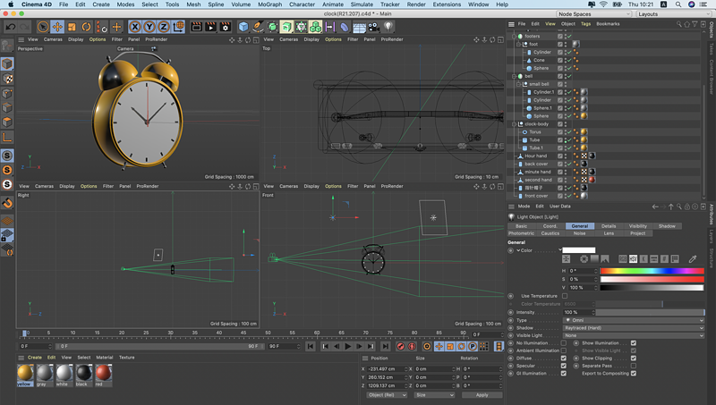
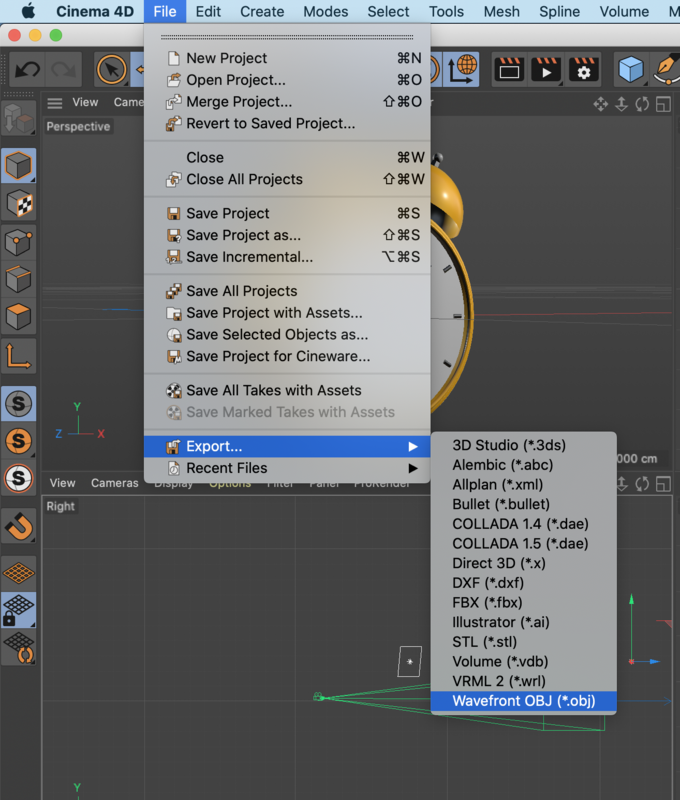
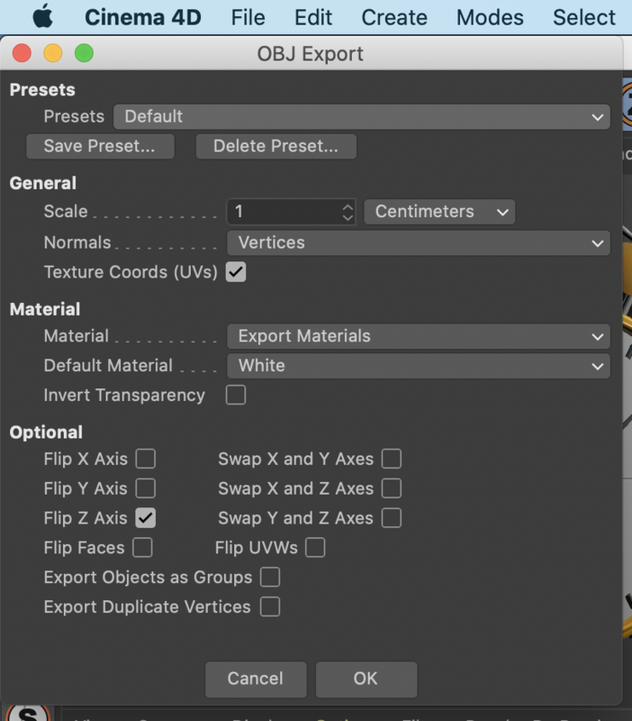
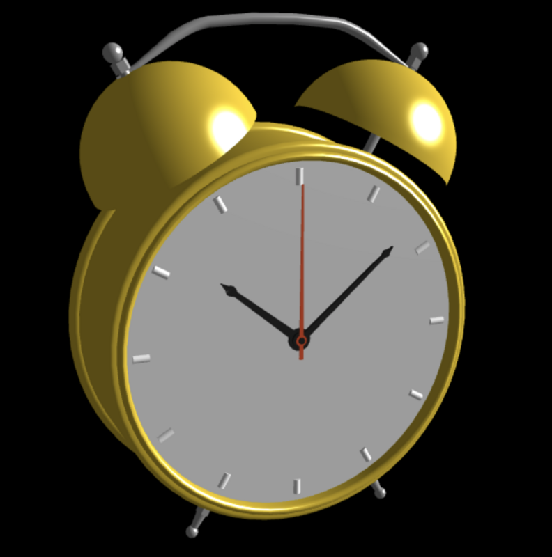

# 从C4D建模到Three.js实现闹钟产品360度展示效果

演示地址：[https://capricorncd.github.io/blog/dist/three/index.html#/ClockObj](https://capricorncd.github.io/blog/dist/three/index.html#/ClockObj)

源码：[https://github.com/capricorncd/blog/tree/master/demos/three](https://github.com/capricorncd/blog/tree/master/demos/three)

C4D文件：clock(R21.207).c4d [https://github.com/capricorncd/blog/tree/master/c4d](https://github.com/capricorncd/blog/tree/master/c4d)

## 流程

* C4D建模
* 导出`.obj`文件
* js实现（Three.js）,此例开发环境使用的Webpack+React

### 一、C4D建模



这里B站有视频教程，这里就不赘述。

在线视频教程：[https://www.bilibili.com/video/BV177411P7d1?p=3](https://www.bilibili.com/video/BV177411P7d1?p=3)

**建模时注意需要注意的地方：**

* 建模：不能使用面(Disc)建模，在浏览器中不会显示，需改用圆柱体(Cylinder)。
* 贴图：需给每个几何体贴图，不能使用分组贴图。在Three.js中分组贴图不能与单个几何体绑定，故浏览器中不会显示贴图。

### 二、导出`.obj`文件

C4D中完成建模和贴图后，就可以导出.obj文件。



```
# 工具栏
file -> Export -> Wavefront OBJ(*.obj)
```

其他导出选项默认即可。导出obj文件的同时，会导出一个同名贴图.mtl文件。



### 三、js实现

```
# "three": "^0.120.1"
npm i -S three
# or
yarn add three
```

src/components/ClockObj/core.js

```javascript
import {
  AmbientLight,
  DirectionalLight, PerspectiveCamera,
  Scene, WebGLRenderer
} from 'three'
import { OBJLoader } from 'three/examples/jsm/loaders/OBJLoader'
import { MTLLoader } from 'three/examples/jsm/loaders/MTLLoader'
import { OrbitControls } from 'three/examples/jsm/controls/OrbitControls'

let scene, renderer

/**
 * 加载贴图和模型对象文件
 * load resource
 * @returns {Promise<unknown>}
 */
 function loadResource() {
   return new Promise((resolve, reject) => {
     const objLoader = new OBJLoader()
     const mtlLoader = new MTLLoader()
     // 加载贴图文件
     mtlLoader.load('static/clock.mtl', mtl => {
       // 加载对象前，先设置贴图数据
       objLoader.setMaterials(mtl)
       // 加载对象文件
       objLoader.load('static/clock.obj', res => {
         resolve(res)
       }, undefined, reject)
     }, undefined, reject)
  })
}

/**
 * 初始化
 */
function _init(el, obj) {
  // 获取容器尺寸，
  // 如果是window对象，请使用window.innerWidth, window.innerHeight
  const width = el.offsetWidth
  const height = el.offsetHeight

  // 创建场景
  scene = new Scene()
  // 将加载完成的模型对象，添加到场景中
  scene.add(obj)

  // 创建环境光
  const ambientLight = new AmbientLight(0x666666)
  ambientLight.position.set(100, -100, -200)
  scene.add(ambientLight)

  // 创建平行光
  const light = new DirectionalLight(0xcccccc, 1)
  light.position.set(2000, 1000, 1000)
  scene.add(light)

  // 创建摄像机
  const camera = new PerspectiveCamera(45, width / height, 1, 80000)
  camera.position.set(-150, -50, 300)

  // 创建renderer
  renderer = new WebGLRenderer({
    // 消除锯齿
    antialias: true
  })
  // 设置渲染区域尺寸
  renderer.setSize(width, height)
  // 设置背景颜色
  renderer.setClearColor(0x000000, 1)
  // 将场景Canvas DOM元素，添加至父元素中
  el.appendChild(renderer.domElement)

  // 创建场景鼠标控制实例，
  // 可以对页面上的模型对象进行旋转/缩放等操作
  const orbitControls = new OrbitControls(camera, el)
  orbitControls.addEventListener('change', render)

  // 执行渲染，指定场景和相机作为参数
  function render() {
    renderer.render(scene, camera)
  }
  render()
}

/**
 * 导出初始化方法
 */
export function init(el) {
  loadResource().then(res => {
    _init(el, res)
  }).catch(console.error)
}

/**
 * destroy
 */
export function destroy() {
  if (!scene || !renderer) return
  scene.remove()
  renderer.dispose()
  scene = null
  renderer = null
}
```

src/components/ClockObj/index.jsx

```jsx
import React, { useEffect } from 'react'
import { destroy, init } from './core'

function ClockObjDemo() {
  useEffect(() => {
    const el = document.querySelector('.clock-demo-el-hook')
    init(el)
    return () => {
      destroy()
    }
  }, [])
  return <main className="clock-demo-el-hook"/>
}

export default ClockObjDemo
```

## 效果截图



## 备注

建模贴图未使用图片等外部文件，可能还有其他的坑，以后遇到了再补上。
