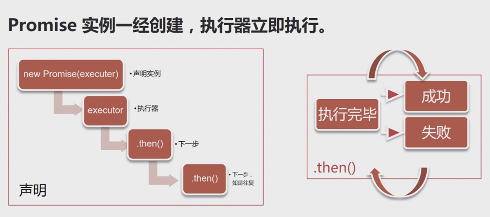
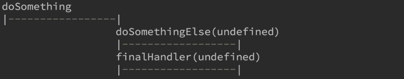
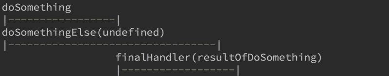
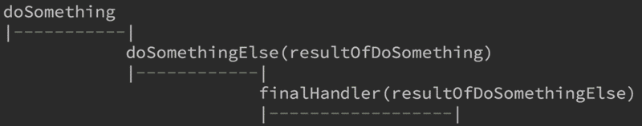
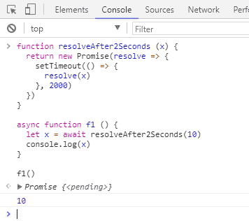

# Promise

英 `[ˈprɒmɪs]` 美 `[ˈprɑ:mɪs]`

vt. 允诺，许诺;给人以…的指望或希望

vi. 许诺;有指望，有前途

n. 许诺;希望，指望;允诺的东西

## 解释

#### # MDN

Promise对象用于异步计算。

一个Promise表示一个现在、将来或永远不可能出现的值。

#### # 按照用途来解释

主要用于异步计算

可以将异步操作队列化，按照期望的顺序执行，返回符合预期的结果。

可以在对象之间传递和操作Promise，帮助我们处理队列。

## Promise诞生原因

#### # JavaScript包含大量的异步操作。

JavaScript为检查表单而生。

创造它的首要目标是操作DOM。

所有，JavaScript的操作大多是异步的。

```
异步操作可以避免页面冻结！
```

#### # 异步操作的常见语法

* 事件监听与响应

```js
const el = document.getElementById('Start')
el.addEventListener('click', start, false)

function start () {
  // 响应事件，进行相应操作
}

// jQuery用'.on()'也是事件监听
$('#Start').on('click', start)
```

* 回调

```
$.ajax('http://url.cn', {
  success: function (res) {
    // 回调处理
  }
})
```

#### # 浏览器中的JavaScript

* 异步操作以事件为主

* 回调主要出现在Ajax和File Api

* 这个时候的问题尚不严重

#### # 有了Node.js之后

对异步的依赖进一步加剧了...

* 无阻塞高并发，是Node.js的招牌

* 异步操作是其保障

* 大量操作依赖回调函数( 暴露出回调的问题 )

* 稍有不慎，就会踏入“回调地狱”

#### # 回调有四个问题

* 嵌套层次很深，难以维护

* 无法正常使用return 和 throw（异步函数不在同一个堆栈）

* 无法正常检索堆栈信息（每次回调都是在一个系统层面的一个新的堆栈）

* 多个回调之间难以建立联系（一个回调一旦启动，我们就再没办法对他进行操作）

## Promise 详解

#### # 栗子

```javascript
new Promise(
  /* 执行器 executor */
  function (resolve, reject) {
    // 一段耗时很长的异步操作

    resolve() // 数据处理完成

    reject() // 数据处理出错
  }
)
.then(function A () {
  // 成功，下一步
}, function B () {
  // 失败，做相应处理
})
```

Promise 是一个代理对象，它和原先进行的操作并无关系。我们只是把原先的操作放到了执行器executor里面而已。

它通过引入一个回调，避免更多的回调。它可以把一个回调展开，全部基于Promise自己的回调。

#### # Promise有3个状态

* pending 【待定】初始状态

* fulfilled 【实现】 操作成功

* reject 【被否决】 操作失败

Promise状态发生改变，就会触发.then()里面的响应函数处理后续步骤

Promise 状态一经改变，不会再变。



#### # 分两次，顺序依次执行

```javascript
new Promise(
   function (resolve) {
     setTimeout(function () {
       resolve('hello')
     }, 2000)
   }
 )
   .then(function (res) {
     console.log(res)
     return new Promise(function (resolve) {
       setTimeout(function () {
         resolve('world!')
       }, 2000)
     })
   })
   .then(function (value) {
     console.log(value + ' world!')
   })
```

结果:

```
Here we go!
hello
world! world!
```

#### # 假设一个Promise已执行完，再`.then`会怎样？

```
console.log('start ...')

let promise = new Promise((resolve) => {
  setTimeout(() => {
    console.log('the promise fulfilled')
    resolve('hello world')
  }, 1000)
})

setTimeout(() => {
  promise.then(value => {
    console.log('after 3000: ' + value)
  })
}, 3000)
```

结果：

```
start ...
the promise fulfilled
after 3000: hello world
```

#### # 在.then()的函数里面不返回新的Promise?

```
console.log('Here we go!')
// Promise实例
new Promise(
  /* 执行器 executor */
  function (resolve) {
    setTimeout(function () {
      resolve('hello')
    }, 2000)
  }
)
  .then(function (value) {
    console.log(value)
    console.log('everyone')
    (function () {
      return new Promise(function (resolve) {
        setTimeout(function () {
          console.log('Mr.Laurence!')
          resolve('Merry Xmax')
        }, 2000)
      })
    }())
    // 此处不return，则下一个then()接收到的参数为undefined
    return false
  })
  .then(function (value) {
    console.log(value + ' world!')
  })
```

结果：

```
Here we go!
hello
everyone
false world!
Mr.Laurence!
```

#### # .then()

* `.then()` 接收两个函数作为参数，分别代表`fulfilled`和`rejected`

* `.then()` 返回一个新的Promise实例，所以它可以链式调用

* 当前面的Promise状态改变时，`.then()`根据其最终状态，选择特定的状态响应函数执行

  如果为fulfilled，则执行fulfilled对应函数；为rejected，则执行rejected对应函数

* 状态响应函数可以返回新的Promise，或其它值

* 如果返回新的Promise，那么下一级`.then()`会在新的Promise状态改变之后执行

* 如果返回其它任何值，则会立刻执行下一级`.then()`

#### # .then()里有.then()的情况

* 因为`.then()`返回的还是Promise实例

* 所有会等里面的`.then()`执行完，再执行外层的`.then()`

* 最好不要嵌套`.then()`，把`.then()`放在同一级方便阅读

## 下面4种Promise的区别

#### # Example 1

```
# 1
doSomething()
  .then(function(){
    return doSomethingElse()
  })
  .then(finalHandler)
```


#### # Example 2

```
# 2
doSomething()
  .then(function(){
    doSomethingElse()
  })
  .then(finalHandler)
```



#### # Example 3

```
# 3
doSomething()
  .then(doSomethingElse())
  .then(finalHandler)
```



`doSomethingElse()` 和 `doSomething()`在同一栈执行，几乎同时执行

`.then(finalHandler)`执行时间为`doSomething()`执行完成的时间

#### # Example 4

```
# 4
doSomething()
  .then(doSomethingElse)
  .then(finalHandler)
```



## 错误处理

#### # Promise 会自动捕获内部异常，并交给rejected响应函数处理

```
// example-error.js
console.log('here we go')
new Promise(function (resolve) {
  setTimeout(function () {
    throw new Error('bye')
  }, 2000)
})
  .then(function (value) {
    console.log(value + ' world')
  })
  .catch(function (err) {
    console.log('Error: ', error.message)
  })

```

```
// example-error-rejected.js
console.log('here we go')
new Promise(function (resolve, reject) {
  setTimeout(function () {
    reject('bye')
  }, 2000)
})
  .then(function (value) {
    console.log(value + ' world')
  }, function (err) {
    console.log('Error: ', err)
  })
```

#### # 处理的两种做法

* reject('错误信息').then(null, message => {})

* throw new Error('错误信息').catch(message => {})

* 推荐使用第二种，更加清晰好读，并且可以捕获前面的错误。

#### # .catch() + .then()

```
// example-catch-then.js
console.log('here we go')
new Promise(function (resolve) {
  setTimeout(function () {
    resolve()
  }, 1000)
})
  .then(function () {
    console.log('Start')
    throw new Error('test error')
  })
  .catch(function (err) {
    console.log('I catch: ', err)
    // 下面这一行的注释将引发不同的走向
    // throw new Error('another error')
  })
  .then(function () {
    console.log('arrive here')
  })
  .then(function () {
    console.log('... and here')
  })
  .catch(function (err) {
    console.log('No, I catch: ', err)
  })
```

#### # 注意

强烈建议在所有队列最后都加上`.catch()`，以避免漏掉错误处理造成意想不到的问题。

```
doSomething()
  .doAnotherThing()
  .doMoreThing()
  .catch(err => {
    console.log(err)
  })
```

队列是异步的，队列执行时没有问题，但执行中可以抛出错误！

## Promise.all()

#### # 批量执行

* `Promise.all([p1, p2, p3, ...])` 用于将多个Promise实例，包装成一个新的Promise实例。

* 返回的实例就是普通Promise

* 它接收一个数组作为参数

* 数组里可以是Promise对象，也可以是别的值，只有Promise会等待状态改变

* 当所有子Promise都完成，该Promise完成，返回值是全部值的数组

* 有任何一个失败，该Promise失败，返回值是第一个失败的子Promise的结果

#### # 例子

```
// example-all.js
console.log('here we go')
Promise.all([1, 2, 3])
  .then(function (all) {
    console.log('1: ', all)
    return Promise.all([function () {
      console.log('00xx')
    }, 'xxoo', false])
  })
  .then(function (all) {
    console.log('2: ', all)
    let p1 = new Promise(function (resolve) {
      setTimeout(function () {
        resolve('I\'m P1')
      }, 1500)
    })
    let p2 = new Promise(function (resolve) {
      setTimeout(function () {
        resolve('I\'m P2')
      }, 1450)
    })
    return Promise.all([p1, p2])
  })
  .then(function (all) {
    console.log('3: ', all)
    let p3 = new Promise(function (resolve, reject) {
      setTimeout(function () {
        reject('I\'m P3')
      }, 1500)
    })
    let p4 = new Promise(function (resolve, reject) {
      setTimeout(function () {
        reject('I\'m P4')
      }, 1000)
    })
    let p5 = new Promise(function (resolve, reject) {
      setTimeout(function () {
        reject('I\'m P5')
      }, 3000)
    })
    return Promise.all([p3, p4, p5])
  })
  .then(function (all) {
    console.log('all: ', all)
  })
  .catch(function (err) {
    console.log('I catch: ', err)
  })
```

结果：

```
here we go
1:  [ 1, 2, 3 ]
2:  [ [Function], 'xxoo', false ]
3:  [ 'I\'m P1', 'I\'m P2' ]
I catch:  I'm P4
```

#### # Promise.all()最常见就是和.map()连用

```
// 查找目录中最大的文件
// ...
```

#### # 实现队列

有时候我们不希望所有动作一起发生，而是按照一定顺序，逐个进行。

```
let promise = doSomething()
promise = promise.then(doSomethingElse)
promise = promise.then(doSomethingElse2)
promise = promise.then(doSomethingElse3)
...
```

* 使用`.forEach()`

```
// 定义queue
function queue (things) {
  let promise = Promise.resolve()
  things.forEach(function (thing) {
    promise = promise.then(function () {
      return new Promise(function (resolve) {
        doThing(thing, function () {
          resolve()
        })
      })
    })
  })
  return promise
}
// 使用
queue(['lots', 'of', 'things', ....])
```

* 使用`.reduce()`

```
// 定义queue
function queue (things) {
  return things.reduce(function () {
    return promise.then(function () {
       return new Promise(function (resolve) {
         doThing(thing, function () {
           resolve()
         })
       })
     })
  }, Promise.resolve())
}
// 使用
queue(['lots', 'of', 'things', ....])
```

两个常见错误：

1. 没有把`.then()`产生的新Promise实例赋给promise，没有生产队列

```
things.forEach(function (thing) {
  promise.then(function () {
    return new Promise(function (resolve) {
      doThing(thing, function () {
        resolve()
      })
    })
  })
})
```

2. Promise实例创建之后，会立刻运行执行器代码，所有这个也无法达成队列的效果

```
function queue (things) {
  return things.reduce(function (promise, thing) {
    let step = new Promise(function (resolve) {
      doThing(thing, function () {
        resoleve()
      })
    })
    return promise.then(step)
  }, Promise.resolve())
}
```

#### # 实战

假设需求：开发一个爬虫，抓取某网站内容

* 参见 `./js/example-spider.js`

## Promise.resolve()

返回一个fulfilled的Promise实例，或原始Promise实例。

* 参数为空，则返回一个状态为fulfilled的Promise实例

* 如果参数是一个与Promise无关的值，返回结果同上。不过fulfilled响应函数会得到这个参数。

* 如果参数为Promise实例，则返回该实例，不做任何修改

* 如果参数为thenable，则立刻执行它的`.then()`方法

* 参见：`./js/example-resolve.js`

```
console.log('start ...')
Promise.resolve()
  .then(function (value) {
    console.log('Step 1', value)
    return Promise.resolve('Hello')
  })
  .then(function (value) {
    console.log(value, ' World')
    return Promise.resolve(new Promise(function (resolve) {
      setTimeout(function () {
        resolve('Good')
      }, 2000)
    }))
  })
  .then(function (val) {
    console.log(val, ' evening')
    return Promise.resolve({
      // thenable
      then () {
        console.log(', everyone')
      }
    })
  })
```

结果：

```
start ...
Step 1 undefined
Hello  World
Good  evening
, everyone
```

## Promise.reject()

返回一个rejected的Promise实例

* Promise.reject()不认thenable

* 参见./js/example-reject.js

```
let promise = Promise.reject('something wrong')

promise
  .then(function () {
    console.log('it\'s not ok')
  })
  .catch(function (msg) {
    console.log(msg)
    console.log('no, it\'s not ok')
    return Promise.reject({
      then() {
        console.log('it vill be ok')
      },
      catch() {
        console.log('not yet')
      }
    })
  })
```

结果：

```
something wrong
no, it's not ok
```

## Promise.race()

类似 Promise.all(),区别在于它有任意一个完成，就算完成。

* 参见./js/example-race.js

```
console.log('start ...')

let p1 = new Promise(function (resolve) {
  setTimeout(function () {
    resolve('I\'m P1')
  }, 10000)
})

let p2 = new Promise(function (resolve) {
  setTimeout(function () {
    resolve('I\'m P2')
  }, 2000)
})

Promise.race([p1, p2])
  .then(function (val) {
    console.log(val)
  })
```

结果：

```
start ...
// 2秒后输出
I'm P2
// 10秒后结束进程
```

#### # 常见用法

* 把异步操作和定时器放在一起

* 如果定时器先触发，就认为超时，告知用户。

## 应用

#### # 把回调包装成Promise

把回调包装成Promise最为常见。它有两个显而易见的好处：

* 可读性更好

* 返回的结果可以加入任何Promise队列

* 参见./js/example-wrap.js

```
const fs = require('./file-system')

fs.readFile('../README.md', 'utf-8')
  .then(function (content) {
    console.log(content)
  })

```

file-system.js

```
const fs = require('fs')

module.exports = {
  readDir (path, options) {
    return new Promise((resolve) => {
      fs.readdir(path, options, (err, files) => {
        if (err) {
          throw err
        }
        resolve(files)
      })
    })
  },
  readFile (path, options) {
    return new Promise((resolve) => {
      fs.readFile(path, options, (err, content) => {
        if (err) {
          throw err
        }
        resolve(content)
      })
    })
  }
}
```

#### # 把任何异步操作包装成Promise

假设需求：

* 用户点击按钮，弹出确认窗体

* 用户确认或取消有不同的处理

* 样式问题不能使用window.confirm()

* 参见./js/example-modal.js

```
// 弹出模态框
let confirm = popupManager.confirm('你确定么？')
confirm.promise
  .then(() => {
    // do confirm staff
  })
  .catch(() => {
    // do cancel staff
  })

// 窗体的构造函数
class Confirm {
  constructor () {
    this.promise = new Promise((resolve, reject) => {
      this.confirmButton.onClick = resolve
      this.cancelButton.onClick = reject
    })
  }
}
```

## jQuery

jQuery 已经实现了Promise

jQuery 1.5版本就引入了Promise思维及功能

```
$.ajax(url, {
  dataType: 'json'
})
  .then(json => {
    // do something
  })
```

#### # IE浏览器

如果需要在IE中使用Promise， 有两个选择：

* 只想实现异步队列，不需要使用Promise关键字：使用jQuery.defered即可

* 需要兼容所有平台，需要使用Promise关键字：Bluebird类库，或Promise polyfill

#### # Fetch API

Fetch API是XMLHTTPRequest的现代化替代方案。

* 相对ajax更强大，也更友好。

* 直接返回一个Promise实例

* 参见./js/example-fetch.js

```
fetch('some.json')
  .then(response => {
    return response.json()
  })
  .then(json => {
    // do something with this josn
    console.log(json)
  })
  .catch(err => {
    console.log(err)
  })
```

## async/await

ES2017新增运算符，新的语言元素

* 赋予JavaScript以顺序手法编写异步脚本的能力

* 既保留异步运算的无阻塞特性，还继续使用同步写法

* 还能正常使用 return/try/catch

#### #为什么还要学Promise

* async/await 仍然需要Promise

* 了解更多，请参考MDN async文档和await文档

* ./js/example-await.js

```
function resolveAfter2Seconds (x) {
  return new Promise(resolve => {
    setTimeout(() => {
      resolve(x)
    }, 2000)
  })
}

async function f1 () {
  let x = await resolveAfter2Seconds(10)
  console.log(x)
}

f1() // 10

```



## 备注

笔记作者：Capricorncd

https://github.com/capricorncd

讲师：Meathill

视频讲解： https://www.imooc.com/learn/949
