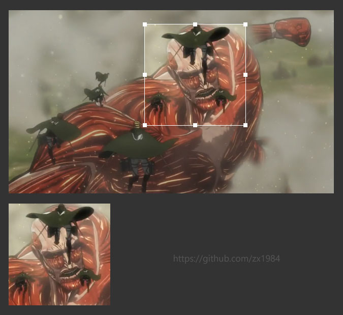

# JavaScript实现图片剪切效果



## 启动DEMO

```bash
// node环境中安装依赖
npm install
// 启动服务
npm run dev
```

浏览器中输入地址：http://localhost:9002

## 知识点

#### # 鼠标位置

|Event属性|说明|
|:--|:--|
|clientX(Y)| 相对于浏览器窗口可视区左上角位置，与滚动条无关 |
|pageX(Y)| 相对于Document文档左上角位置 |
|layerX(Y)| 相对于event.target容器左上角位置 |
|screenX(Y)| 相对于设备(比如显示器)窗口左上角位置 |
|x(y)| 同clientX(Y) |

#### # 元素尺寸

|属性|块元素|行内元素|说明|
|:--|:--:|:--:|:--|
|clientWidth(Height)|实际像素|0|元素宽（高）+ padding - 滚动条宽度|
|clientTop(Left)|实际像素|0|chrome测试结果：像是border宽度|
|offsetWidth(Height)|实际像素|实际像素|元素宽（高）+ padding + border|
|offsetTop(Left)|实际像素|实际像素|外边框据Document顶部（左边）距离|
|scrollWidth(Height)|实际像素|0|内部能滚动的元素宽（高）|
|scrollTop(Left)|实际像素|0|滚动条位置|

## Remark

笔记作者：Capricorncd

https://github.com/capricorncd

视频讲师：Ben

https://www.imooc.com/learn/144
