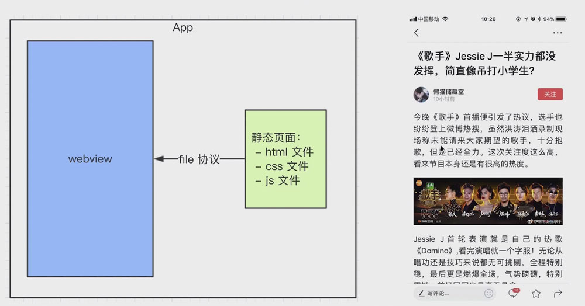
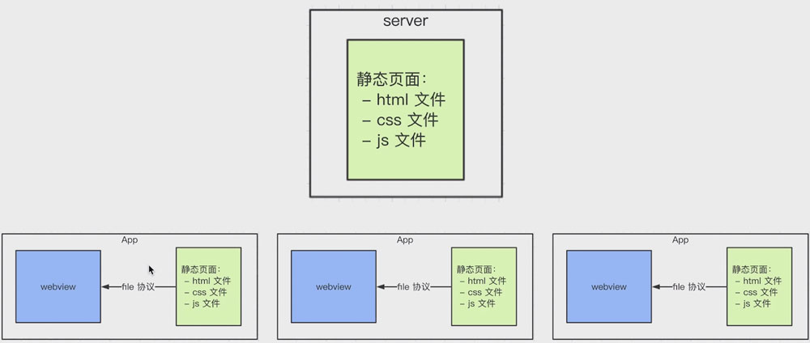
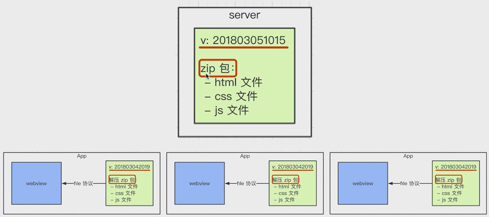
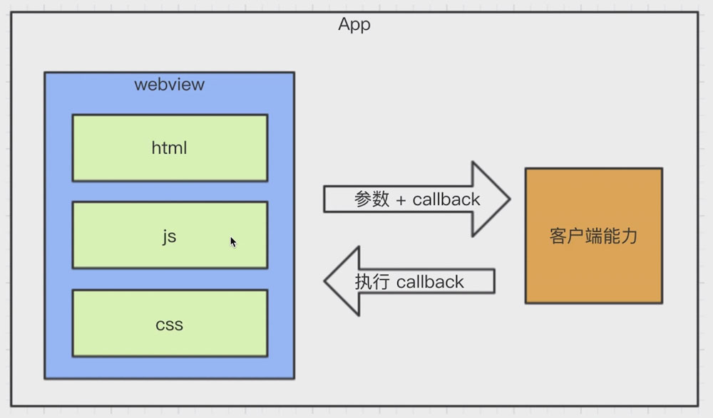

# Hybrid

## Hybrid是什么，为什么要用Hybrid

#### Hybrid

Hybrid “混合”，即前端和客户端的混合开发

需要前端开发人员和客户端开发人员配合完成

某些环节也可能涉及到server端

#### 存在价值

可以快速迭代更新，无需app审核

体验流畅（某些效果和NA的体验基本类似）

## webview

是app中的一个组件（app可以有webview，也可以没有）

用于加载H5页面，即一个小型的浏览器内核

## file协议

其实在一开始接触html开发时，就已经使用了file协议

只不过你当没有“协议” “标准”等这些概念

再次强调“协议” “标准”的重要性

#### 与http(s)区别

file协议：本地文件，快

http(s)协议：网络加载，相对慢

## 具体实现

不是所有场景都适合使用hybrid

使用NA：体验要求极致，变化不频繁（如头条的首页）

使用hybrid：体验要求高，变化频繁（如头条的新闻详情页）

使用H5：体验不要求，不常用（如举报、反馈等页面）

* 前端做好静态页面（html js css），将文件交给客户端

* 客户端拿到静态文件，以文件形式存储在app中

* 客户端在一个webview中

* 使用file协议加载静态页面



## 更新上线流程



#### 思考

要替换每个客户端的静态文件，只能客户端来做（客户端是我们自己开发的）

客户端去server下载最新的静态文件

web开发维护server的静态文件

#### 完整流程



分版本，有版本号，如201805290018

将静态文件压缩成zip包，上传到服务器

客户端每次启动，都去服务器端检查版本号

如果服务端版本号大于客户端，则需下载更新zip包

下载完成解压，覆盖（删除）本地文件

## hybrid和h5区别

#### 优点

体验更好，更NA体验基本一致

可以快速迭代，无需app审核【关键】

#### 缺点

开发成本高。联调、测试、查bug都比较麻烦

运维成本高。（参考之前的更新上线流程）

#### 适用的场景

hybrid：产品的稳定功能，体验要求高，迭代频繁；适合产品型

h5：单次的运营活动（如xxx红包），或补常用功能；适合运营型

## 前端和客户端通信

#### JS和客户端通信的基本形式



JS访问客户端能力，传递参数和回调函数

客户端通过回调函数返回内容

#### schema协议简介和使用

之前介绍了http(s)和file协议

schema协议 —— 前端和客户端通讯的约定

```
// 扫一扫
weixin://dl/scan
// 朋友圈
weixin://dl/moments
// ...
```

```javascript
let iframe = document.createElement('iframe')

iframe.style.display = 'none'
iframe.src = 'weixin://dl/scan'

let body = document.body || document.getElementsByName('body')[0]
body.appendChild(iframe)
setTimeout(_ => {
  body.removeChild(iframe)
  iframe = null
})
```

#### schema使用的封装

```javascript
// 实现
(function () {

  // 调用schema的封装
  function _invoke (action, data, callback) {
    // 拼装schema协议
    let schema = 'myapp://utils/' + action
    // 拼接参数
    schema += '?'
    for (let key in data) {
      if (data.hasOwnProperty(key)) {
        schema += `&${key}=${data[key]}`
      }
    }
    // 处理callback
    let callbackName = ''
    if (typeof callback === 'string') {
      callbackName = callback
    } else {
      callbackName = action + Date.now()
      window[callbackName] = callback
    }

    schema += `callback=${callbackName}`

    // 触发
    let iframe = document.createElement('iframe')
    iframe.style.display = 'none'
    iframe.src = schema
    let body = document.body || document.getElementsByName('body')[0]
    body.appendChild(iframe)
    setTimeout(_ => {
      body.removeChild(iframe)
      iframe = null
    })
  }

  // 暴露到全局
  window.invoke = {
    share (data, callback) {
      _invoke('share', data, callback)
    },
    login (data, callback) {
      _invoke('login', data, callback)
    },
    scan (data, callback) {
      _invoke('scan', data, callback)
    }
  }
}(window))
```

#### 内置上线

将以上封装的代码打包，为invoke.js，内置到客户端

客户端每次启动webview，都默认执行invoke.js

本地加载，免去网络加载的时间，更快

本地加载没有网络请求，黑客看不到schema协议，更安全


