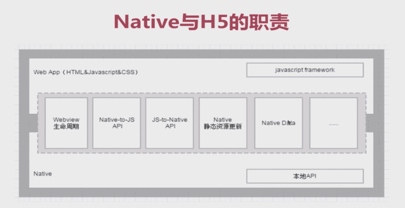
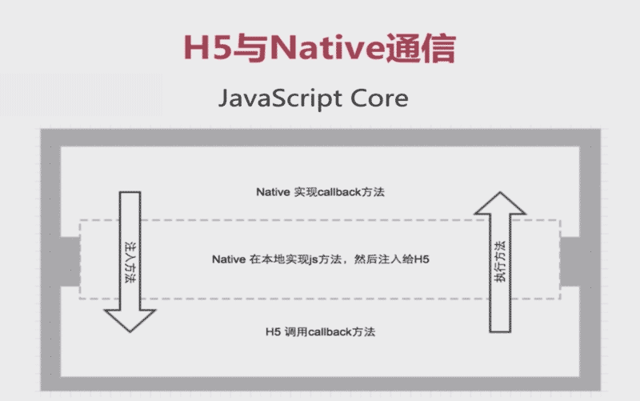
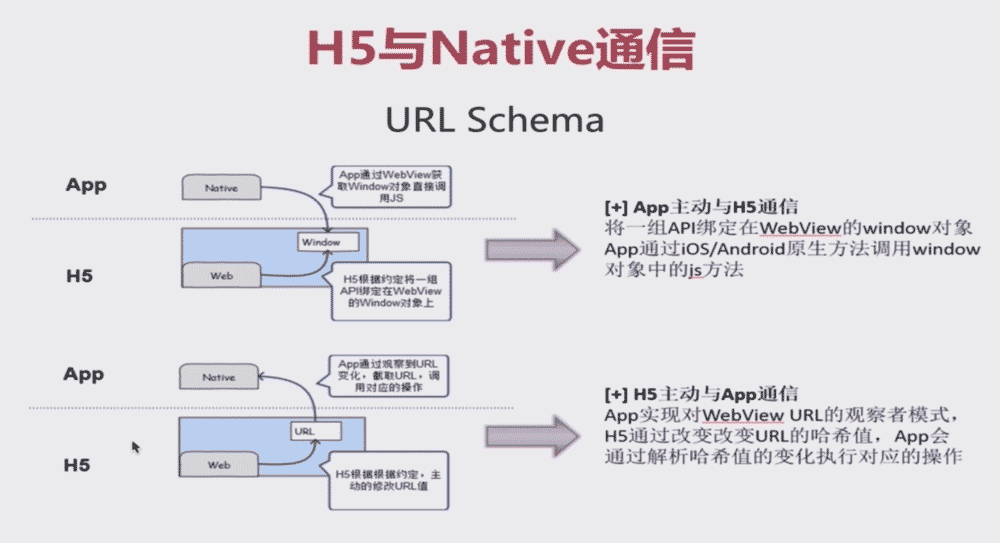
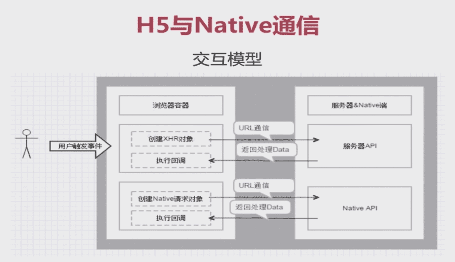
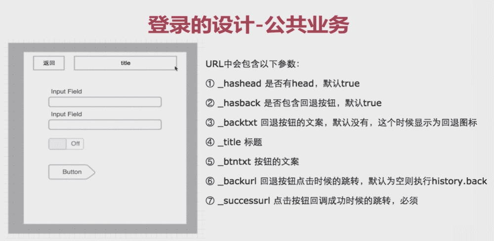
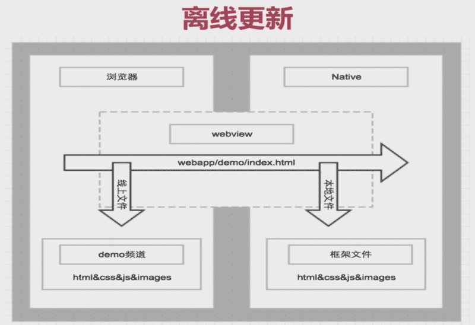

# Hybrid

## # Hybrid 应用场景

* 选型问题

Native App优缺点
Hybrid App优缺点

|-|Native|Html5|Hybrid|
|--:|:--:|:--:|:--:|
|图形渲染|本地API渲染|Html、Canvas、CSS|混合|
|性能|快|慢|慢|
|原生界面|原生|模仿|模仿|
|发布|App Store|Web|App Store|

## # Native与H5的职责

* 界限问题

H5做业务

Native提供基础能力

Native做好必须Native做的业务



## # Hybrid的发展

React native, Weex

## # H5与Native通信

* App版本标志

User Agent: haybrid_xxx_1.0.0

User Agent: wechatdevtools/0.7.0 MicroMessenger/6.3.9

* JavaScript Core



当两种技术都能实现某一功能时，尽量选择比较成熟的那种

* URL Schema



交换模型



```javascript
// JavaScriptCore == JS Bridge
// URL Schema

const NativeBridge = {};

NativeBridge.getAddress = function (callback) {
  // bridge在这个函数体里面有H5与Native通信的方式，抹平差异
  requestHybird({
    tagname: 'getAddressList',
    callback: function (data) {
      callback(data);
    }
  })
  // xmq://getAddressList?a=22&b=33
}
```

* 源码实现分析

```javascript
// 处理参数
let _getHybridUrl = function (params) {
  let k
  let paramStr = ''
  let url = 'hybrid://'
  let flag = '?'
  // 时间戳，防止url不起效
  url += params.tagname
  if (params.callback) {
    flag = '&'
    url += '?callback=' + params.callback
    // delete params.callback
  }
  let param = params.param
  if (param) {
    paramStr = typeof param === 'object' ? JSON.stringify(param) : ''
    url = url + flag + 'param=' + encodeURIComponent(paramStr)
  }
  return url
}

let bridgePostMsg = function (params) {
  let url = _getHybridUrl(params)
  // 兼容ios6
  let ifr = $(`<iframe style="display: none" src="${url}"></iframe>`)
  console.log(`${params.tagname}-hybrid请求发出-${+new Date()}+url:`)
  if ($.os.android) {
    // Android情况协议发的太快会有问题
    setTimeout(_ => {
      $('body').append(ifr)
    })
  } else {
    $('body').append(ifr)
  }

  // 这样会阻断第二次请求
  // window.location = url

  setTimeout(_ => {
    ifr.remove()
    ifr = null
  })
}

// h5与Native基本交互
let requestHybrid = function (params) {
  if (!params.tagname) alert('必须包含tagname')
  // 生成唯一执行函数，执行后销毁
  let tt = +new Date() + '_' + _.uniqueId() + '_'
  // 生成一个唯一的字符串
  let t = 'hybrid_' + params.tagname + '_' + tt
  let tmpFn
  // 处理有回调的情况
  if (params.callback) {
    tmpFn = params.callback
    params.callback = t
    window.Hybrid[t] = function (data) {
      tmpFn(data)
      // delete window.Hybrid[t]
    }
  }
  // 解析callback，生成唯一的callbackid
  // 将一个函数和一个字符串映射起来
  // callbackid: function () {}
  bridgePostMsg(params)
}

// hybrid://getAddressList?callback=id
requestHybrid({
  tagname: 'getAddressList',
  param: {},
  callback: function (data) {
    // ...
  }
})
```

## # 思维拓展

* 什么是收口

Ajax请求收口

## # Hybrid核心交互

* 跳转

forward

动画

* 全局化

back实现

History乱了

Native Path化

* 思考-入口的设计

鉴权的矛盾

体系化

## # 账号体系

* 请求鉴权怎么做

前后分离

Webview中的鉴权

* 登录的设计-公共业务



## # Native能力的设计

* Header组件的设计

H5中的header组件

Native中的header组件

* Webview的生命周期

onwebviewshow

onwebviewhide

* 分享

NativeUI

独立API

## # 离线更新



* 增量问题

App增大的取舍

## # 做一个Hybrid项目

* 如何落地

共赢、调试、文档

## # 总结

一套代码三端运行

H5效率高的伪命题

H5体验差的错误认识

技术体系化的作用

http://www.cnblogs.com/yexiaochai

https://github.com/yexiaochai/Hybrid
