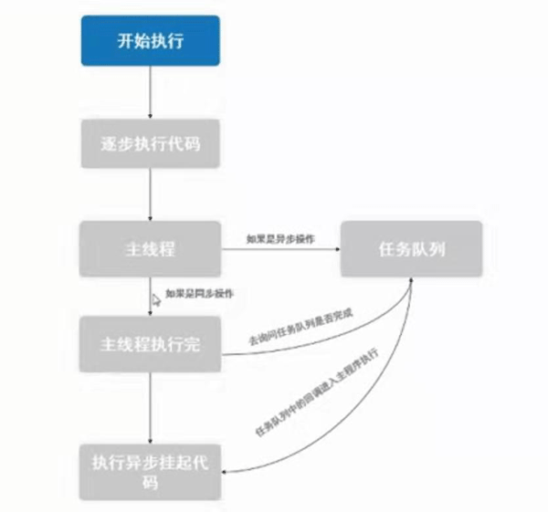
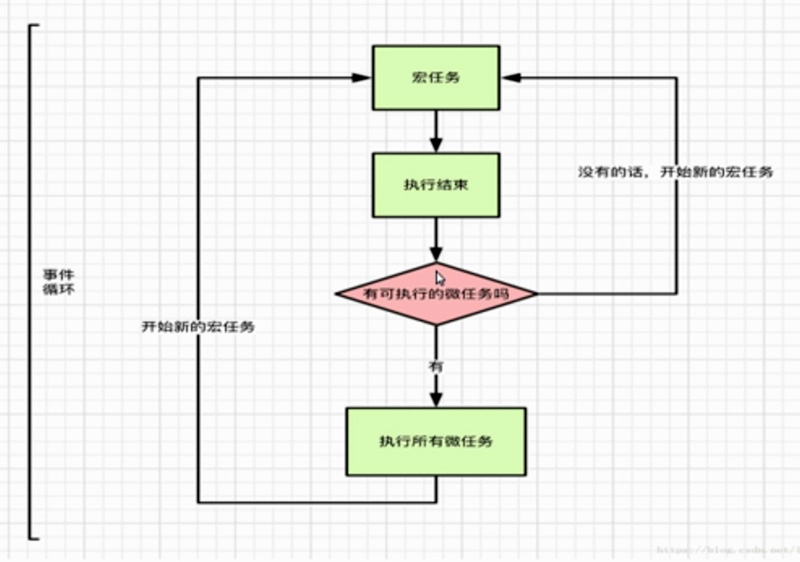

# 异步交互2.0

### JS执行机制

宏任务&微任务

js主要的异步操作

* 事件绑定

* 定时器

* Ajax请求

### 回调函数

容易形成回调地狱，不利于阅读。

### Promise

* Promise属于宏任务

* Promise构造函数是同步的，而then里是异步的

* Promise状态不可逆

* then或catch里return的值会被后面的then或catch接受

* Promise不管返回什么，都会被包装成promise对象，即使返回一个Error

* then接收到的如果不是函数，会发生穿透

* Promise对象resolve或者reject一个promise对象，前一个promise的状态会由后一个决定。
