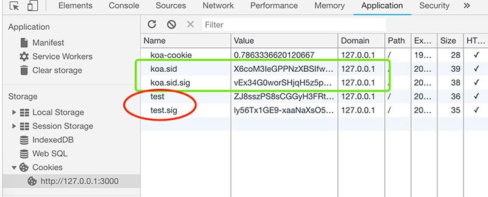

ridis概念&安装，应用场景及用法

https://redis.io

http://www.redis.cn

```
# 配合koa使用，需要安装
npm i -S koa-generic-session koa-redis
```

```
const Koa = require('koa')

// session & redis
const session = require('koa-generic-session')
const Redis = require('koa-redis')

const app = new Koa()

app.keys = [
  'keys',
  'keyss'
]
// 与redis建立链接
app.use(session({
  // 无该配置项，session将直接使用内存存储
  store: new Redis()
}))
```

新增以上配置后，浏览器cookie会自动新增`koa.sid`，`koa.sid.sig`属性值



### # 查看存储内容

```
# git bash
redis-cli
> keys *
1) preXXXXXXXXXXXXXXXX
# view detail
> get preXXXXXXXXXXXXXXXX
```

### # 直接操作redis

```
const Redis = require('koa-redis')

const Store = new Redis().client

router.get('/redis', async ctx => {
  const st = await Store.hset('fix', 'name', Math.random())
  ctx.body = {
    code: 0,
    st
  }
})
```

```
# git bash
redis-cli
> fix
1) "preXXXXXXXXXXXXXXXX"
# view detail
> hget fix name
"0.2934729472347398"
```
