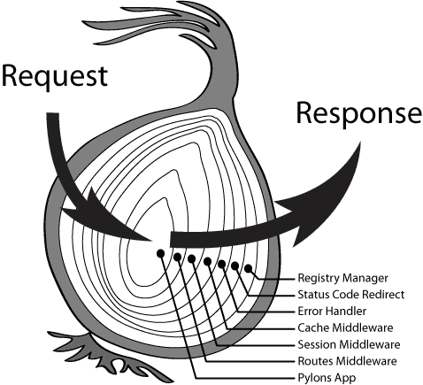

Koa 是一个新的 web 框架，由 Express 幕后的原班人马打造， 致力于成为 web 应用和 API 开发领域中的一个更小、更富有表现力、更健壮的基石。 通过利用 async 函数，Koa 帮你丢弃回调函数，并有力地增强错误处理。 Koa 并没有捆绑任何中间件， 而是提供了一套优雅的方法，帮助您快速而愉快地编写服务端应用程序。

https://koa.bootcss.com

* koa-generator

* asycn & awite

* koa2中间件

  https://github.com/koajs/koa/wiki#middleware

* koa2路由

* cookie & session

* mongoose

* redis 基础

## # koa-generator

https://www.npmjs.com/package/koa2-generator

```
npm install -g koa2-generator
```

### # use

v 1.1.7

```
# init
# Initial project in directory app, and enter directory app
koa2 -e ./app && cd ./app
# -e: use ejs template

# Install dependencies:
npm i

# Start your Koa app at http://localhost:3000/:
npm start
# or npm run start
```


## # Koa middleware



define

```
// koa-test-mdw.js
function testMdwFunc (ctx) {
  console.log('testFunc: ' + ctx.path)
}

module.exports = function () {
  return async function (ctx, next) {
    testMdwFunc(ctx)
    await next()
  }
}
```

use

```
const Koa = require('koa')
const app = new Koa()
const testMdw = require('./koa-test-mdw.js')
app.use(testMdw())
```

## # koa-router

https://github.com/alexmingoia/koa-router#readme

```
var Koa = require('koa');
var Router = require('koa-router');

var app = new Koa();
var router = new Router();

router.get('/', (ctx, next) => {
  // ctx.router available
});

app
  .use(router.routes())
  .use(router.allowedMethods());
```

## # cookie & session

### # ctx.cookies.get(name, `[options]`)

通过 options 获取 cookie name:

signed 所请求的cookie应该被签名
koa 使用 cookies 模块，其中只需传递参数。

### # ctx.cookies.set(name, value, `[options]`)

通过 options 设置 cookie name 的 value :

* maxAge 一个数字表示从 Date.now() 得到的毫秒数
* signed cookie 签名值
* expires cookie 过期的 Date
* path cookie 路径, 默认是'/'
* domain cookie 域名
* secure 安全 cookie
* httpOnly 服务器可访问 cookie, 默认是 true
* overwrite 一个布尔值，表示是否覆盖以前设置的同名的 cookie (默认是 false). 如果是 true, 在同一个请求中设置相同名称的所有 Cookie（不管路径或域）是否在设置此Cookie 时从 Set-Cookie 标头中过滤掉。

koa 使用传递简单参数的 [cookies](https://github.com/pillarjs/cookies) 模块。
