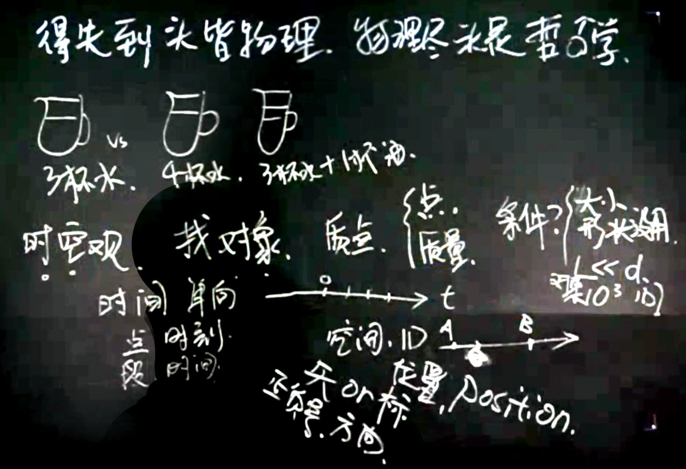
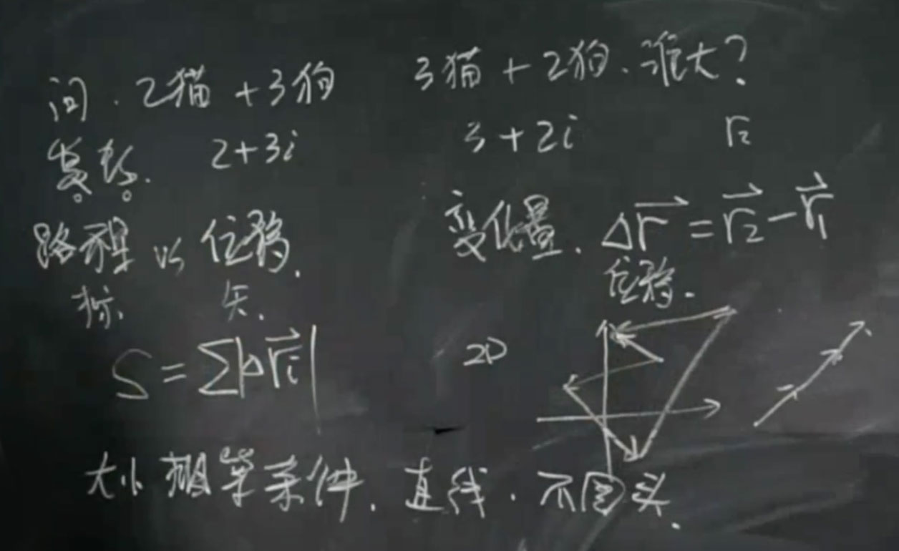
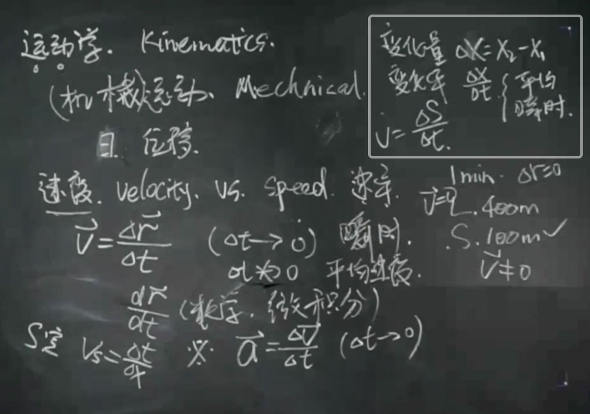
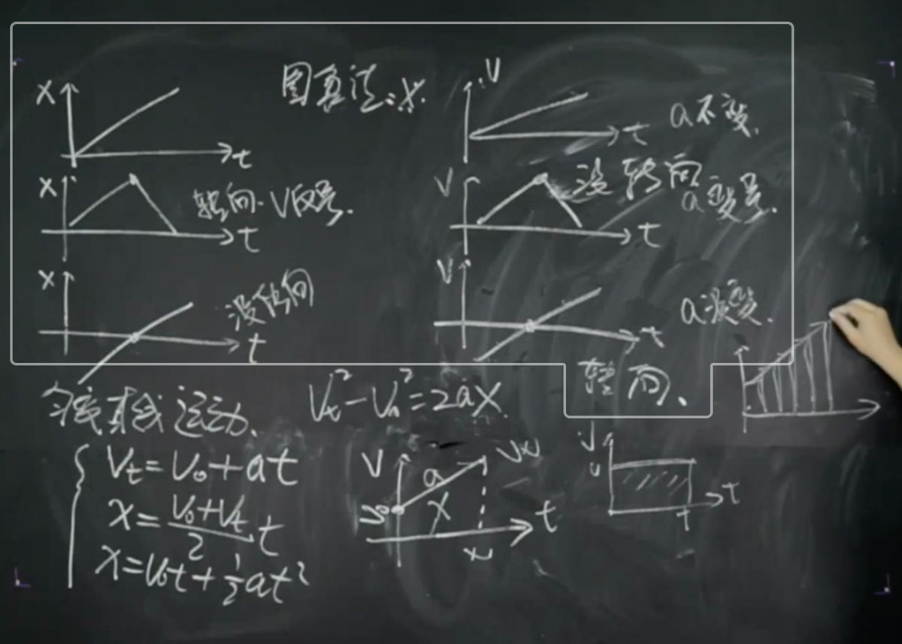
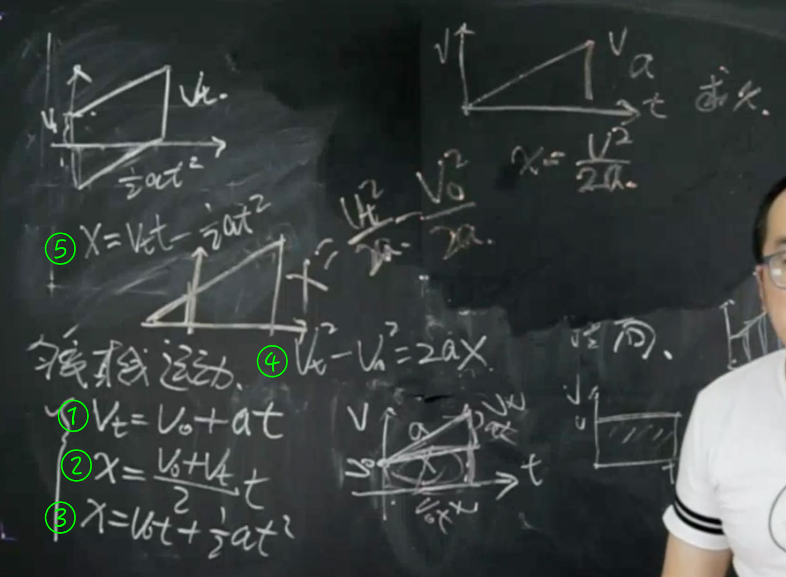

# 如何描述运动

得失到头皆物理，物理尽头是哲学。

上下四方为宇（空间维度），古往今来为宙（时间维度）。

时空观 找对象

质点（点和质量） 使用条件？：物体的大小和形状没有用，L << d (对象的尺度L远小于问题的尺度d，一般指相差10^3以上)

## 运动学 kinematics

(机械)运动 mechanical

速度（velocity）vs （初中）Speed 速率

### 图像法

匀变速运动的4+1个公式

