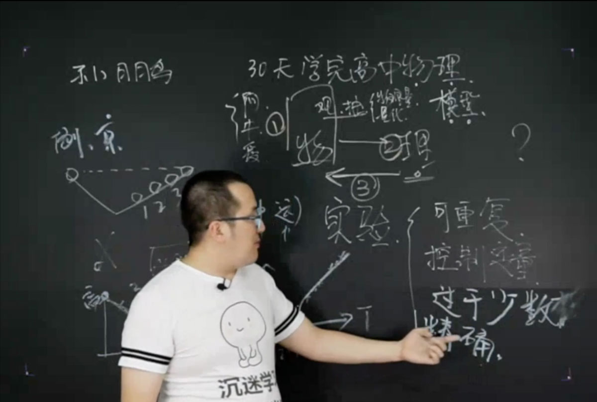

# 30天学完高中物理

https://www.bilibili.com/video/BV13J41197Ta?from=search&seid=211144475804735613

阿基米德：腿伸进缸里，水溢了出来，得知了这是"浮力"原理

牛顿：苹果往地上掉，"万有引力"

爱因斯坦：相对论

```
物 --（观察、抽象）--> 理 --（实验）-->  物
```

### 从物到理的抽象过程

```
观察 -> 抽象 -> 物理量（量化）
```

物理关心的是：通过观察抽象处理的模型，根据该模型能进一步总结处理的"原理"

### 实验

* 可重复

* 控制变量

* 用过于少的数据得出结论是不靠谱的

* 精确度（根据实验水平的不同，得到的结果可能有差异）



数学是火，点亮了物理的灯，照亮了化学的路，走向了生物的坑。

元代：刘致 得失到头皆物理。

### 初中与高中物理学习的区别总结

|初中|高中|
|:--|:--|
|定性|定量|
|状态|过程|
|标量|矢量|
|直线1D|2D、3D、4D（竞赛）|

F（力：矢量） = S（面积：矢量） * P（压强：标量）

I（电流：标量）= Q（？：标量） / t（时间：标量）
