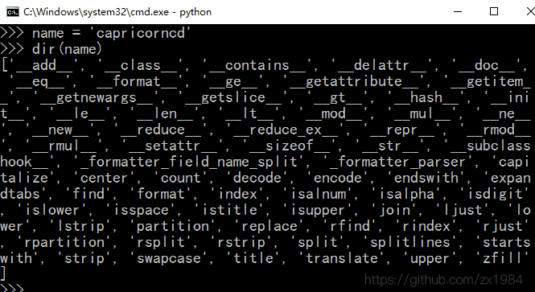
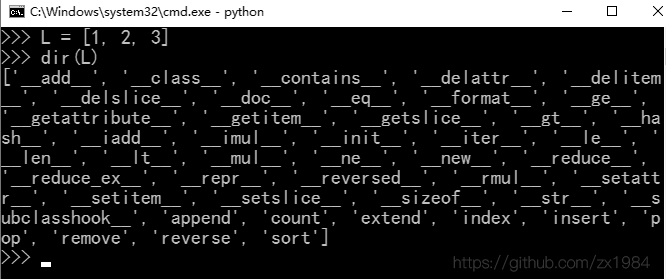

# Python 2.7 - 数据类型（扩展）

## 数据类型(扩展)

标准数据类型，Python2中有6个标准的数据类型

| Number| 数字| `英 [ˈnʌmbə(r)] 美 [ˈnʌmbɚ] `|
|:--|:--|:--|
| String| 字符串 | `英 [strɪŋ] 美 [strɪŋ]` |
| List | 列表 | `英 [lɪst] 美 [lɪst] ` |
| Tuple | 元组 | `英 [tʌpl] 美 [tʌpl] n. 元组，数组` |
| Sets | 集合 | `英 ['sets] 美 ['sets] ` |
| Dictionary | 字典 | `英 [ˈdɪkʃənri] 美 [ˈdɪkʃəneri] ` |

#### # Number 数字

int, float, bool, complex(复数)

* int 整型

    Python2中，只有一种`整数类型 int`，表示长整型

* float 浮点型

    浮点型即小数，之所以称之为浮点型，是因为按照科学计数法表示时，一个浮点的小数点位置是可变的。比如 1.23x10<sup>9</sup>和12.3x10<sup>8</sup>是相等的。

    浮点数可以用数学写法，如 1.23, 3.14, -.9.01等等。

    但是对于很大或很小的浮点型，就必须用科学计数法表示，把10用e替代，1.23x10<sup>9</sup>即为1.23e9或12.3e8，0.000012即为1.2e-5 等等。

```
>>> a = 3.14
>>> b = 1.23e10
>>> a
3.14
>>> b
12300000000.0
>>> type(a)
'float'
>>> type(b)
'float'
```

* bool 布尔值

    布尔值和布尔代数的表示完全一致，一个布尔值只有True、False两种值。注意不能用true或false，Python中将true/flase会识别为自定义变量。

#### # string 字符串

字符串就是一些列字符。Python中，用引号(单引号或双引号)括起来的就是字符串。如'This is String', "This is also a String"

| 字符串方法 | 作用 | 例子 |
| :-- | :-- | :-- |
| String.title() | 首字母大写 | 'ada love'.title() # 'Ada Love' |
| String.upper() | 所有字母大写 | 'ada love'.upper() # 'ADA LOVE' |
| String.lower() | 所有字母小写 | 'ADA LOVE'.lower() # 'ada love' |



```python
# 字符串拼接(合并)
>>> name = 'Capricorncd'
>>> msg = name + ' is an uncle'
>>> msg
'Capricorncd is an uncle'
```

- 使用函数`str()`避免类型错误

```
>>> age = 30
>>> msg = 'Happy' + str(age) + 'rd birthday!'
>>> msg
'Happy 30rd birthday!'
```

大多数情况下，Python中使用数字都比较简单。如果结果出乎意料，请检查Python是否按你期望的方式解读了数值或字符串。

#### # List 列表

**List** 是Python中使用最频繁的数据类型。

列表可以完成大多数集合类的数据结构实现。列表中元素的类型可以不相同，支持数字、字符串，甚至可以包含列表(所谓嵌套)。

列表是写在方括号[]之间，用逗号分隔开的元素列表。

```python
>>> L = ['abc', 123, 2.3, 'Capricorncd']
>>> L[0]
'abc'
>>> L[1:3]
[123, 2.3]
>>> L[2:]
[2.3, 'Capricorncd']
>>> L*2
['abc', 123, 2.3, 'Capricorncd', 'abc', 123, 2.3, 'Capricorncd']
```



## 基本运算符

算术运算符、比较(关系)运算符、赋值运算符、逻辑运算符、位运算符、成员运算符、身份运算符

#### # 算术运算符

| 运算符 | 名称| 说明 | 实例 |
| :--: | :--: | :-- | :-- |
| + | 加 | 两个对象相加 | 5+4 结果 9|
| - | 减 | 两个数相减 | 4.3-2 结果 2.3|
| * | 乘 | 两个数相乘，或返回一个被重复n次的字符串/List | [12, 34]*2 结果 [12, 34, 12, 34]|
| / | 除 | 两个数相除(注意类型) | 3/4 结果 0; 3/4.0 结果 0.75|
| % | 取余/取模 | 返回除法的余数 | 5%4 结果 1|
| ** | 乘方/幂 | 返回x的n次幂 | 5**2 结果 25|
| // | 取整除 | 返回商的整数部分(向下取整) | -2//4 结果 -1|

注意：除法`/` 整数除以整数，结果为整数，且向下取整。浮点型除以整数，或整数除以浮点型，或浮点型除以浮点型，其结果为浮点数。

#### # 比较运算符

以下假设变量 `a = 10` , `b = 20`

| 运算符 | 说明 | 实例 |
| :--: | :-- | :-- |
| == | 等于 - 比较对象是否相等 | a == b 返回 False |
| != | 不等于 - 比较对象是否不相等 | a != b 返回 True |
| > | 大于 - 返回a是否大于b | a > b 返回 False |
| < | 小于 - 返回a是否小于b | a < b 返回 True |
| >= | 大于等于 - 返回a是否大于等于b | a >= b 返回 False |
| <= | 小于等于 - 返回a是否小于等于b | a <= b 返回 True |

#### # 赋值运算符

以下假设变量 `a = 10` , `b = 20`

| 运算符 | 说明 | 实例 |
| :--: | :-- | :-- |
| = | 简单的赋值运算符 | c = a + b |
| += | 加法赋值运算符 | c += a 等效于 c = c + a |
| -= | 减法赋值运算符 | c -= a 等效于 c = c - a |
| *= | 乘法赋值运算符 | c *= a 等效于 c = c * a |
| /= | 除法赋值运算符 | c /= a 等效于 c = c / a |
| %= | 取模赋值运算符 | c %= a 等效于 c = c % a|
| **= | 幂赋值运算符 | c **= a 等效于 c = c ** a |
| //= | 取整除赋值运算符 | c //= a 等效于 c = c // a |

#### # 逻辑运算符

| 运算符 | 表达式 | 说明 | 实例 |
| :--: | :-- | :-- | :-- |
| and | x and y | '与'。x为False，x and y 返回 False，否则返回y的计算值 | a and b 返回 20 |
| or | x or y | '或'。x为True，它返回True，否则返回y的计算值 | a or b 返回 10 |
| not | not x | '非'。x为True，它返回False；x为False，它返回True | not(a and b) 返回 False |

#### # 位运算符

#### # 成员运算符

#### # 身份运算符

#### # 运算符优先级顺序

## List和Tuple

**List** 是一种有序的集合，可以随时添加或删除其中的某个元素

| 方法 | 说明 |
| :-- | :-- |
| append(item) | 在list尾部追加元素 |
| extend() | 在列表尾部追加包含多个值的序列，即扩展一个list |

```
list1 = [1, 2, 3]
list2 = [7, 8]
list1.append(4)
# [1, 2, 3, 4]
list1.append(list2)
# [1, 2, 3, 4, [7, 8]]
```

```
list1 = [1, 2, 3]
list2 = [7, 8]
list1.extend(list2)
# [1, 2, 3, 4, 7, 8]
```

## 参考资料

笔记作者：Capricorncd

https://github.com/capricorncd

腾讯课堂：python零基础入门到精通

https://ke.qq.com/course/206902
