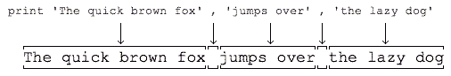
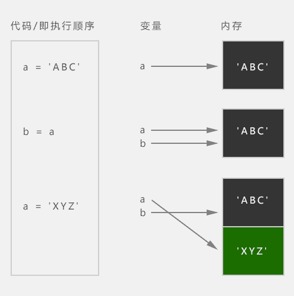

# Python 2.7 - 变量和数据类型

## 语法规则

1. 缩进统一(空格或Tab，但不能混用)

2. 标识符的**第一个字符**必须是字母(大写或小写)或者一个下划线('_')，标识符名称的其他部分可以由字符、下划线或数字(0-9)组成。

3. 标识符名称是对**大小写敏感**的。例如：myname和myName不是一个标识符。

4. Python注释 `#`号为单行注释；**多行注释**用3个单引号或3个双引号

   任何时候，我们都可以给程序加上注释。注释是用来说明代码的，给自己或别人看，而程序运行的时候，Python解释器会直接忽略掉注释，所以，有没有注释不影响程序的执行结果，但是影响到别人能不能看懂你的代码。

    ```python
    # 单行注释
    ```

    ```python
    '''
    多行注释内容
    '''
    ```

    ```python
    """
    多行注释内容
    """
    ```

## 数据类型

计算机顾名思义就是可以做数学计算的机器，因此，计算机程序理所当然地可以处理各种数值。但是，计算机能处理的远不止数值，还可以处理文本、图形、音频、视频、网页等各种各样的数据，不同的数据，需要定义不同的数据类型。在Python中，能够直接处理的数据类型有以下几种：

#### # 整数

Python可以处理任意大小的整数，当然包括负整数。，整数的表示方法和数学上的写法一模一样，例如：`1`，`100`，`-8080`，`0` 等等。

计算机由于使用二进制，所以，有时候用十六进制表示整数比较方便，十六进制用`0x`前缀和`0-9`，`a-f`表示，例如：`0xff00`，`0xa5b4c3d2` 等等。

#### # 浮点数

浮点数也就是小数，之所以称为浮点数，是因为按照科学记数法表示时，一个浮点数的小数点位置是可变的，比如，`1.23x10^9`和`12.3x10^8`是相等的。浮点数可以用数学写法，如`1.23`，`3.14`，`-9.01` 等等。但是对于很大或很小的浮点数，就必须用科学计数法表示，把`10`用`e`替代，`1.23x10^9`就是`1.23e9`，或者`12.3e8`，`0.000012`可以写成`1.2e-5` 等等。

整数和浮点数在计算机内部存储的方式是不同的，整数运算永远是精确的（除法难道也是精确的？是的！），而浮点数运算则可能会有四舍五入的误差。

#### # 字符串

字符串是以`''`或`""`括起来的任意文本，比如`'abc'`，`"xyz"`等等。请注意，`''`或`""`本身只是一种表示方式，不是字符串的一部分，因此，字符串`'abc'`只有`a`，`b`，`c`这3个字符。

#### # 布尔值

布尔值和布尔代数的表示完全一致，一个布尔值只有`True`、`False`两种值，要么是`True`，要么是`False`。在Python中，可以直接用`True`、`False`表示布尔值（请注意大小写），也可以通过布尔运算计算出来。

布尔值可以用`and`、`or`和`not`运算。

| 关键字 | 名称 |描述|
|:--:|:--|:--|
| and | 与运算 | 只有所有都为 True，and运算结果才是 True |
| or | 或运算 | 只要其中有一个为 True，or 运算结果就是 True |
| not | 非运算 | 它是一个单目运算符，把 True 变成 False，False 变成 True |

#### # 空值

空值是Python里一个特殊的值，用`None`表示。`None`不能理解为`0`，因为`0`是有意义的，而`None`是一个特殊的空值。

此外，Python还提供了列表、字典等多种数据类型，还允许创建自定义数据类型...

## print语句

print语句可以向屏幕上输出指定的文字。比如输出'hello, world'，用代码实现如下：

```
>>> print 'Hello, World'
```

注意：

1. 当我们在Python交互式环境下编写代码时，`>>>`是Python解释器的提示符，不是代码的一部分。

2. 当我们在文本编辑器中编写代码时，千万不要自己添加 `>>>`。

**print语句** 也可以跟上多个字符串，用逗号`“,”`隔开，就可以连成一串输出：

```
print 'The quick brown fox', 'jumps over', 'the lazy dog'
# 输出结果：The quick brown fox jumps over the lazy dog
```

print会依次打印每个字符串，遇到逗号“,”会输出一个空格，因此，输出的字符串是这样拼起来的：



## 变量

在Python中，变量的概念基本上和初中代数的方程变量是一致的。

例如，对于方程式 `y=x*x` ，`x`就是变量。当`x=2`时，计算结果是`4`，当`x=5`时，计算结果是`25`。

只是在计算机程序中，变量不仅可以是数字，还可以是任意数据类型。

在Python程序中，变量是用一个变量名表示，变量名必须是大小写英文、数字和下划线（_）的组合，且不能用数字开头。

Python中的变量不需要声明。每个变量在使用前都必须赋值，变量赋值以后该变量才会被创建。

#### # 变量定义

```python
# 变量语法
变量名 = 变量的值
```

1. 变量名只能包含字母、数字和下划线，变量名可以以字母或下划线开头，但不能以数字开头。

2. 变量名不能包含空格，可以用下划线来分割单词

3. 不要将Python自带关键字或函数名作变量名

4. 变量名应该简短并具有描述性，比如`name`, `studentName`, `nameLength`, `student_name`, `name_length`

5. 慎用小写字母`l`和大写字母`O`

6. 在Python中，等号`=`是赋值语句，可以把任意数据类型赋值给变量，同一个变量可以反复赋值，而且可以是不同类型的变量，例如：

```python
a = 123    # a是整数
print a
a = 'python'   # a变为字符串
print a
```

#### # 动态语言 && 静态语言

变量本身类型不固定的语言称之为**动态语言**，与之对应的是**静态语言**。

静态语言在定义变量时必须指定变量类型，如果赋值的时候类型不匹配，就会报错。例如Java是静态语言，赋值语句如下（// 表示注释）：

```java
// java
int a = 123; // a是整数类型变量
a = "python"; // 错误：不能把字符串赋给整型变量
```

和静态语言相比，动态语言更灵活，就是这个原因。

#### # 赋值语句的等号

请不要把赋值语句的等号等同于数学的等号。比如下面的代码：

```python
x = 10
x = x + 2
```

如果从数学上理解x = x + 2那无论如何是不成立的，在程序中，赋值语句先计算右侧的表达式x + 2，得到结果12，再赋给变量x。由于x之前的值是10，重新赋值后，x的值变成12。

#### # 变量在计算机内存中的表示

最后，理解变量在计算机内存中的表示也非常重要。当我们写：`a = 'ABC'`时，Python解释器干了两件事情：

1. 在内存中创建了一个'ABC'的字符串；

2. 在内存中创建了一个名为a的变量，并把它指向'ABC'。

也可以把一个变量a赋值给另一个变量b，这个操作实际上是把变量b指向变量a所指向的数据，例如下面的代码：

```python
a = 'ABC'
b = a
a = 'XYZ'
print b
```

最后一行打印出变量b的内容到底是'ABC'呢还是'XYZ'？如果从数学意义上理解，就会错误地得出b和a相同，也应该是'XYZ'，但实际上b的值是'ABC'，让我们一行一行地执行代码，就可以看到到底发生了什么事：



1. 执行`a = 'ABC'`，解释器创建了字符串  'ABC'和变量 a，并把a指向 'ABC'；
2. 执行`b = a`，解释器创建了变量 b，并把b指向 a 指向的字符串'ABC'；
3. 执行`a = 'XYZ'`，解释器创建了字符串'XYZ'，并把a的指向改为'XYZ'，但b并没有更改；
4. 所以，最后打印变量b的结果自然是'ABC'了。

#### # Test 等差数列

**等差数列**可以定义为每一项与它的前一项的差等于一个常数，可以用变量 x1 表示等差数列的第一项，用 d 表示公差，请计算数列 `1 4 7 10 13 16 19 ...` 前 100 项的和。

arithmetic-sum.py

```python
x1 = 1
d = 3
n = 100
x100 = x1 + (100 - 1) * d
s = 0
while (n > 0):
  s += x1 + (n - 1) * d
  n -= 1

'''
# or
while (n > 0):
  n -= 1
  s += x1 + n * d
'''

print 'x100 = ', x100
print 'sum = ', s
```


## 参考资料

笔记作者：Capricorncd

https://github.com/capricorncd

腾讯课堂：python零基础入门到精通

https://ke.qq.com/course/206902

原讲师：廖雪峰

https://www.imooc.com/learn/177
