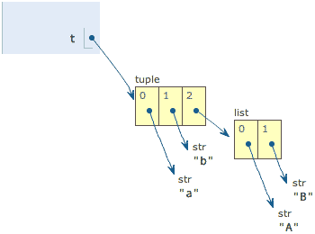
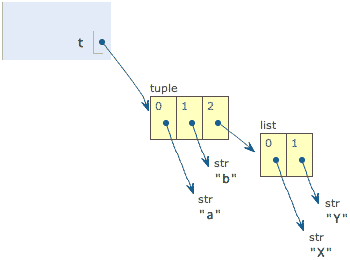

# Python tuple

tuple是另一种有序的列表，中文翻译为“元组”。tuple 和 list 非常类似，但是，tuple一旦创建完毕，就不能修改了。

## 创建tuple

同样是表示班里同学的名称，用tuple表示如下：

```
t = ('Adam', 'Lisa', 'Bart')
```

创建tuple和创建list唯一不同之处是用`( )`替代了`[ ]`。

现在，这个 `t` 就不能改变了，tuple没有 `append()`方法，也没有insert()和pop()方法。所以，新同学没法直接往 tuple 中添加，老同学想退出 tuple 也不行。

获取 tuple 元素的方式和 list 是一模一样的，我们可以正常使用 `t[0]`，`t[-1]`等索引方式访问元素，但是不能赋值成别的元素，不信可以试试：

```
>>> t[0] = 'Paul'
Traceback (most recent call last):
  File "<stdin>", line 1, in <module>
TypeError: 'tuple' object does not support item assignment
```

## 之创建单元素tuple

tuple和list一样，可以包含 0 个、1个和任意多个元素。

```python
# 包含 0 个元素的 tuple，也就是空tuple，直接用 ()表示：
>>> t = ()
>>> print t
()
```

```python
# 创建包含1个元素的 tuple
>>> t = (1)
>>> print t
1
```

好像哪里不对！t 不是 tuple ，而是整数1。为什么呢？

因为`()`既可以表示tuple，又可以作为括号表示运算时的优先级，结果 `(1)` 被Python解释器计算出结果 1，导致我们得到的不是tuple，而是整数 1。

正是因为用`()`定义单元素的tuple有歧义，所以 Python 规定，单元素 tuple 要多加一个逗号“,”，这样就避免了歧义：

```python
>>> t = (1,)
>>> print t
(1,)
```

Python在打印单元素tuple时，也自动添加了一个“,”，为了更明确地告诉你这是一个tuple。

多元素 tuple 加不加这个额外的“,”效果是一样的：

```python
>>> t = (1, 2, 3,)
>>> print t
(1, 2, 3)
```

## “可变”的tuple

前面我们看到了tuple一旦创建就不能修改。现在，我们来看一个“可变”的tuple：

```python
>>> t = ('a', 'b', ['A', 'B'])
```

注意到 t 有 3 个元素：'a'，'b'和一个list：`['A', 'B']`。list作为一个整体是tuple的第3个元素。list对象可以通过 `t[2]` 拿到：

```python
>>> L = t[2]
```

然后，我们把list的两个元素改一改：

```python
>>> L[0] = 'X'
>>> L[1] = 'Y'
```

再看看tuple的内容：

```python
>>> print t
('a', 'b', ['X', 'Y'])
```

不是说tuple一旦定义后就不可变了吗？怎么现在又变了？

别急，我们先看看定义的时候tuple包含的3个元素：



当我们把list的元素'A'和'B'修改为'X'和'Y'后，tuple变为：



表面上看，tuple的元素确实变了，但其实变的不是 tuple 的元素，而是list的元素。

tuple一开始指向的list并没有改成别的list，所以，tuple所谓的“不变”是说，tuple的每个元素，指向永远不变。即指向'a'，就不能改成指向'b'，指向一个list，就不能改成指向其他对象，但指向的这个list本身是可变的！

理解了“指向不变”后，要创建一个内容也不变的tuple怎么做？那就必须保证tuple的每一个元素本身也不能变。

## 参考资料

笔记作者：Capricorncd

https://github.com/capricorncd

腾讯课堂：python零基础入门到精通

https://ke.qq.com/course/206902

原讲师：廖雪峰

https://www.imooc.com/learn/177
